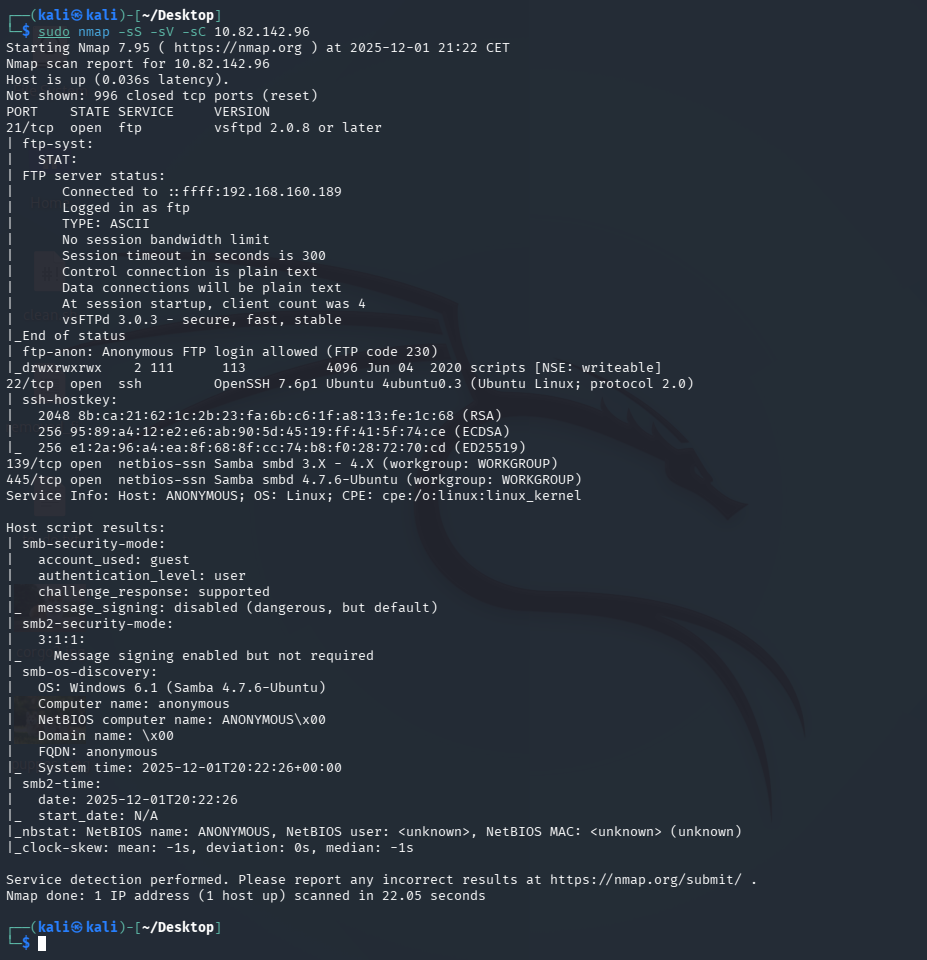
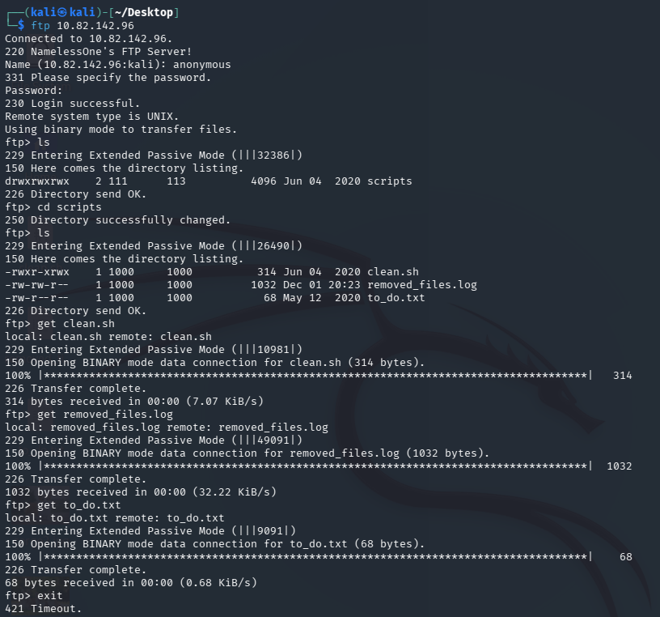
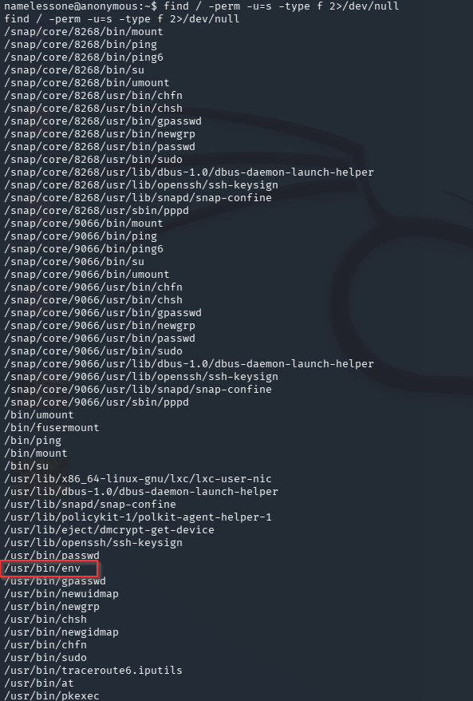

# Anonymous — TryHackMe

| | |
|---|---|
| **Platform** | TryHackMe |
| **Difficulty** | Easy |
| **OS** | Linux |
| **Status** | ✅ Room explicitly aimed at write-ups/beginners |
| **Key techniques** | Anonymous FTP, SMB share enumeration, SUID `env` abuse (GTFOBins) |

---

## TL;DR

A beginner-focused room built around a single theme: **anonymous access**
left open on both FTP and SMB. Anonymous FTP holds a script that, once
understood and lightly modified, becomes a reverse shell delivery
mechanism, and privilege escalation is a straightforward SUID binary abuse
once `env` turns up with the SUID bit set.

---

## Recon & Enumeration

```bash
nmap -sC -sV <TARGET_IP>
```

Four ports open, including FTP and SMB (139/445). Both were checked for
anonymous access, which is the obvious first move whenever either service
is present with no other clear entry point:

```bash
enum4linux -a <TARGET_IP>
```



SMB enumeration confirmed a share holding user files (a `pics` share), while
FTP allowed anonymous login and contained a script (`clean.sh`) alongside a
compiled helper — the box's actual foothold vector.

---

## Foothold / Initial Access

Anonymous FTP access wasn't just readable — it was **writable**, letting the
existing `clean.sh` script be edited/replaced rather than exploited through
any deliberate scripting flaw. Appending a reverse shell one-liner to the
script and waiting for whatever scheduled/triggered process ran it caught a
shell:

```bash
ftp <TARGET_IP>
# anonymous / anonymous
get clean.sh
# edit clean.sh to append a bash reverse shell one-liner
put clean.sh
```



```bash
nc -lvnp <PORT>
```

User flag retrieved.

---

## Privilege Escalation

A SUID-permission sweep found `env` with the SUID bit set — an unusual and
immediately actionable finding, since `env` is meant to just print or modify
environment variables before running a command, but with SUID set it runs
that command with the file owner's privileges:

```bash
find / -perm -4000 2>/dev/null
```



GTFOBins documents the abuse directly: `env` with SUID launches whatever
command follows it *with the elevated privilege the binary itself carries*
— effectively an inherited-privilege shell spawn:

```bash
env /bin/sh -p
```

Root shell obtained. Root flag retrieved.

---

## Lessons Learned

- **Anonymous FTP being *writable*, not just readable, changes the whole
  approach** — modifying an existing script that a scheduled process later
  executes is a simpler path than searching for an independent code
  execution bug.
- **A routine SUID sweep (`find / -perm -4000`) should be one of the first
  privilege-escalation checks on any Linux box** — an unexpected binary
  like `env` on that list is immediately actionable via GTFOBins.

---

## Remediation

- Disable anonymous FTP write access at minimum, and anonymous access
  entirely where not explicitly required.
- Remove the SUID bit from any binary that doesn't strictly require it;
  `env` should never carry SUID on a production system.

---

## Tools used

- `nmap`, `enum4linux`
- `ftp`, `nc`
- `find` (SUID sweep), GTFOBins

---

**See also:** [Linux privilege escalation methodology](../../methodology/linux-privesc.md)

---

**Room:** [TryHackMe — Anonymous](https://tryhackme.com/room/anonymous)
