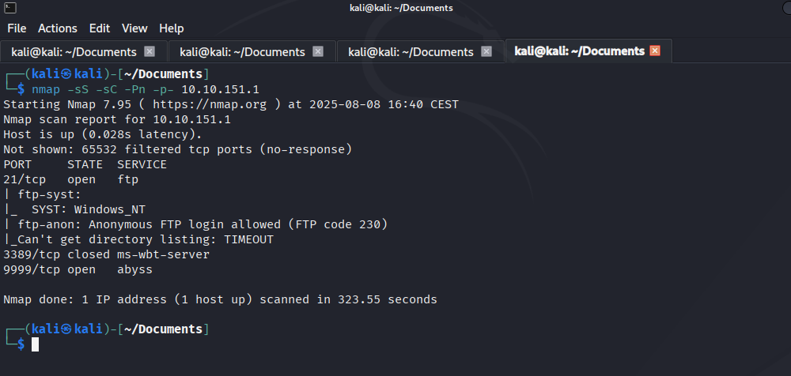
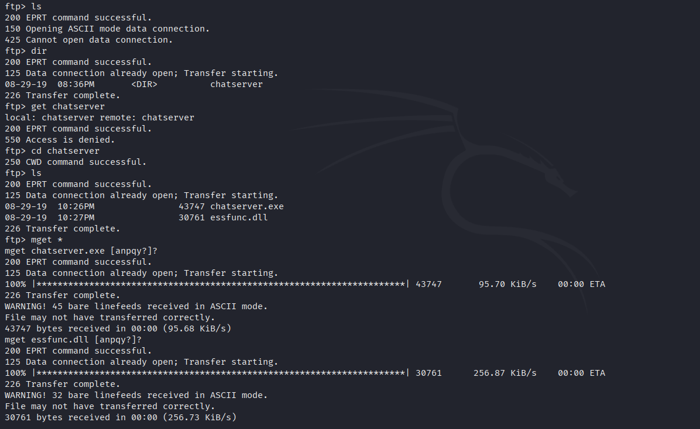
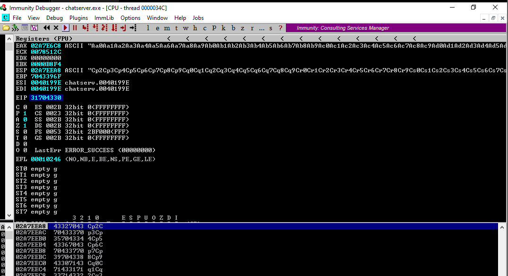
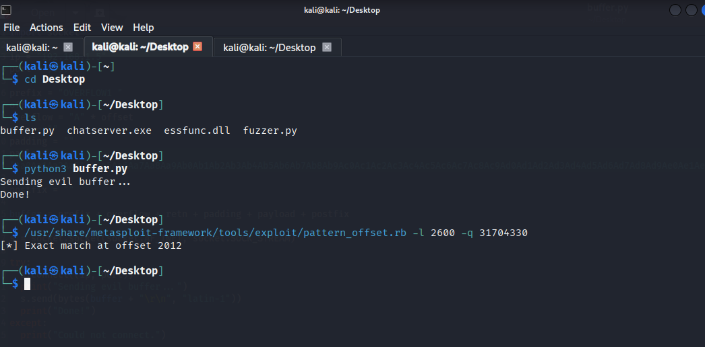
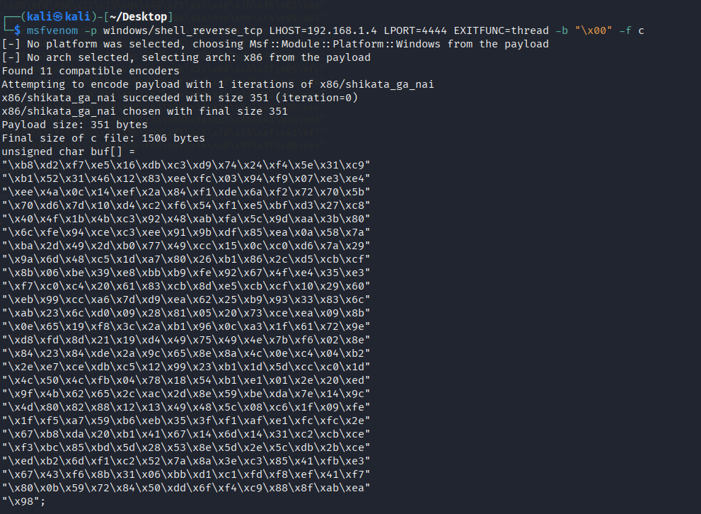
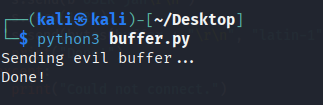
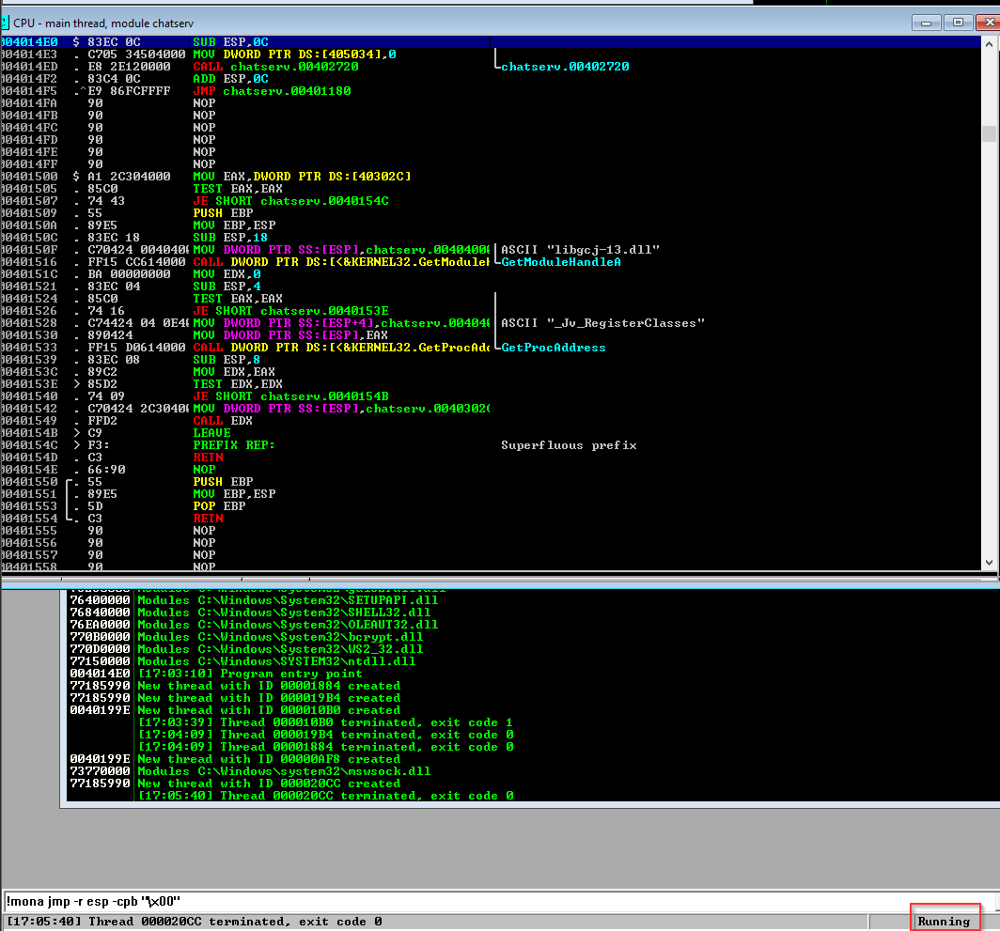
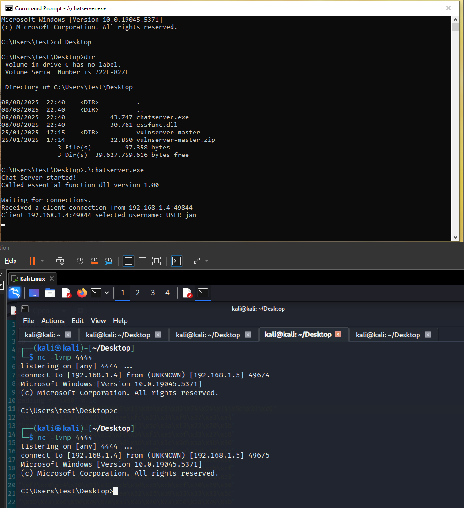
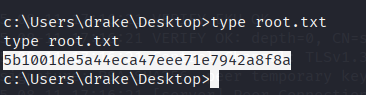

# Brainstorm — TryHackMe

  

Reverse engineer a chat program and write a script to exploit a Windows machine.

## **Deploy Machine and Scan Network**

## **Accessing Files**

## **Access**

After enumeration, you now must have noticed that the service interacting on the strange port is some how related to the files you found! Is there anyway you can exploit that strange service to gain access to the system? 

It is worth using a Python script to try out different payloads to gain access! You can even use the files to locally try the exploit. 

If you've not done buffer overflows before, check [this](https://tryhackme.com/room/bof1) room out!

###### Answer the questions below

Read the description.

After testing for overflow, by entering a large number of characters, determine the EIP offset.  

Now you know that you can overflow a buffer and potentially control execution, you need to find a function where ASLR/DEP is not enabled. Why not check the DLL file.  

Since this would work, you can try generate some shellcode - use msfvenom to generate shellcode for windows.  

After gaining access, what is the content of the root.txt file?
5b1001de5a44eca47eee71e7942a8f8a

---

**Live version:** [read this write-up on my blog](https://debasjan.github.io/writeups/brainstorm/)
