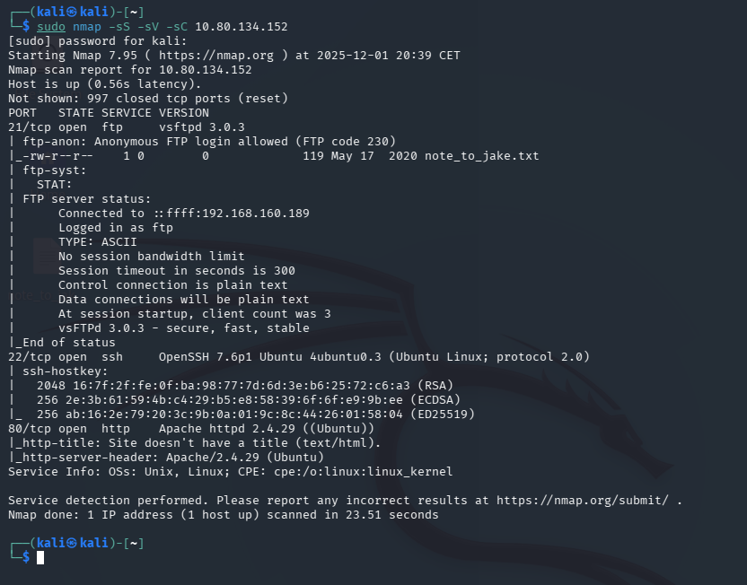
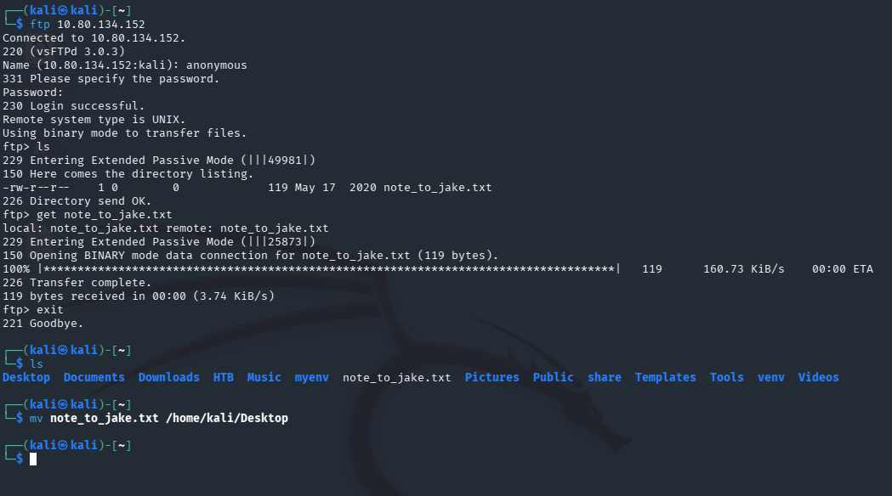
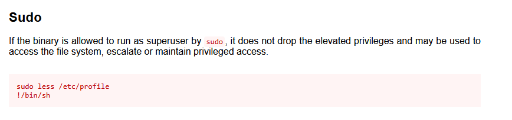

# Brooklyn Nine Nine — TryHackMe

| | |
|---|---|
| **Platform** | TryHackMe |
| **Difficulty** | Easy |
| **OS** | Linux |
| **Key techniques** | FTP credential discovery, SSH login, SUID `less` abuse (GTFOBins) |

---

## TL;DR

A themed beginner room (Brooklyn Nine-Nine references throughout) where FTP
holds a file leaking SSH credentials directly, and privilege escalation is
another SUID-binary abuse — this time `less`, reached through GTFOBins'
documented shell-escape trick.

---

## Recon & Enumeration

```bash
nmap -sC -sV <TARGET_IP>
```



FTP and SSH were the two relevant services. FTP allowed anonymous access
and held a file readable by anyone connecting.



---

## Foothold / Initial Access

The FTP-hosted file contained a working SSH credential pair for a user
(`jake`, in keeping with the room's theme). Logging in directly over SSH
with the recovered credentials worked immediately — no exploitation
required beyond finding and reading the leaked file:

```bash
ftp <TARGET_IP>
# download the file, read its contents for the credential
ssh jake@<TARGET_IP>
```

User flag retrieved.

---

## Privilege Escalation

A `sudo -l` / SUID sweep turned up **`less`** as runnable with elevated
privileges. `less`, like several pager/editor-style Unix tools, supports an
in-program shell escape (`!` followed by a command) — documented directly on
GTFOBins as a privilege escalation primitive when the pager itself runs
with elevated rights:

```bash
sudo less /path/to/some/file
!/bin/sh
```



Root shell obtained. Root flag retrieved.

---

## Lessons Learned

- **FTP is worth checking for leaked credentials even on "themed" or
  beginner-oriented boxes** — the pattern (anonymous FTP holding a text file
  with real creds) repeats across dozens of easy machines because it
  reflects a genuinely common real-world mistake.
- **Any pager or editor granted through `sudo` (`less`, `more`, `vim`,
  `man`) is a near-automatic root shell** via its built-in shell escape —
  always check GTFOBins for the exact escape sequence before assuming a
  `sudo` rule is "just" read access.

---

## Remediation

- Never store credentials in a file reachable via anonymous FTP or any
  unauthenticated service.
- Avoid granting `sudo` rights to pagers, editors, or any tool with a
  documented shell-escape; if such access is required, use `--restricted`
  modes or wrapper scripts that strip the escape capability.

---

## Tools used

- `nmap`
- `ftp`, `ssh`
- GTFOBins (`less`)

---

**See also:** [Linux privilege escalation methodology](../../methodology/linux-privesc.md)

---

**Room:** [TryHackMe — Brooklyn Nine Nine](https://tryhackme.com/room/brooklynninenine)

---

**Live version:** [read this write-up on my blog](https://debasjan.github.io/writeups/brooklyn-nine-nine/)
