# Daily Bugle — TryHackMe

<p align="left">
  
</p>

Compromise a Joomla CMS account via SQLi, practise cracking hashes and escalate your privileges by taking advantage of yum.

## **Deploy**


###### Answer the questions below

Access the web server, who robbed the bank?
Spiderman


## **Obtain user and root**


Hack into the machine and obtain the root user's credentials.

###### Answer the questions below

What is the Joomla version?
3.7.0

*Instead of using SQLMap, why not use a python script!*  

What is Jonah's cracked password?
spiderman123

What is the user flag?
27a260fe3cba712cfdedb1c86d80442e

What is the root flag?
eec3d53292b1821868266858d7fa6f79

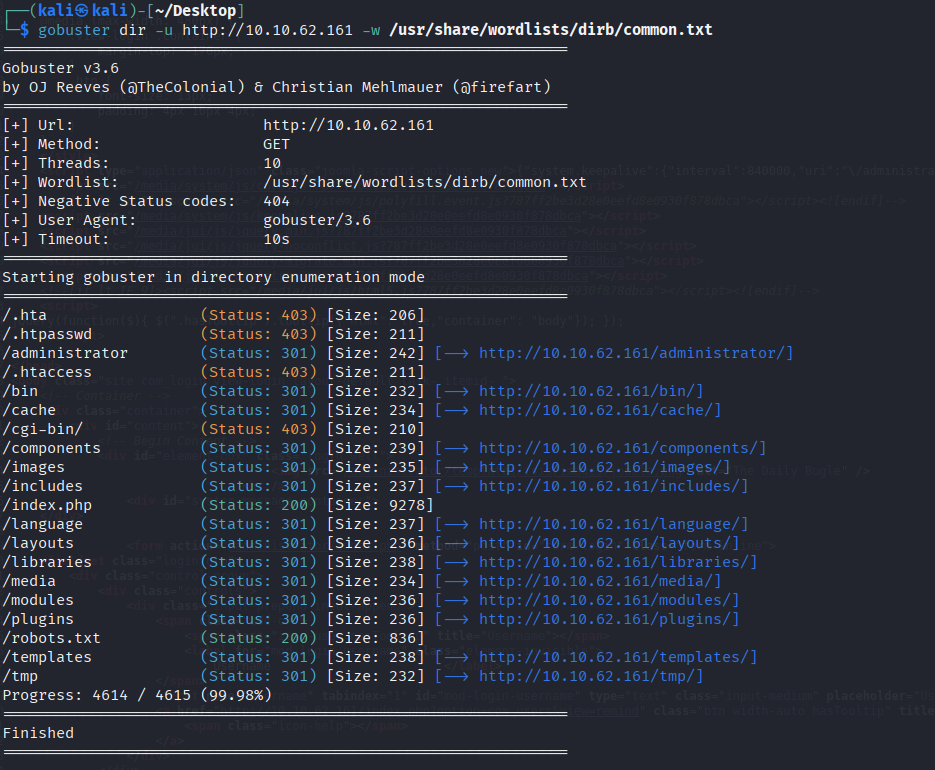


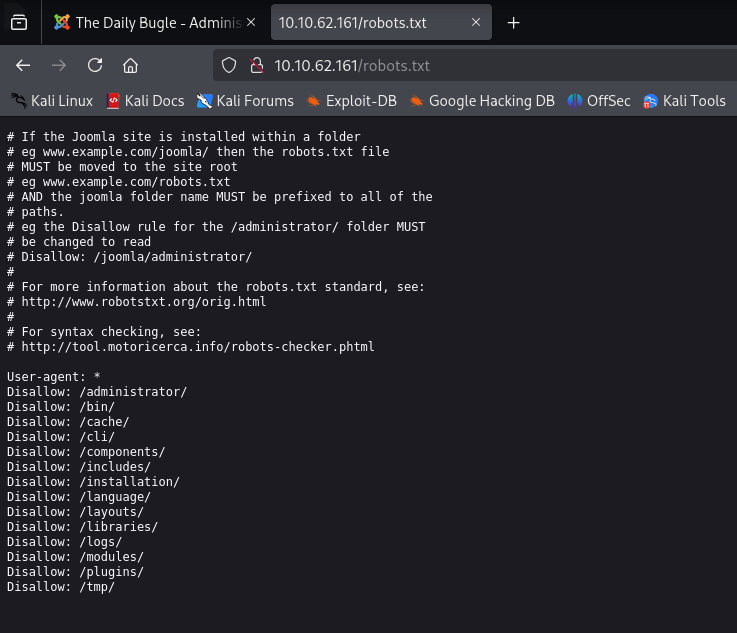
```
cmseek -u http://(target)
```
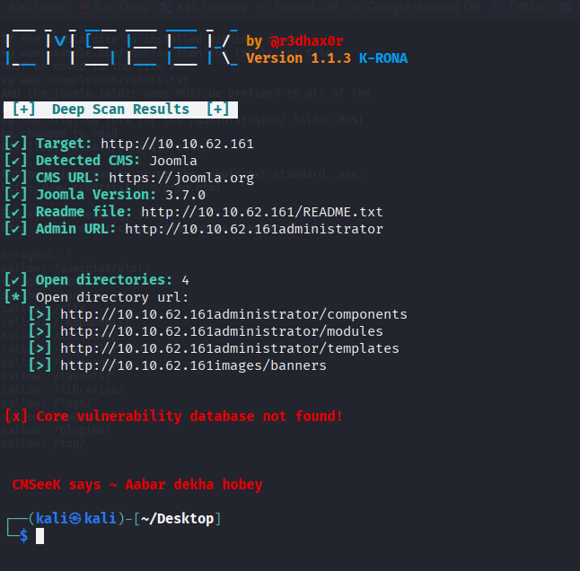


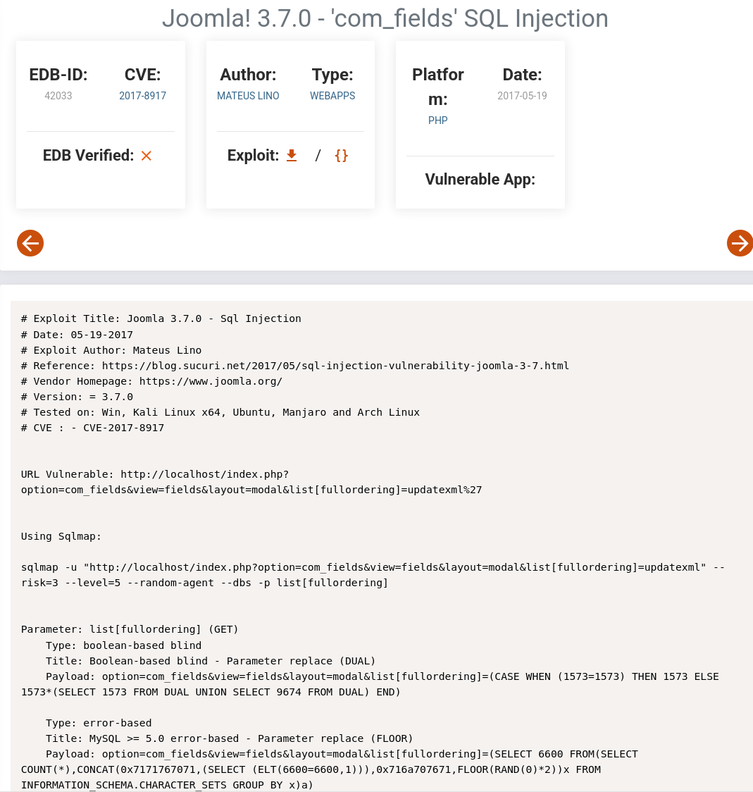
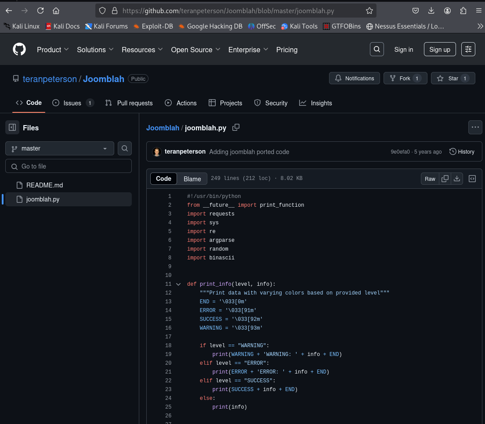


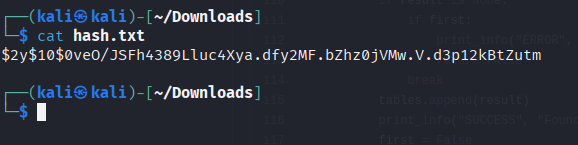

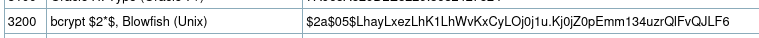

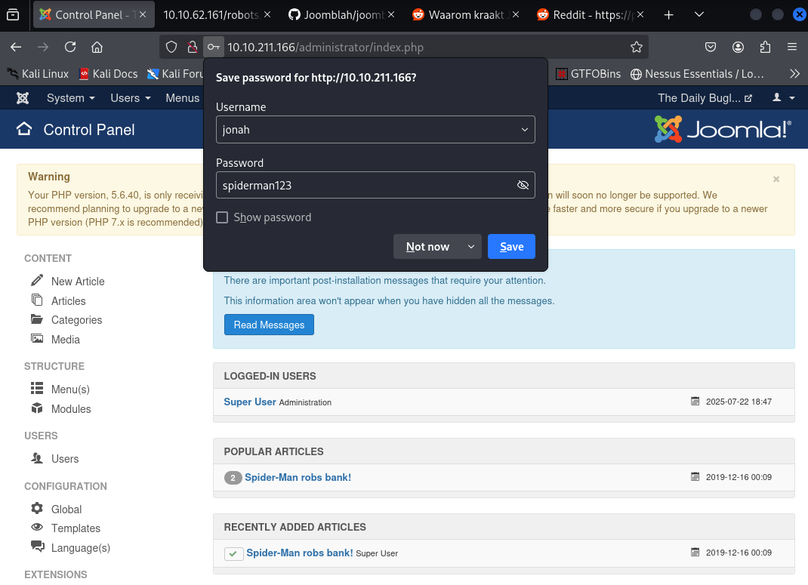
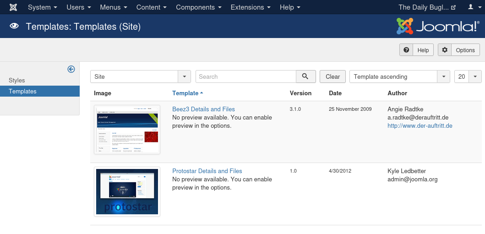

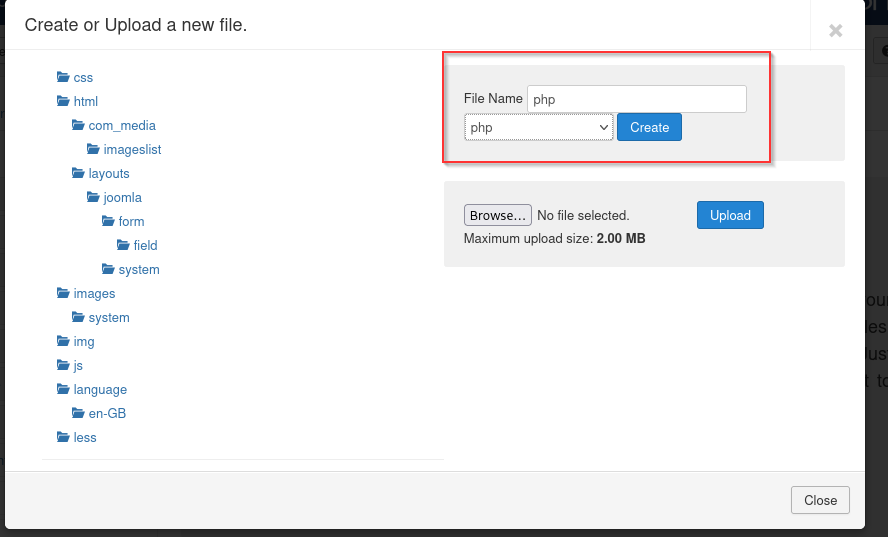


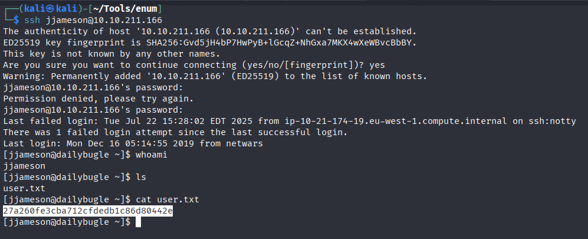
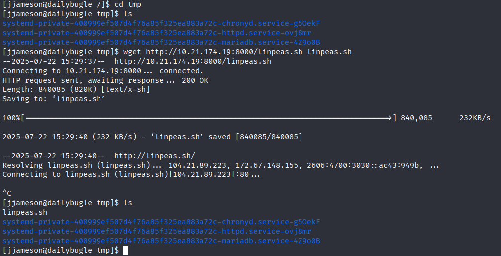
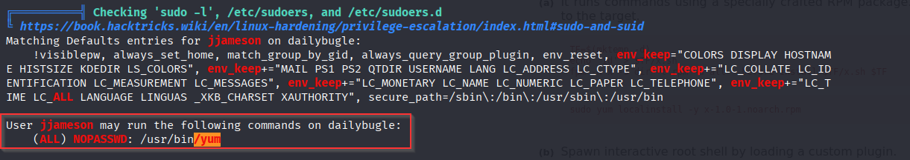
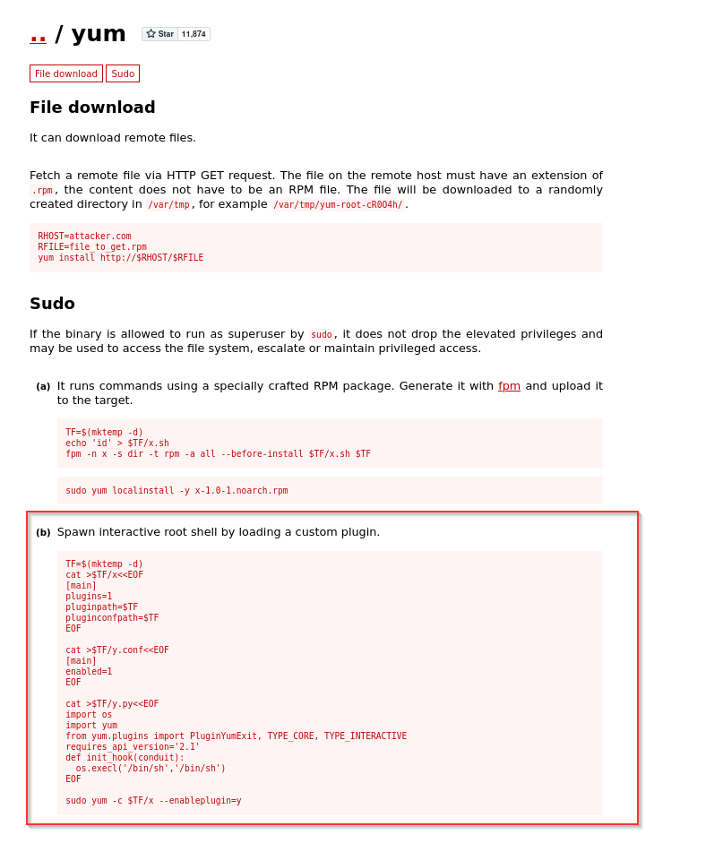


---

**Live version:** [read this write-up on my blog](https://debasjan.github.io/writeups/daily-bugle/)
