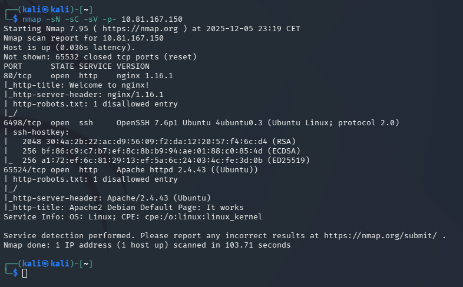
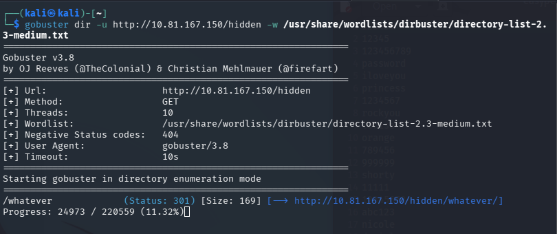

# Easy Peasy — TryHackMe

| | |
|---|---|
| **Platform** | TryHackMe |
| **Difficulty** | Easy |
| **OS** | Linux |
| **Status** | ✅ Room explicitly aimed at write-ups/beginners |
| **Key techniques** | Directory brute-forcing, layered encoding (base62/base64), hash cracking, steganography (`stegcracker`), binary-to-text decoding |

---

## TL;DR

Easy Peasy is less about a single vulnerability and more a **chain of
encoding/decoding puzzles** gating access to the actual machine: directory
brute-forcing and source inspection surface progressively obfuscated data
(base62, then a crackable hash), an image conceals a password via
steganography, and that password itself needs one more decode (binary) before
it works over SSH. Root is a short script-based privilege escalation once
inside.

---

## Recon & Enumeration

```bash
nmap -sC -sV <TARGET_IP>
```

nginx and Apache both present on non-standard ports — nginx serving the
main site, Apache on the highest port found. Directory brute-forcing on the
nginx-served site was the natural next step given no other obvious surface:

```bash
gobuster dir -u http://<TARGET_IP> -w <wordlist>
```



---

## Foothold / Initial Access

Brute-forcing turned up a hidden path whose page source contained an
encoded value. Decoding it (through CyberChef or equivalent) revealed a
**base62**-encoded string pointing to a further hidden directory — each
layer's output became the input/location for the next.



Following that chain led to a hash, cracked offline against a
room-provided wordlist, and eventually to an **image file containing a
password hidden via steganography**, recovered with `stegcracker` against
the same wordlist:

```bash
stegcracker <image_file> <wordlist>
```

The extracted password was itself encoded one more time (binary), and
decoding it produced the actual working credential — used to log in over
SSH.

```bash
ssh <user>@<TARGET_IP>
```

User access obtained.

---

## Privilege Escalation

A script left accessible on the box, once decoded/reversed in the same
spirit as the earlier steps, revealed the path to root — following its
logic (rather than a traditional SUID/`sudo` misconfiguration) was enough to
complete the escalation and reach a root shell.

---

## Lessons Learned

- **Not every room is a "real" vulnerability chain** — some are built
  specifically to drill encoding/decoding recognition (base62 vs base64 vs
  hex vs binary), a skill that's genuinely useful for spotting obfuscated
  payloads and encoded credentials in real engagements.
- **Steganography tools (`stegcracker`, `steghide`) are worth trying
  whenever an image shows up somewhere unusual** in a challenge's data
  flow, especially once a wordlist is already established from an earlier
  step.
- Layered encoding chains reward methodical, one-step-at-a-time decoding
  over trying to guess the final answer — each layer's output is the next
  layer's input, not a red herring.

---

## Remediation

Not directly applicable — this is a puzzle-style CTF room rather than a
realistic misconfiguration scenario. The transferable lesson for real
environments is recognizing encoded/obfuscated data during log or traffic
analysis, and never relying on encoding (base64, hex, etc.) as a substitute
for actual encryption or access control.

---

## Tools used

- `nmap`, `gobuster`
- CyberChef
- `stegcracker`
- `ssh`

---

**See also:** [Enumeration & foothold methodology](../../methodology/enumeration.md)

---

**Room:** [TryHackMe — Easy Peasy](https://tryhackme.com/room/easypeasy)
