# Gatekeeper — TryHackMe

  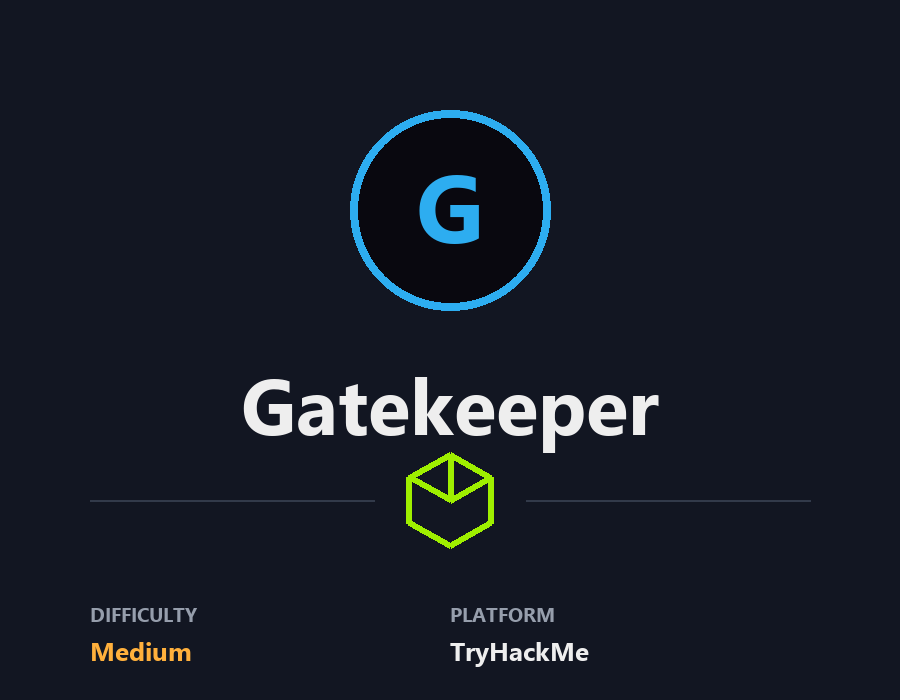

## **Approach the Gates**

Deploy the machine when you are ready to release the Gatekeeper.

## **Defeat the Gatekeeper and pass through the fire.**

Defeat the Gatekeeper to break the chains.  But beware, fire awaits on the other side.  

###### Answer the questions below

Locate and find the User Flag.  
{H4lf_W4y_Th3r3}

Locate and find the Root Flag
{Th3_M4y0r_C0ngr4tul4t3s_U}

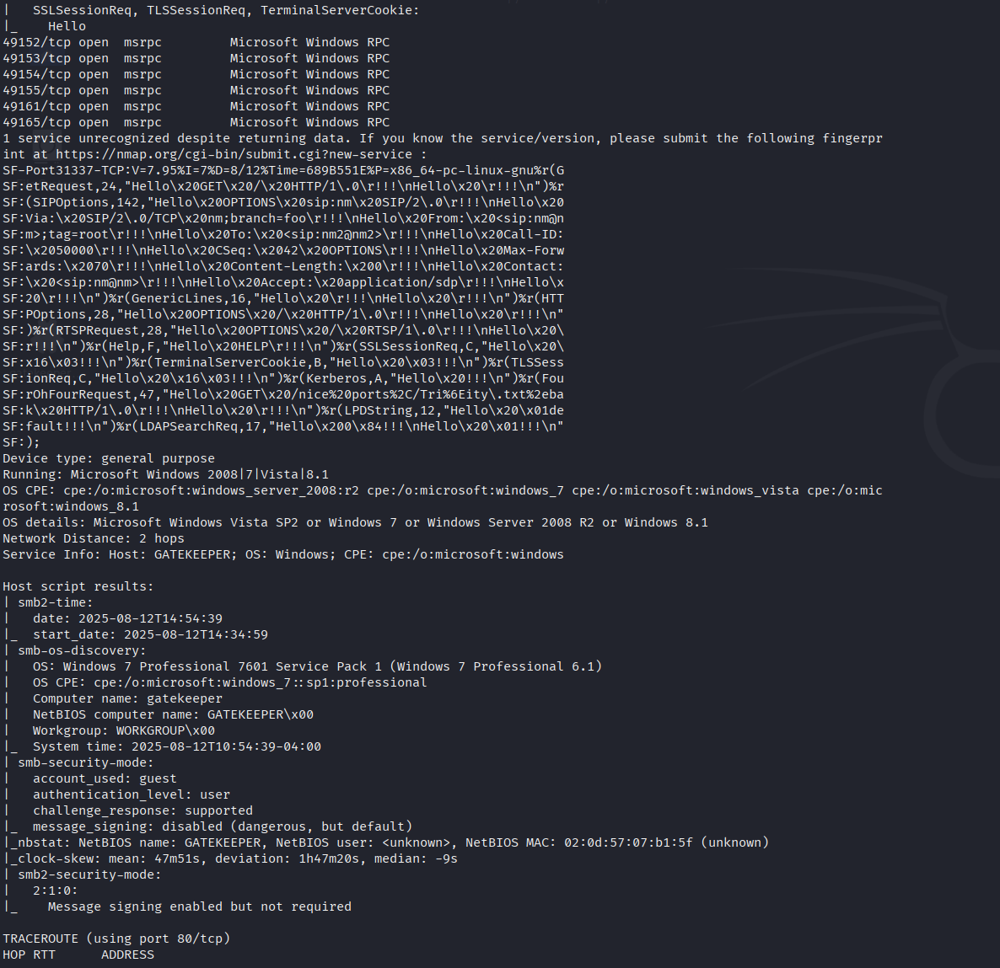

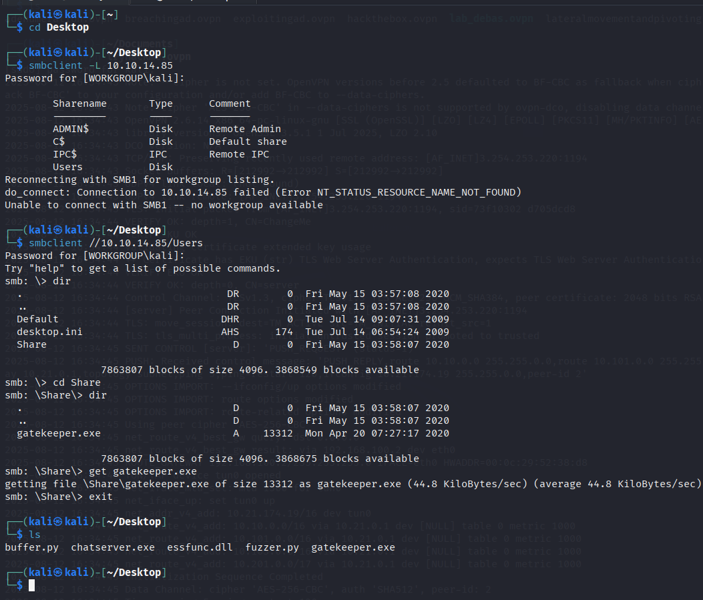

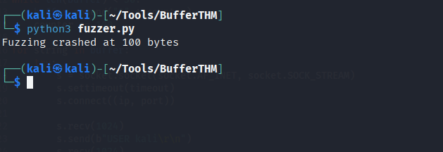

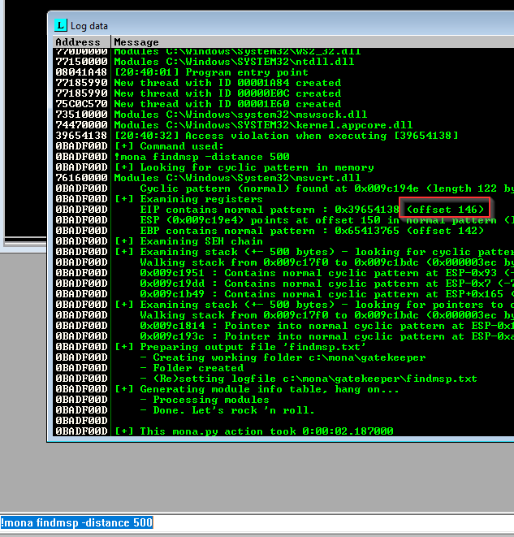

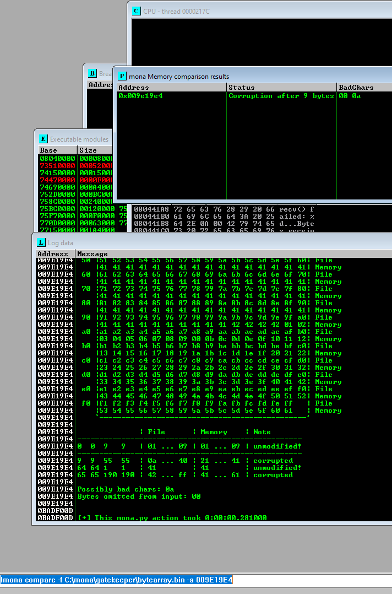

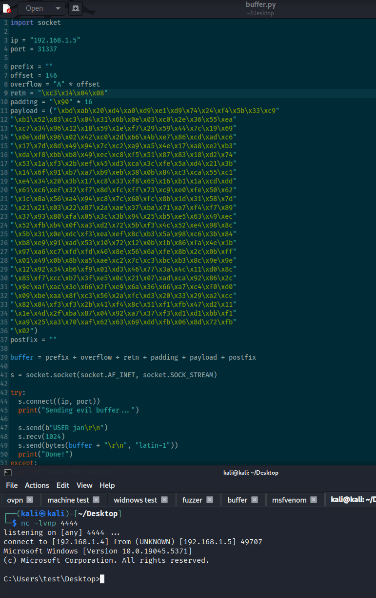

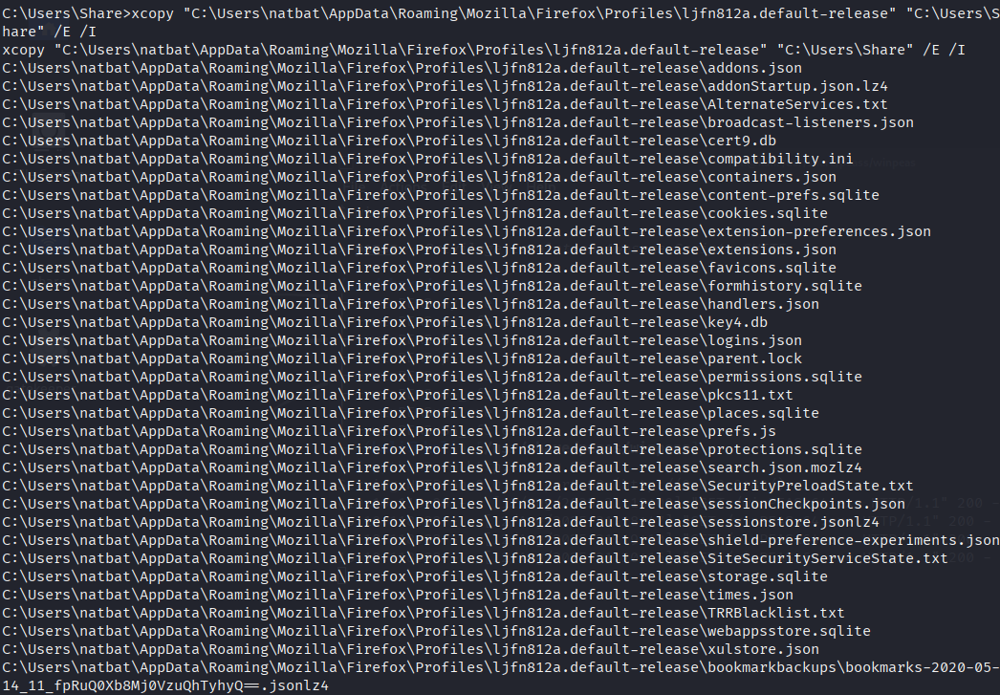

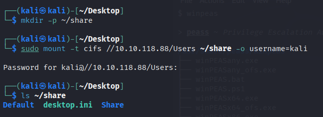

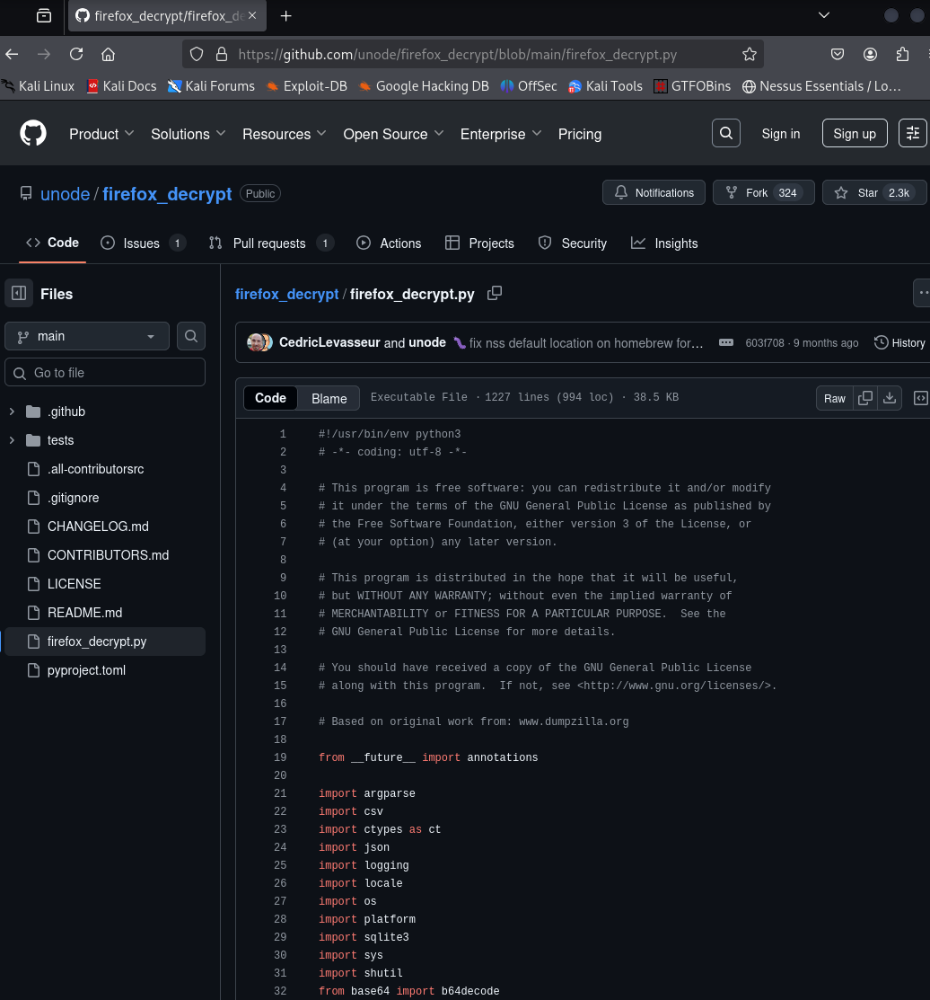
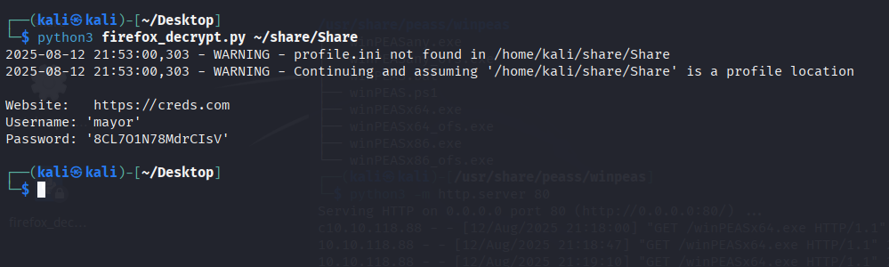
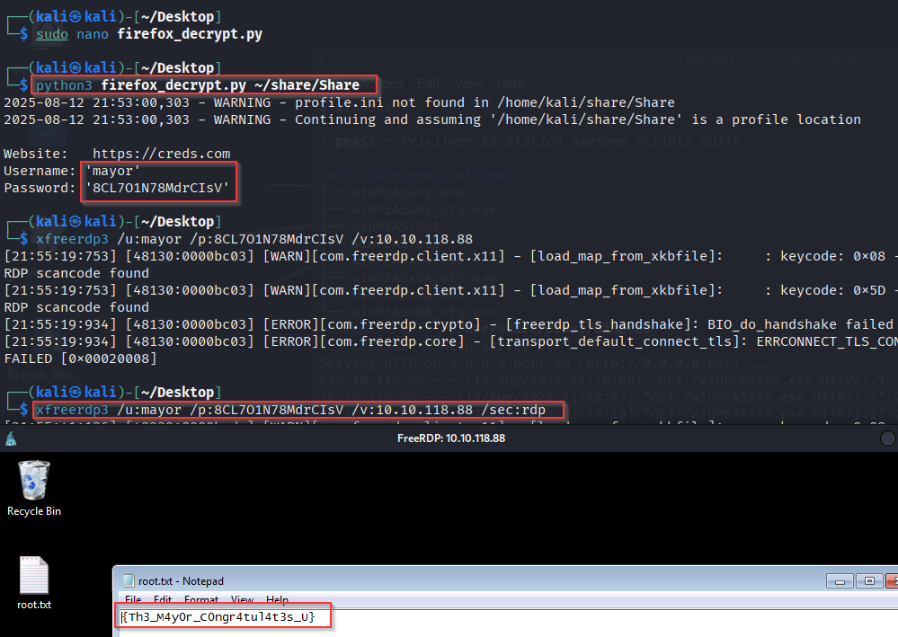
---

**Live version:** [read this write-up on my blog](https://debasjan.github.io/writeups/gatekeeper/)
