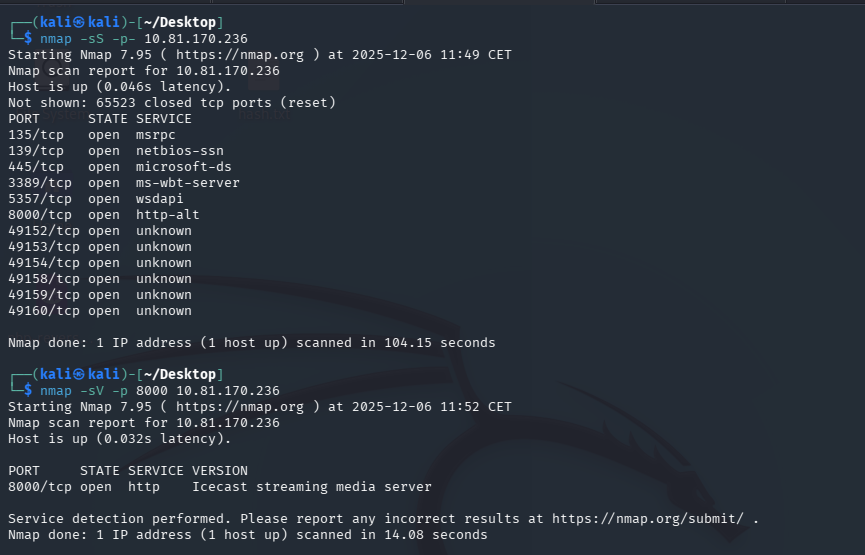
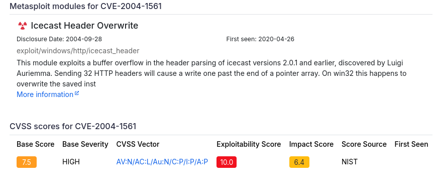

# Ice — TryHackMe

| | |
|---|---|
| **Platform** | TryHackMe |
| **Difficulty** | Easy |
| **OS** | Windows |
| **Status** | ✅ Room explicitly aimed at write-ups/beginners |
| **Key techniques** | Icecast RCE (CVE-2004-1561), Meterpreter local exploit suggester, UAC bypass, process migration for `lsass` access, Mimikatz/Kiwi credential dumping |

---

## TL;DR

A room built around **Icecast**, a streaming media server with a
disclosed, dated remote code execution vulnerability and a ready Metasploit
module. After landing an initial Meterpreter session, the room walks through
a full post-exploitation chain: a UAC-bypass local exploit for SYSTEM,
migrating into a process capable of touching `lsass`, and using Mimikatz
(via Meterpreter's `kiwi` extension) to dump credentials and demonstrate
golden-ticket generation.

---

## Recon & Enumeration

```bash
nmap -sC -sV <TARGET_IP>
```



RDP and an unusual service on port 8000 identified as **Icecast**. Looking
up Icecast vulnerabilities for the disclosed version turned up a known,
scored CVE with public exploitation history.



---

## Foothold / Initial Access

Metasploit ships a module targeting this exact Icecast vulnerability. After
setting the required target options and running the exploit, a Meterpreter
session opened running as the account that owned the Icecast process.

---

## Privilege Escalation

With an initial foothold, Meterpreter's built-in **local exploit suggester**
(`post/multi/recon/local_exploit_suggester`) enumerated the OS build for
applicable privilege escalation modules and returned several candidates. The
first — a UAC bypass via the Event Viewer autoelevate mechanism
(`bypassuac_eventvwr`) — was selected, pointed at the backgrounded session,
and run with a fresh listener IP set. It returned a second, elevated
session.

From that elevated session, `getprivs` confirmed expanded privileges
including the ability to take ownership of files — a strong signal that
further access to protected processes (like `lsass`) was now possible.

To actually reach `lsass`-protected credential material, the session needed
to be running inside a process with matching architecture and sufficient
privilege. The print spooler service (`spoolsv.exe`) fit both requirements
and restarts automatically if it crashes, making it a safe migration target:

```
migrate -N spoolsv.exe
```

Confirming `NT AUTHORITY\SYSTEM` afterward, loading Meterpreter's Mimikatz
integration (`load kiwi`) and running its credential-dumping command
recovered the logged-in user's plaintext password directly from memory —
notable because the room highlights this works even without the user
actively logged in, since a scheduled task runs the vulnerable service under
that account's context, and Windows Defender is disabled on the box.

---

## Post-Exploitation

The room also walks through several standard Meterpreter post-exploitation
capabilities once SYSTEM is held: `hashdump` for local password hashes,
`screenshare`/`record_mic` for live monitoring, `timestomp` for altering
file timestamps (explicitly framed as something to never do outside an
authorized engagement, since it actively harms incident-response timeline
reconstruction), and Mimikatz's **golden ticket** generation — forging a
Kerberos ticket-granting ticket to authenticate as any domain user going
forward, a persistence technique built on having already compromised the
`krbtgt` account's material.

---

## Lessons Learned

- **A local exploit suggester is a fast way to triage privilege escalation
  options** once initial access exists, especially on unfamiliar or dated
  Windows builds.
- **Migrating into a stable, architecture-matched, auto-restarting process**
  (like a spooler service) before touching credential material is safer
  than working from a fragile initial shell.
- **Credentials can be recovered from memory even without an active login
  session**, if a scheduled task or service runs under that account's
  context — `lsass` retains cached material accordingly.

---

## Remediation

- Patch or retire outdated Icecast installations; this CVE has been public
  and fixed for a long time.
- Keep endpoint protection (Windows Defender or equivalent) enabled and
  monitored — several steps in this chain are meaningfully harder with
  active AV/EDR.
- Apply the Event Viewer autoelevate UAC bypass mitigations (patch level
  and UAC configuration) and monitor for `lsass` access attempts from
  unexpected processes.

---

## Tools used

- `nmap`
- Metasploit / Meterpreter (`icecast_header`, `local_exploit_suggester`, `bypassuac_eventvwr`, `kiwi`)

---

**Room:** [TryHackMe — Ice](https://tryhackme.com/room/ice)
