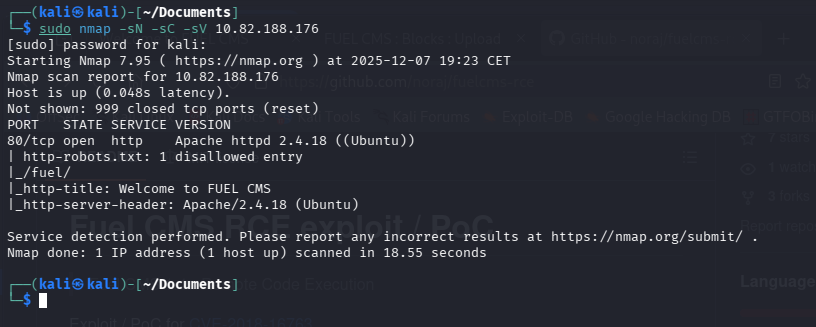
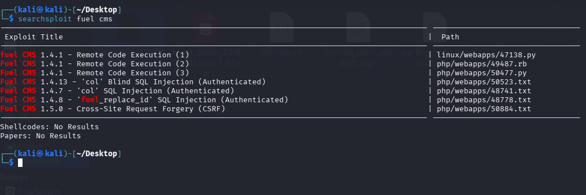

# Ignite — TryHackMe

| | |
|---|---|
| **Platform** | TryHackMe |
| **Difficulty** | Easy |
| **OS** | Linux |
| **Key techniques** | CMS version fingerprinting, public authenticated RCE (Fuel CMS) |

---

## TL;DR

A short, single-application box: the site runs **Fuel CMS**, and its
version and dashboard are enough to identify a public, well-documented
remote code execution exploit for the platform. Running it delivers a shell
directly, and the database configuration reachable from that shell hands
over the root path.

---

## Recon & Enumeration

```bash
nmap -sC -sV <TARGET_IP>
gobuster dir -u http://<TARGET_IP> -w <wordlist>
```



The web application identified itself as **Fuel CMS** through its
dashboard, with the version visible directly on the page.



---

## Foothold / Initial Access

Fuel CMS has a known **authenticated command execution** vulnerability in
its evaluation/preview functionality, with public exploit code available
for the disclosed version. Using the published technique to inject and
execute a command, then a full reverse shell payload, returned a connection
as the web service account:

```bash
nc -lvnp <PORT>
```

Shell flag / user-level access confirmed.

---

## Privilege Escalation

The web application's own database configuration file, reachable from the
foothold shell, contained credentials that provided access to the
underlying database directly, and from there to root-level access on the
box. Root flag retrieved.

---

## Lessons Learned

- **CMS dashboards that disclose their exact version are a direct line to
  `searchsploit`** — Fuel CMS's evaluation feature is a recurring
  real-world RCE pattern for CMS platforms that allow templated/dynamic
  code evaluation.
- **Application configuration files are a first stop after any web-shell
  foothold** — database credentials stored in plaintext config are a common
  and fast route to further access.

---

## Remediation

- Patch Fuel CMS to a version past the disclosed RCE, and disable any
  evaluation/preview feature that executes arbitrary PHP from templates in
  production.
- Store database credentials outside the web root, and restrict
  application config file permissions to the owning service account only.

---

## Tools used

- `nmap`, `gobuster`
- `searchsploit`
- `nc`

---

**See also:** [Web application attacks methodology](../../methodology/web-application-attacks.md)

---

**Room:** [TryHackMe — Ignite](https://tryhackme.com/room/ignite)

**Live version:** [read this write-up on my blog](https://debasjan.github.io/writeups/ignite/)
