# Kenobi — TryHackMe

<p align="left">
  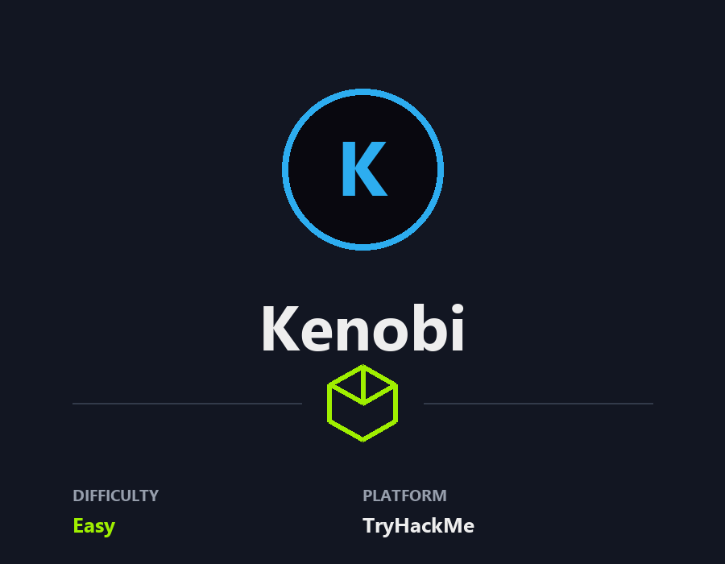
</p>

Walkthrough on exploiting a Linux machine. Enumerate Samba for shares, manipulate a vulnerable version of proftpd and escalate your privileges with path variable manipulation.

## **Deploy the vulnerable machine**

This room will cover accessing a Samba share, manipulating a vulnerable version of proftpd to gain initial access and escalate your privileges to root via an SUID binary.

###### Answer the questions below

Make sure you're connected to our network and deploy the machine

Scan the machine with nmap, how many ports are open?
7

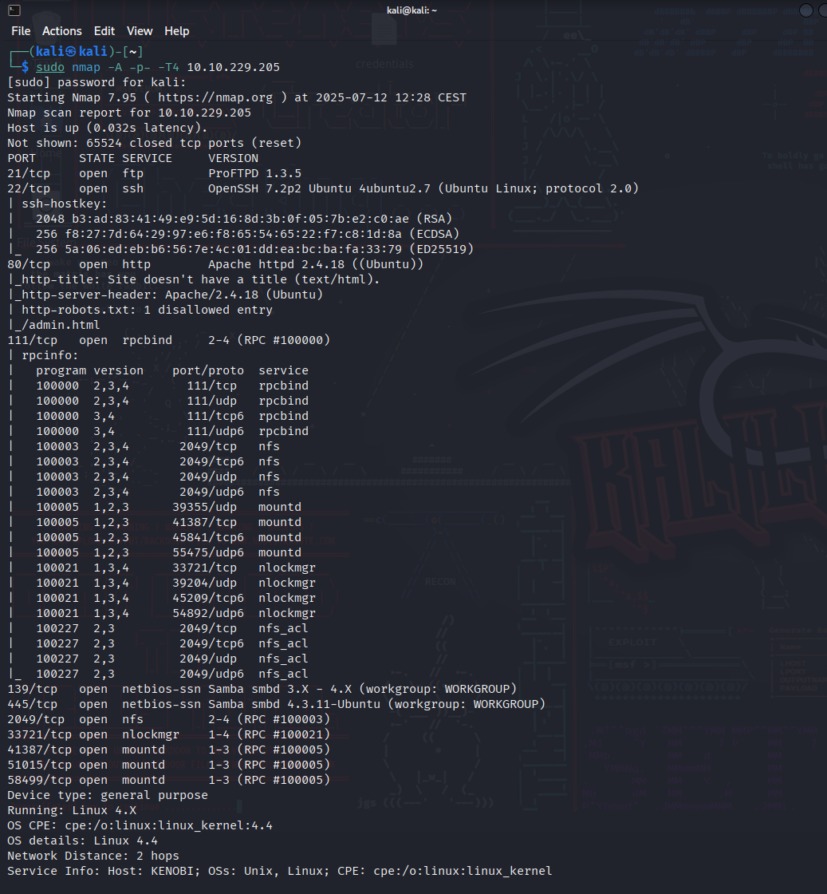


## **Enumerating Samba for shares**

Samba is the standard Windows interoperability suite of programs for Linux and Unix. It allows end users to access and use files, printers and other commonly shared resources on a companies intranet or internet. Its often referred to as a network file system.

Samba is based on the common client/server protocol of Server Message Block (SMB). SMB is developed only for Windows, without Samba, other computer platforms would be isolated from Windows machines, even if they were part of the same network.

###### Answer the questions below

Using nmap we can enumerate a machine for SMB shares.

Nmap has the ability to run to automate a wide variety of networking tasks. There is a script to enumerate shares!

```
nmap -p 445 --script=smb-enum-shares.nse,smb-enum-users.nse 10.10.229.205
```

SMB has two ports, 445 and 139.

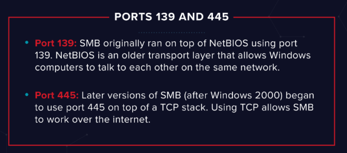

Using the nmap command above, how many shares have been found?
3

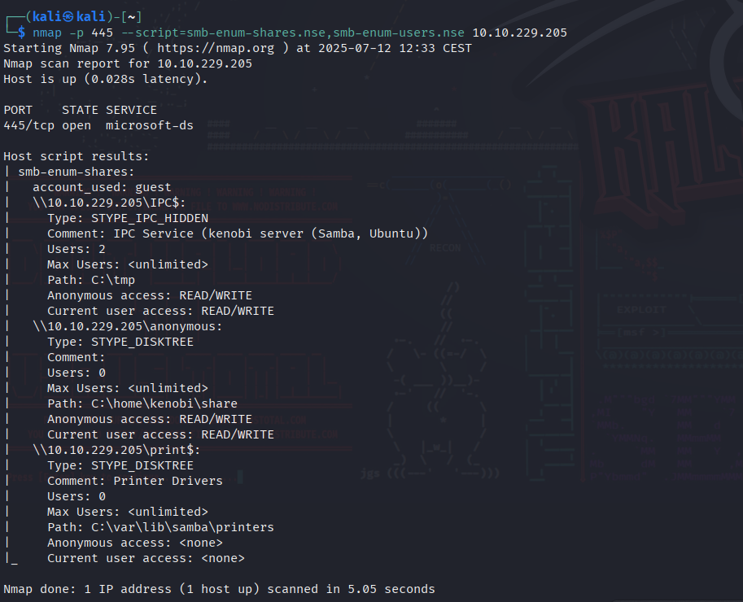

On most distributions of Linux smbclient is already installed. Lets inspect one of the shares.

```
smbclient //10.10.229.205/anonymous
```

Using your machine, connect to the machines network share.

Once you're connected, list the files on the share. What is the file can you see?
log.txt

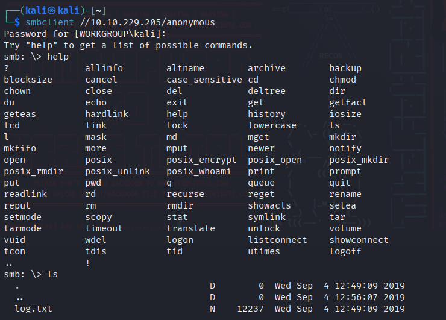

You can recursively download the SMB share too. Submit the username and password as nothing.

```
smbget -R smb://10.10.229.205/anonymous
```

Open the file on the share. There is a few interesting things found.

- Information generated for Kenobi when generating an SSH key for the user
- Information about the ProFTPD server.

What port is FTP running on?
21
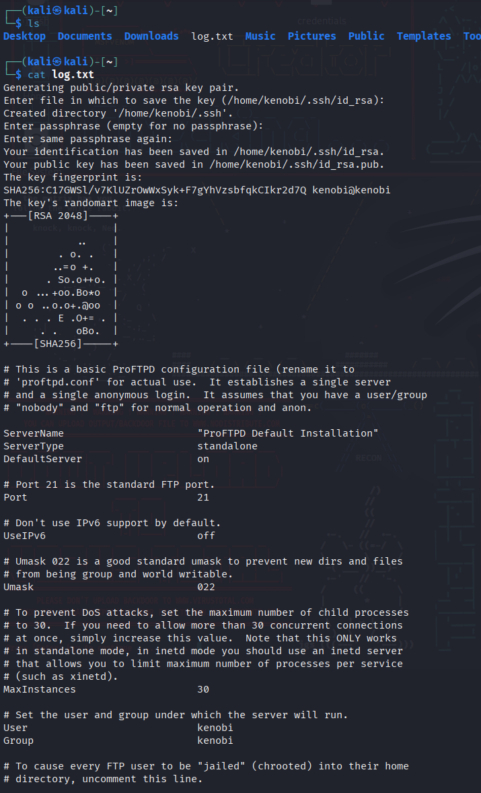

Your earlier nmap port scan will have shown port 111 running the service rpcbind. This is just a server that converts remote procedure call (RPC) program number into universal addresses. When an RPC service is started, it tells rpcbind the address at which it is listening and the RPC program number its prepared to serve. 

In our case, port 111 is access to a network file system. Lets use nmap to enumerate this.

```
nmap -p 111 --script=nfs-ls,nfs-statfs,nfs-showmount 10.10.229.205
```

What mount can we see?
/var
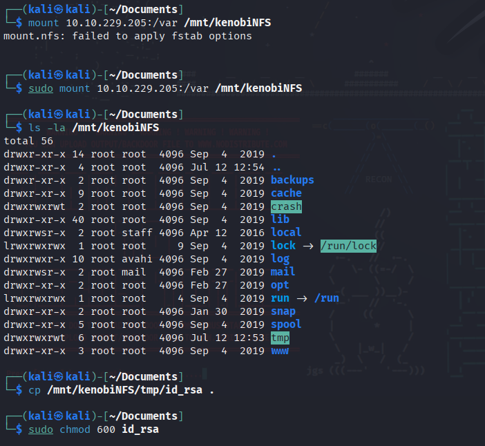


## **Gain initial access with ProFtpd**

ProFtpd is a free and open-source FTP server, compatible with Unix and Windows systems. Its also been vulnerable in the past software versions.

###### Answer the questions below

Lets get the version of ProFtpd. Use netcat to connect to the machine on the FTP port.

What is the version?
1.3.5

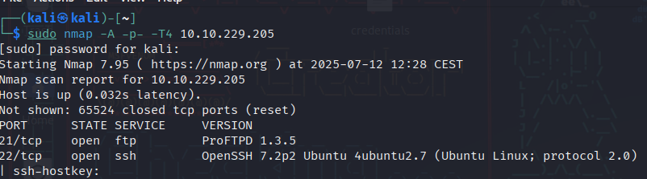

We can use searchsploit to find exploits for a particular software version.

Searchsploit is basically just a command line search tool for exploit-db.com.

How many exploits are there for the ProFTPd running?
4

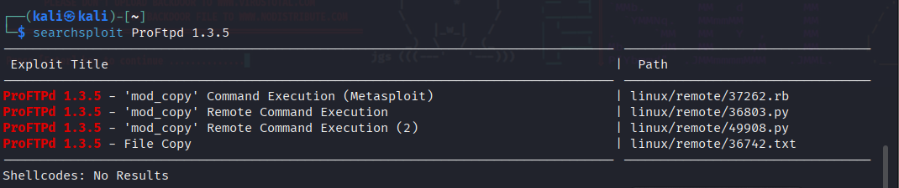

You should have found an exploit from ProFtpd's [mod_copy module](http://www.proftpd.org/docs/contrib/mod_copy.html). 

The mod_copy module implements **SITE CPFR** and **SITE CPTO** commands, which can be used to copy files/directories from one place to another on the server. Any unauthenticated client can leverage these commands to copy files from any part of the filesystem to a chosen destination.

We know that the FTP service is running as the Kenobi user (from the file on the share) and an ssh key is generated for that user.

We're now going to copy Kenobi's private key using SITE CPFR and SITE CPTO commands.

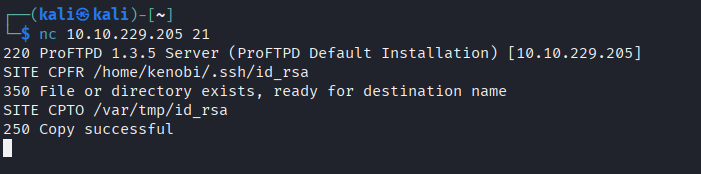

We knew that the /var directory was a mount we could see (task 2, question 4). So we've now moved Kenobi's private key to the /var/tmp directory.

Lets mount the /var/tmp directory to our machine

```
mkdir /mnt/kenobiNFS  
mount 10.10.229.205:/var /mnt/kenobiNFS  
ls -la /mnt/kenobiNFS
```


We now have a network mount on our deployed machine! We can go to /var/tmp and get the private key then login to Kenobi's account.

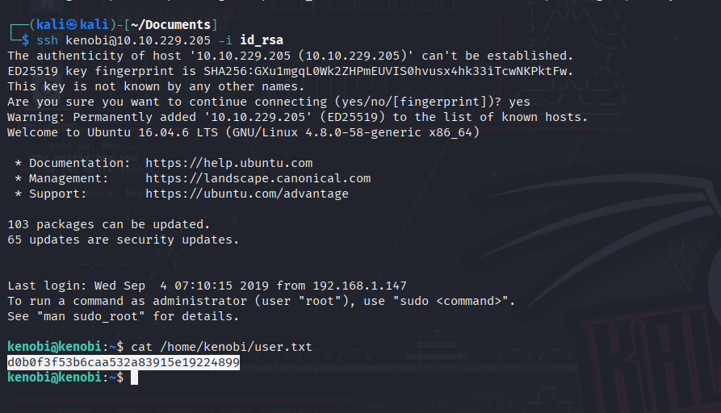

What is Kenobi's user flag (/home/kenobi/user.txt)?
d0b0f3f53b6caa532a83915e19224899


## **Privilege Escalation with Path Variable Manipulation**

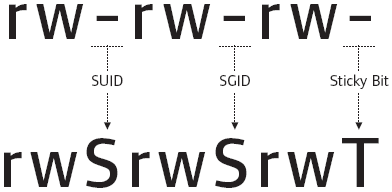

Lets first understand what what SUID, SGID and Sticky Bits are.

|   |   |   |
|---|---|---|
|**Permission**|**On Files**|**On Directories**|
|SUID Bit|User executes the file with permissions of the _file_ owner|-|
|SGID Bit|User executes the file with the permission of the _group_ owner.|File created in directory gets the same group owner.|
|Sticky Bit|No meaning|Users are prevented from deleting files from other users.|

###### Answer the questions below

SUID bits can be dangerous, some binaries such as passwd need to be run with elevated privileges (as its resetting your password on the system), however other custom files could that have the SUID bit can lead to all sorts of issues.

To search the a system for these type of files run the following: find / -perm -u=s -type f 2>/dev/null

What file looks particularly out of the ordinary?
/usr/bin/menu

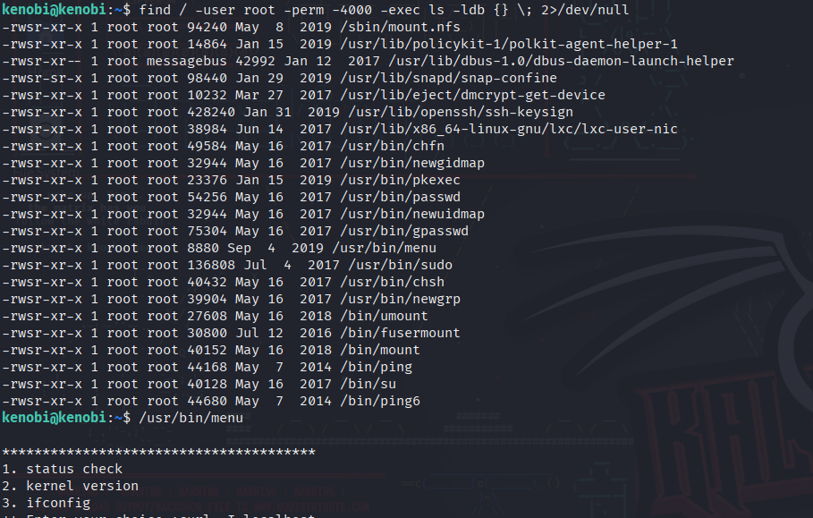

Run the binary, how many options appear?
3

Strings is a command on Linux that looks for human readable strings on a binary.

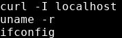

This shows us the binary is running without a full path (e.g. not using /usr/bin/curl or /usr/bin/uname).

As this file runs as the root users privileges, we can manipulate our path gain a root shell.

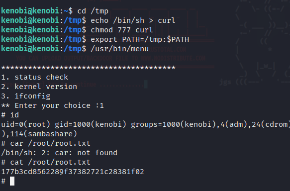

We copied the /bin/sh shell, called it curl, gave it the correct permissions and then put its location in our path. This meant that when the /usr/bin/menu binary was run, its using our path variable to find the "curl" binary.. Which is actually a version of /usr/sh, as well as this file being run as root it runs our shell as root!

What is the root flag (/root/root.txt)?
177b3cd8562289f37382721c28381f02
---

**Live version:** [read this write-up on my blog](https://debasjan.github.io/writeups/kenobi/)
