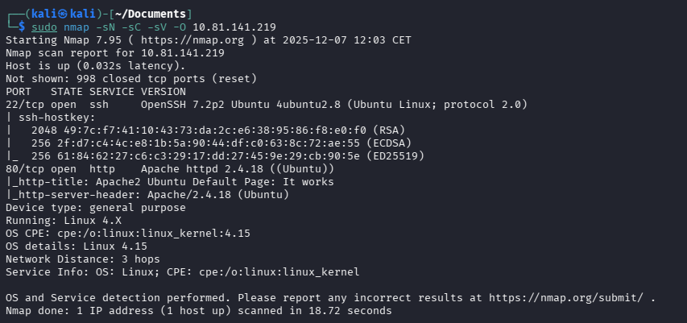
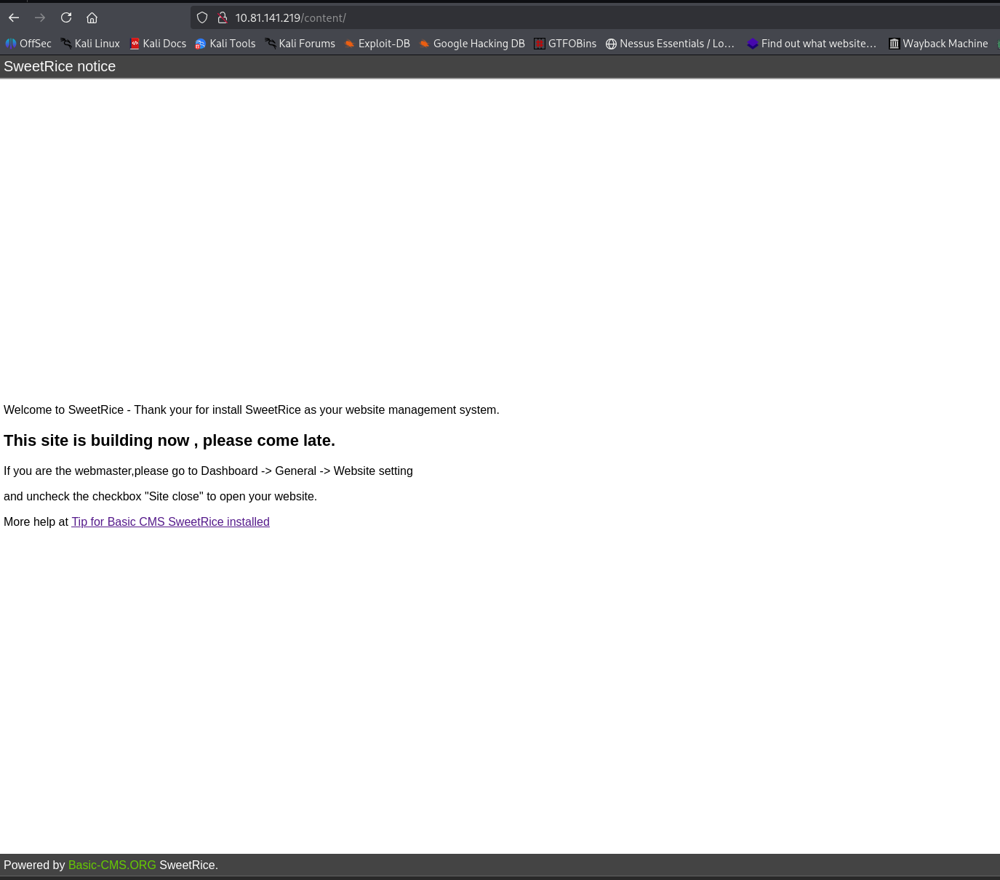
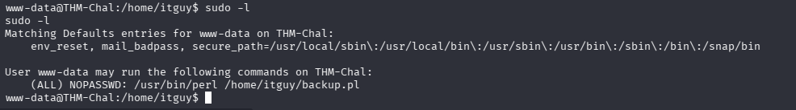

# LazyAdmin — TryHackMe

| | |
|---|---|
| **Platform** | TryHackMe |
| **Difficulty** | Easy |
| **OS** | Linux |
| **Key techniques** | Directory brute-forcing to a CMS admin panel, database credential reuse, `sudo` script abuse via a writable Perl backup script |

---

## TL;DR

LazyAdmin's web root hides an outdated CMS (**SweetRice**) behind
brute-forced directories. A database credential recovered from the CMS's
own files unlocks its admin panel, which accepts a file upload used to
plant a PHP reverse shell. Privilege escalation reuses a `sudo`-permitted
Perl backup script that's writable by the current user — editing it
directly gets root on its next authorized run.

---

## Recon & Enumeration

```bash
nmap -sC -sV <TARGET_IP>
gobuster dir -u http://<TARGET_IP> -w <wordlist>
```



Brute-forcing surfaced a nested path eventually leading to an installation
of **SweetRice CMS**, identifiable by version through its own files/pages.



---

## Foothold / Initial Access

An `inc`/includes-style path exposed a MySQL database credential directly
in a reachable file. Testing that credential against the local database
confirmed it was valid, and cross-referencing it against the CMS's own
admin login worked as well — credential reuse between the database and the
application layer.

Logged into the SweetRice admin panel, a file-upload feature (typically
meant for media/attachments) accepted a PHP file directly. Uploading a
reverse shell and requesting it through its known upload path triggered
execution:

```bash
nc -lvnp <PORT>
```

User flag retrieved.

---

## Privilege Escalation

`sudo -l` showed the current user could run a specific Perl backup script
(`backup.pl`) as root with no password — and critically, that script file
itself was **writable** by the current user. A `sudo`-permitted script that
can be edited by the user running it is equivalent to arbitrary code
execution as the target of the `sudo` rule: replacing its contents with a
reverse-shell command (or simply appending one) and then invoking it through
`sudo` runs the injected code as root:

```bash
sudo /usr/bin/perl /path/to/backup.pl
```



Root shell obtained. Root flag retrieved.

---

## Lessons Learned

- **Directory brute-forcing needs to go more than one level deep** — the
  CMS install here sat behind a nested, non-obvious path that a shallow
  scan would miss.
- **Database credentials found in application files are worth testing
  against the application's own login**, not just the database itself —
  credential reuse across layers is extremely common.
- **A `sudo`-permitted script is only as safe as its own file
  permissions** — if the invoking user can edit the script, the `sudo` rule
  grants arbitrary code execution as its target user regardless of what the
  script was originally meant to do.

---

## Remediation

- Never store database credentials in a web-reachable file; use environment
  variables or a secrets manager instead.
- Ensure any script granted through `sudo` is owned by and writable only by
  root (or another suitably trusted account), never by the user permitted
  to execute it.
- Restrict CMS upload features to expected file types, validated by content
  rather than extension.

---

## Tools used

- `nmap`, `gobuster`
- `nc`
- `sudo`, `perl`

---

**See also:** [Linux privilege escalation methodology](../../methodology/linux-privesc.md)

---

**Room:** [TryHackMe — LazyAdmin](https://tryhackme.com/room/lazyadmin)

**Live version:** [read this write-up on my blog](https://debasjan.github.io/writeups/lazyadmin/)
