# Mr Robot CTF — TryHackMe

<p align="left">
  
</p>

## **Hack the machine**


Can you root this Mr. Robot styled machine? This is a virtual machine meant for beginners/intermediate users. There are 3 hidden keys located on the machine, can you find them?

###### Answer the questions below

What is key 1?
073403c8a58a1f80d943455fb30724b9

What is key 2?
822c73956184f694993bede3eb39f959

What is key 3?
04787ddef27c3dee1ee161b21670b4e4

# Mr-Robot-CTF-Writeup

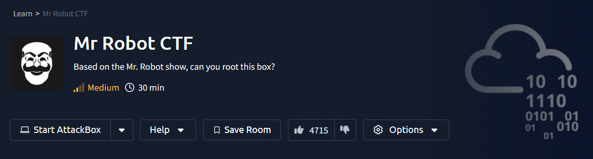

The goal of this "Mr Robot" machine is to find three hidden keys and obtain root access. Below is an organized writeup with the commands used and a short explanation for each important step.

### 1. Information gathering

First thing first, let’s scan the machine with Nmap to see its open ports:
```
nmap -A -p- -T4 10.10.48.88
```
Explanation: `-p-` scans all ports, `-A` performs OS/service detection and script scans, `-T4` speeds up the scan.

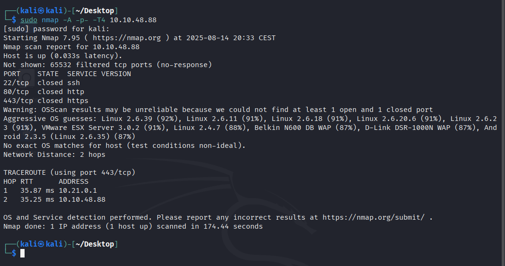

Result: open ports: 22 (SSH), 80 (HTTP), 443 (HTTPS).


### 2. HTTP enumeration — finding hidden directories

The website basically tells you a few things, and lets you input some commands. After a quick test, those don’t seem very useful.
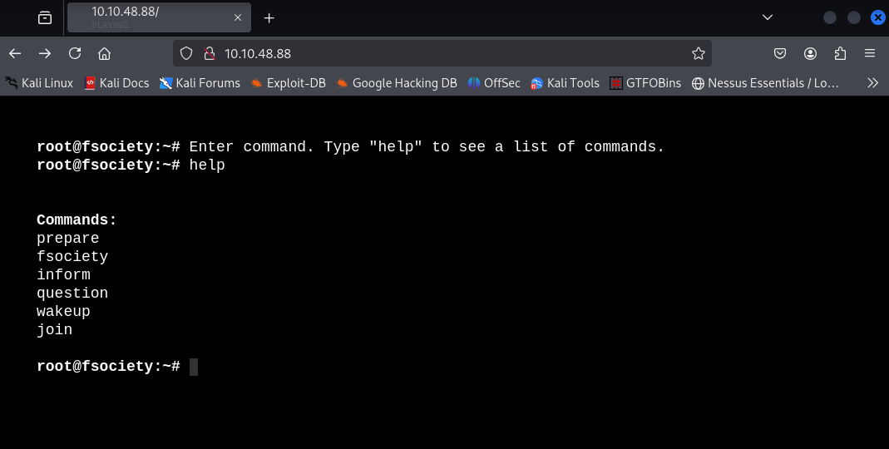

So while I explore it, let’s run gobuster to discover hidden files and directories:

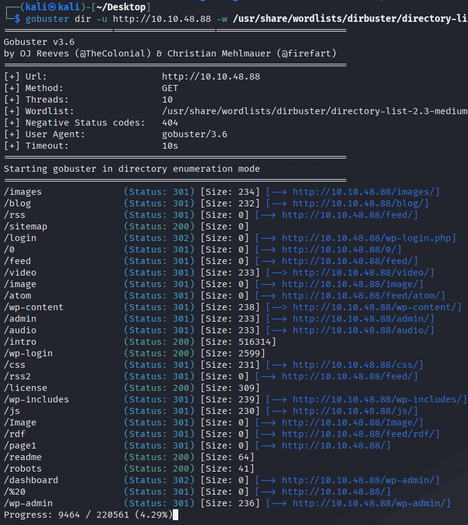

So, I got a few interesting directories:
	-/sitemap
	-/wp-login
	-/readme
	-/robots

I checked first robots and got first key:
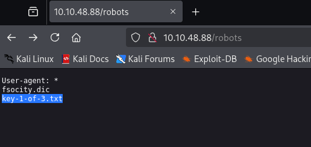
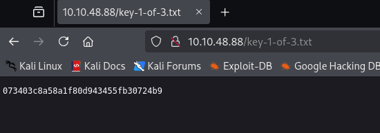

I saw also a fsocity.dic directorie but I can't do nothing with it.
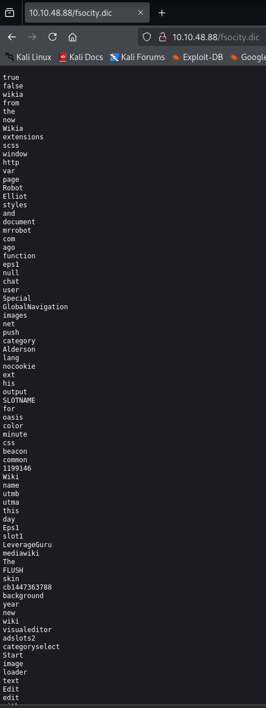

### 3. Further site exploration — base64 discovery
I've verified the license directory and I got a base64 string that may be an encrypted password. I could find it using a Inspector to check what is hidden.

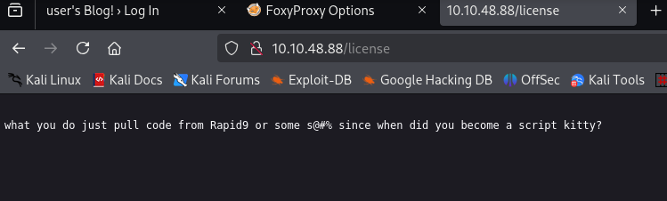
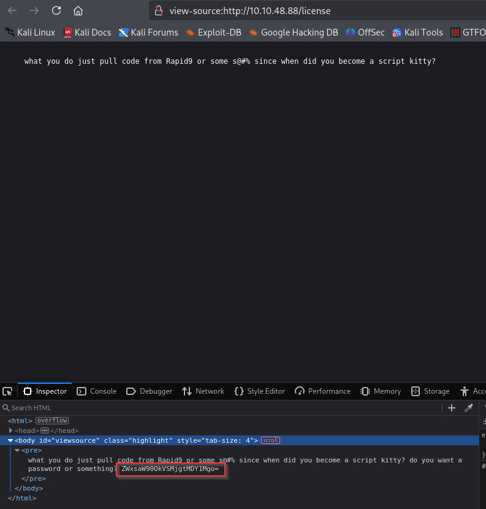

So, I decoded the base64 code and i got a username with a password.
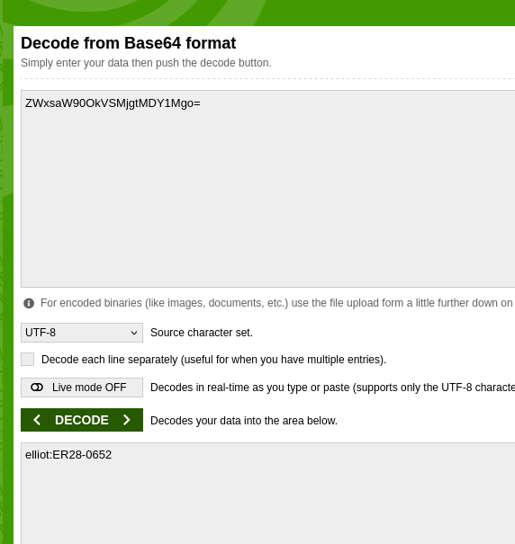

### 4. WordPress — login and upload reverse shell
Using the discovered credentials, log in at `/wp-login.php` as `elliot`.

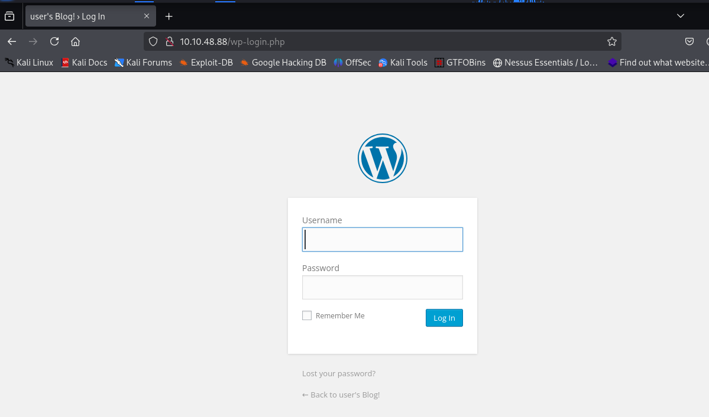
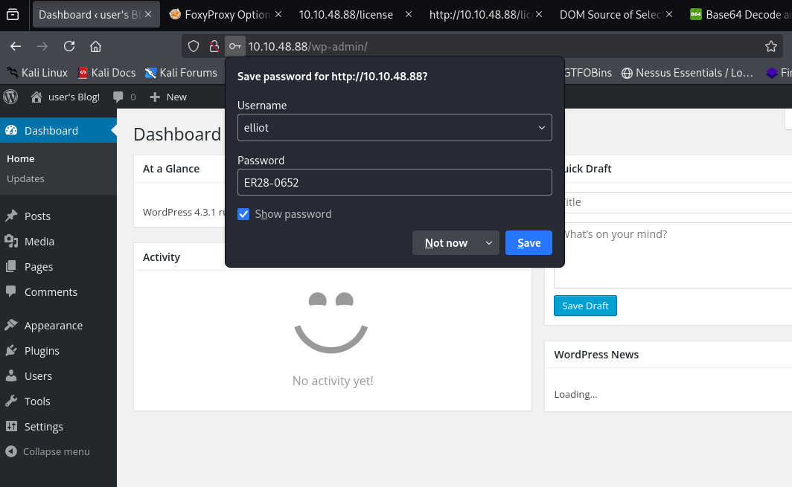

After exploring wp-admin I noticed that we can edit themes. To do that I go to : Appearance –> Editor –> then on the right click Archives. Let’s try to get a reverse shell that way.
`https://github.com/pentestmonkey/php-reverse-shell/blob/master/php-reverse-shell.ph`

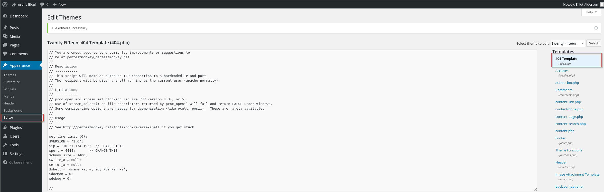

After loading the reverse shell script, I launched the website before that, setting the port 4444 listener on the attacking machine to gain a connection.
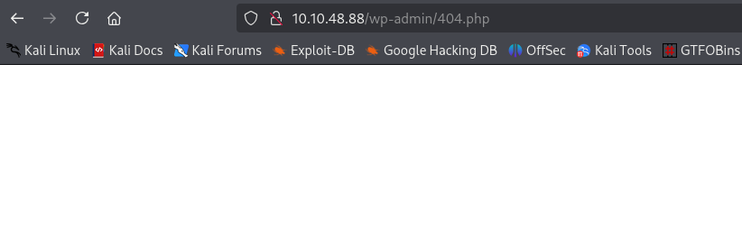

The script ran and gained a shell on the machines.
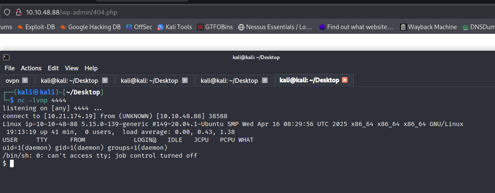

### 5. Stabilize the shell
After getting a simple shell, stabilize it to an interactive TTY:
```
python3 -c 'import pty; pty.spawn("/bin/bash")'
```

### 6. Recon on the machine and initial files
There were two users: `robot` and `ubuntu`. In `/home/robot` I found two files: one contained the second key (permission-limited) and the other contained an MD5 hash of the robot's password.

#### 6.1 Viewing the hash file
```
cat password.raw-md5
```
The displayed MD5 hash was saved to a file for cracking.

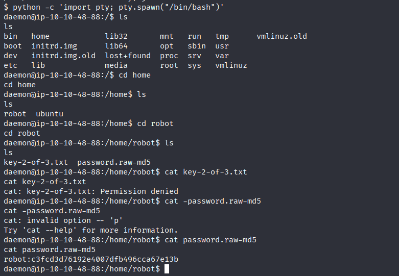

### 7. Cracking the MD5
Use hashcat or john with rockyou to crack the MD5:

```
hashcat -a 0 -m 0 hash.txt /usr/share/wordlists/rockyou.txt
```

The recovered password was:: abcdefghijklmnopqrstuvwxyz
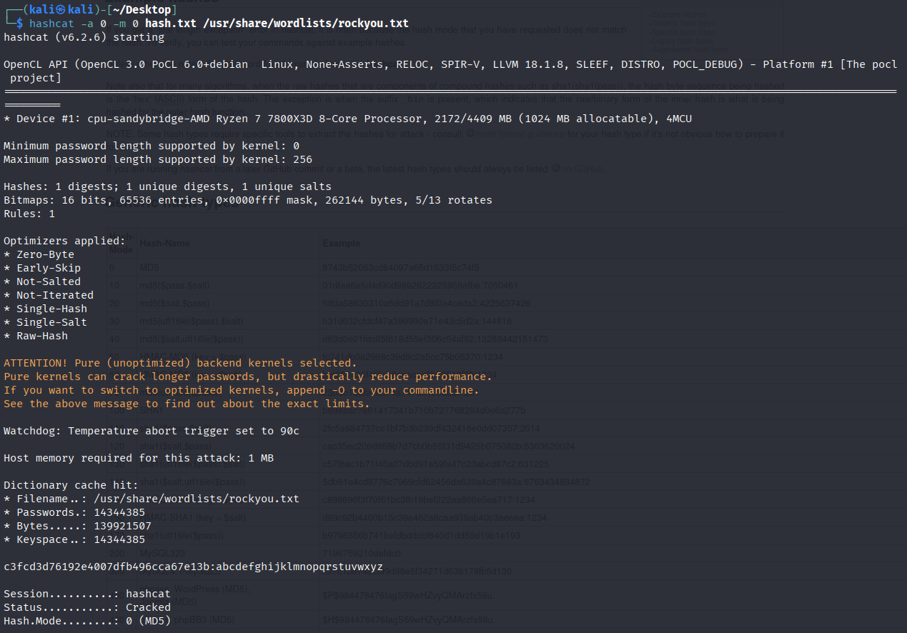

### 8. SSH to robot

With username `robot` and the cracked password:
```
ssh robot@10.10.48.88 - p22
```
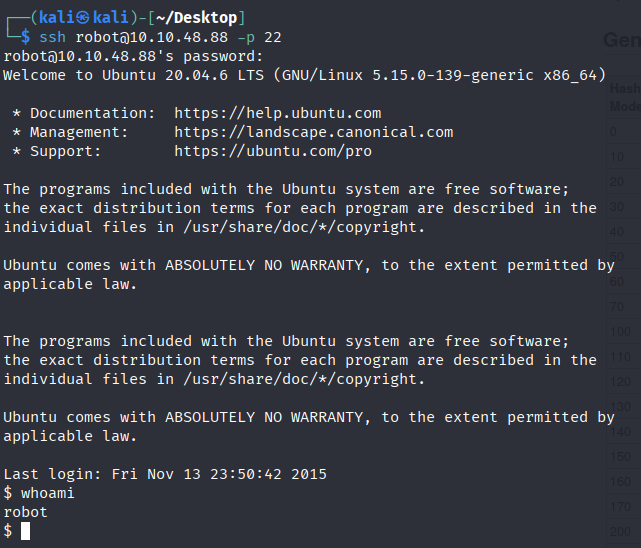

After logging in, I could read the second key in `/home/robot`.
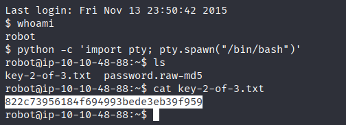

### 9. Privilege escalation — finding SUID binaries
To find files with the SUID bit set:

One of the SUID binaries was `nmap` (or an nmap binary version that could be used interactively). The challenge hint mentioned nmap.
```
find / -perm -u=s -type f 2>/dev/null
```
- `find` – a command used to search for files and directories in the system.
- `/` – the starting directory for the search. Here, it means the entire filesystem, starting from the root directory.
- - `-perm` – filter by file permissions.
- `-u=s` – search for files with the SUID bit (Set User ID) set.
- `-type f` Limits results to regular files only (not directories or symbolic links).
- `2>` – redirects the error stream (stderr)..
- `/dev/null` – a "black hole" where all data ends up.

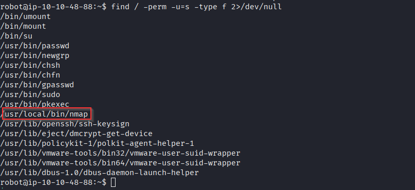

Note that we have "nmap" as a hint for the third key. So after some investigation, I found there is a weakness in Nmap, which you can set up into interactive mode. That allows to run shell commands inside of nmap

Technique reference:: `https://gtfobins.github.io/gtfobins/nmap/
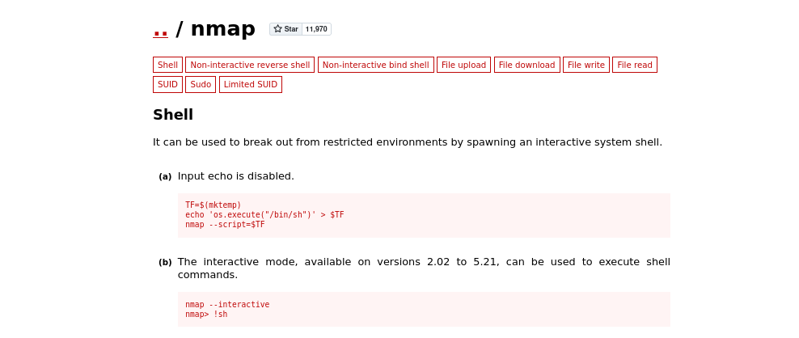

### 10. Getting root and the third key
After escalating to root, read the third key (usually in `/root`):
cat /root/root.txt
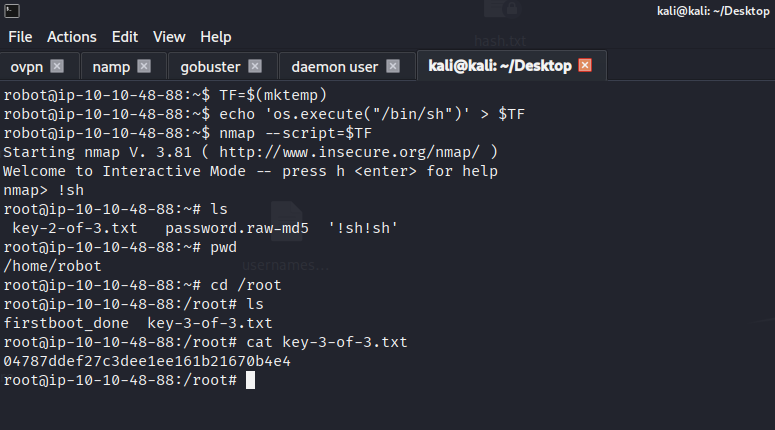
---

**Live version:** [read this write-up on my blog](https://debasjan.github.io/writeups/mr-robot-ctf/)
