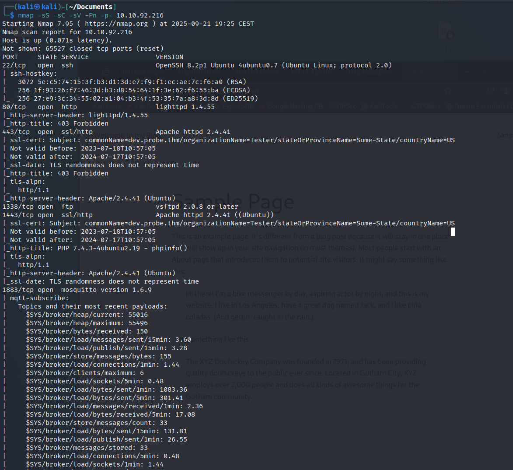
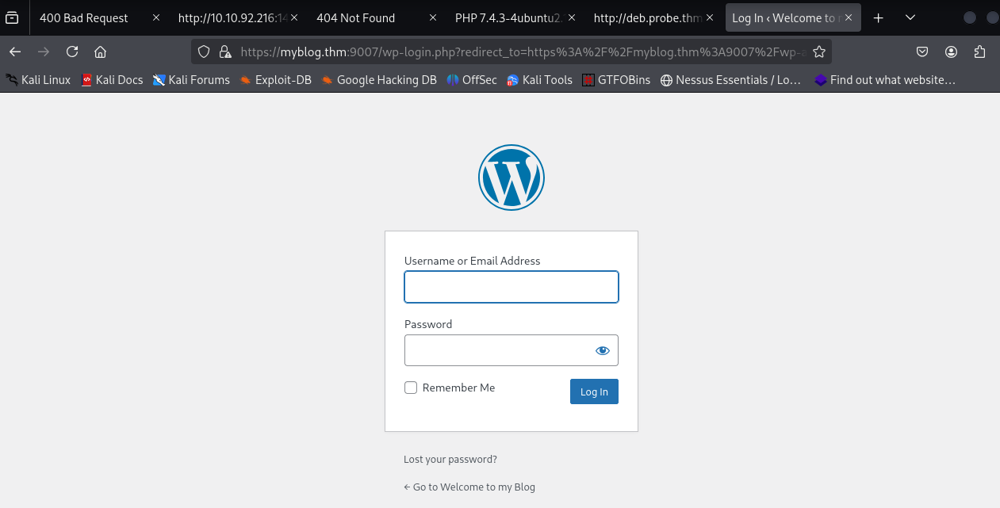

# Probe — TryHackMe

| | |
|---|---|
| **Platform** | TryHackMe |
| **Difficulty** | Easy |
| **OS** | Linux |
| **Status** | ✅ Room explicitly aimed at write-ups/beginners |
| **Key techniques** | Multi-service fingerprinting, SSL certificate metadata inspection, CMS/version identification (WordPress, phpMyAdmin), Nikto vulnerability scanning |

---

## TL;DR

Probe is a pure **enumeration** room — there's no exploitation or shell to
obtain, just a target with an unusually wide service footprint (multiple
web servers on different ports, FTP, a database admin panel, a
self-signed-cert site) to fully fingerprint. The exercise is in being
methodical: checking every open port's banner, every certificate's
metadata, and every web root's version-disclosing files rather than
stopping at the first web server found.

---

## Recon & Enumeration

```bash
nmap -sC -sV -p- <TARGET_IP>
```

A notably large number of open ports for an "easy" box — several distinct
HTTP services on non-standard ports, FTP on a non-default port, and a
self-signed HTTPS site.



**Web fingerprinting, port by port:**

- The standard HTTP port ran `lighttpd`, identified from its response
  headers.
- A separate port served a full Apache instance hosting **WordPress**,
  with the exact CMS version and admin username both readable from
  standard WordPress fingerprinting (REST API/meta generator tag and
  author archive enumeration).

  
- Another port exposed **phpMyAdmin**, identified by its default login
  page.
- The self-signed HTTPS site's **certificate metadata** (subject/contact
  email) was inspected directly — SSL certificates are a frequently
  overlooked source of hostnames and organizational/contact information.
- **Nikto** against the web roots flagged a licensing file
  (`OSVDB-3092`), a common fingerprint for identifying blogging-platform
  software by its bundled licensing artifact.
- The FTP service's own connection banner disclosed a value directly in
  its welcome text.

---

## Lessons Learned

- **A wide-open service footprint rewards methodical, port-by-port
  fingerprinting** over rushing to the first web app found — several
  distinct findings here were only reachable by checking every port
  individually.
- **SSL/TLS certificates are enumeration data, not just encryption** — the
  subject and contact fields on a self-signed cert can leak hostnames,
  environment names, and organizational details.
- **Service banners (FTP welcome text, HTTP response headers) are free
  information disclosure** that's easy to skip past if only default nmap
  script output is reviewed.

---

## Remediation

- Minimize the number of distinct services/admin panels exposed on a
  single host; each one is independent attack surface.
- Strip identifying metadata (contact emails, internal hostnames) from
  self-signed certificates used outside of pure internal testing.
- Suppress version banners and licensing files that allow fingerprinting
  CMS platforms and their exact release version.

---

**Room:** [TryHackMe — Probe](https://tryhackme.com/room/probe)
