# Retro — TryHackMe

<p align="left">
  
</p>

| | |
|---|---|
| **Platform** | TryHackMe |
| **Difficulty** | Hard |
| **OS** | Windows |
| **Key techniques** | WordPress recon (comments as intel), Hydra login brute-force, RDP with recovered creds, **CVE-2019-1388** UAC bypass via `hhupd.exe` |

---

## TL;DR

Retro is short and gimmicky, but it teaches one very good lesson:
**read the WordPress comments**, they're intel too.

1. Web enum: `/retro` is a WordPress install with the "Cool Retro
   Term" aesthetic. The blog posts include a `wade` account.
2. The admin login is stubborn; a Burp-captured login request feeds
   `hydra` and gives `wade`'s password — but there's a shortcut. One
   post's **comments** contain a note where `wade` mentions the
   password out loud.
3. RDP in as `wade` → user.txt is on his desktop.
4. On the desktop is an `hhupd.exe` installer. Right-clicking it in
   the Windows Certificate Dialog surfaces a hyperlink; opening it
   launches a browser as **SYSTEM** — the classic **CVE-2019-1388**
   UAC bypass. From that SYSTEM browser I "Save as" a `.bat`
   spawning `cmd.exe`, and root.txt is done.

---

## Recon

```bash
nmap -sC -sV -p- 10.10.62.207
```

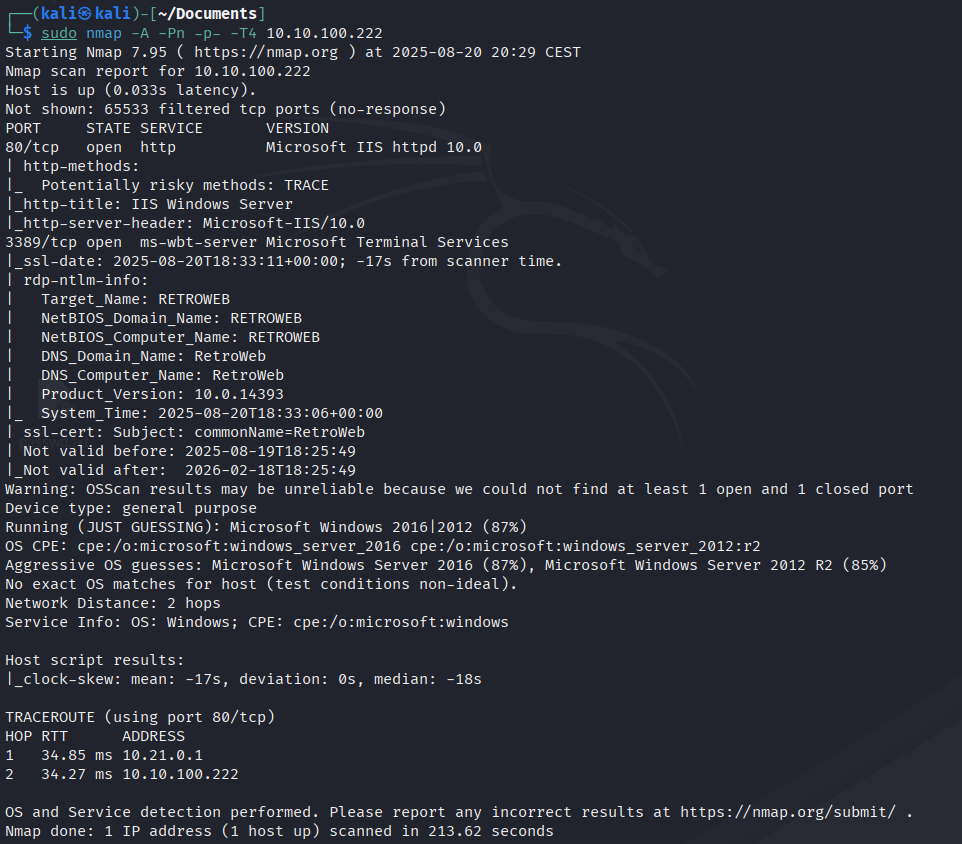

Open ports: **80 (IIS), 3389 (RDP)**. A Windows box that speaks RDP
before it speaks SMB is a strong hint I'll be logging in with a real
credential, not stealing an SMB share.

---

## Web enumeration

Port 80 is a plain IIS page. Directory brute:

```bash
gobuster dir -u http://10.10.62.207 -w /usr/share/wordlists/dirbuster/directory-list-2.3-medium.txt
```


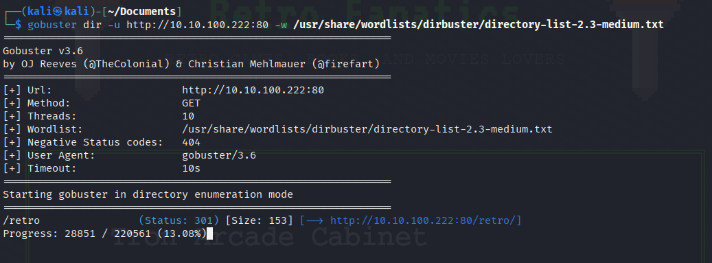

`/retro/` is a WordPress blog:


Poking at the posts and skimming the front page — the blog author is
`wade`, and the site's title/description are cluttered with Ready
Player One / 80s references. That "Cool Retro Term" tag on one post
is the one to open.

Trying the login on `/retro/wp-login.php` with obvious guesses fails:

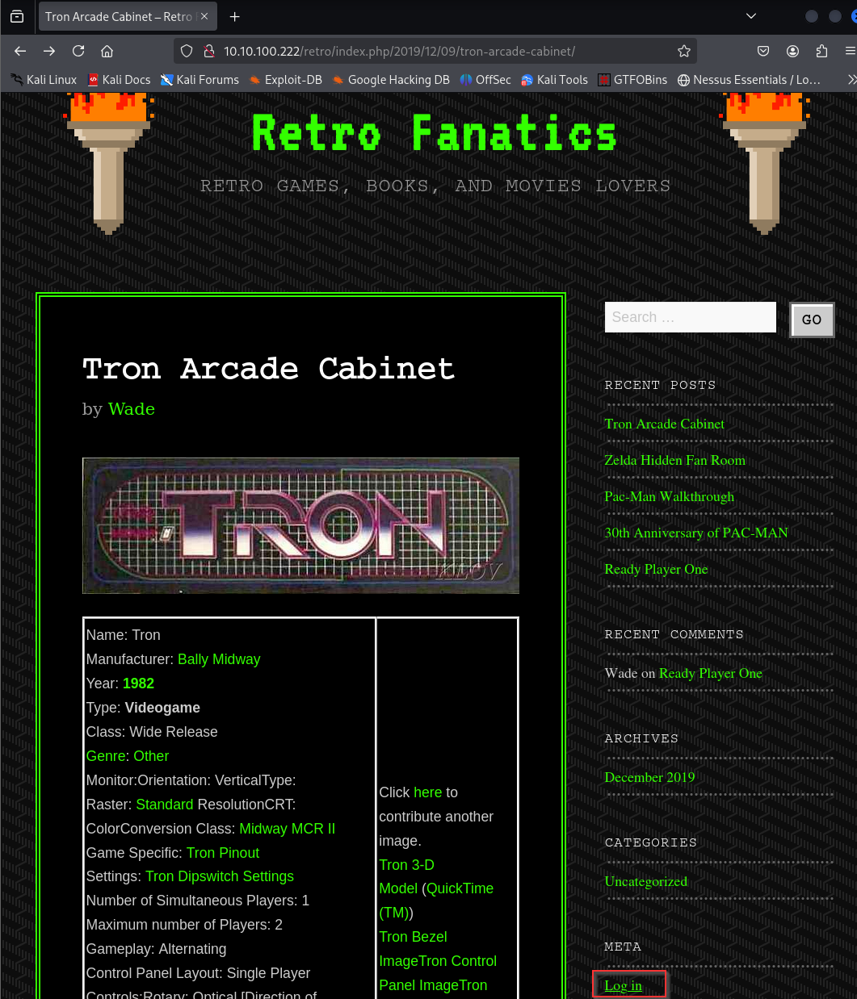
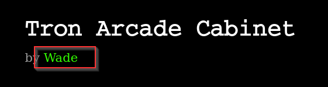
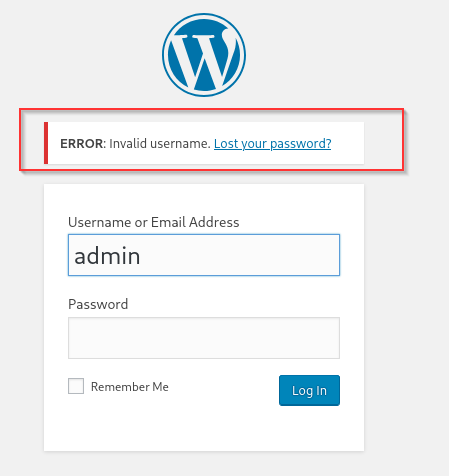
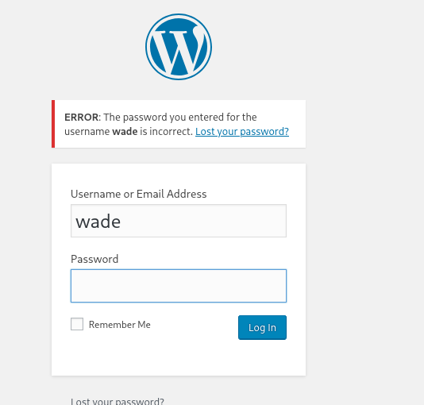

---

## Credential — Hydra, or just read the comments

**The right answer:** read the comments on the "Cool Retro Term" post.
Wade left a self-note asking the admin to reset his password back to
what he uses everywhere else. The password is right there.

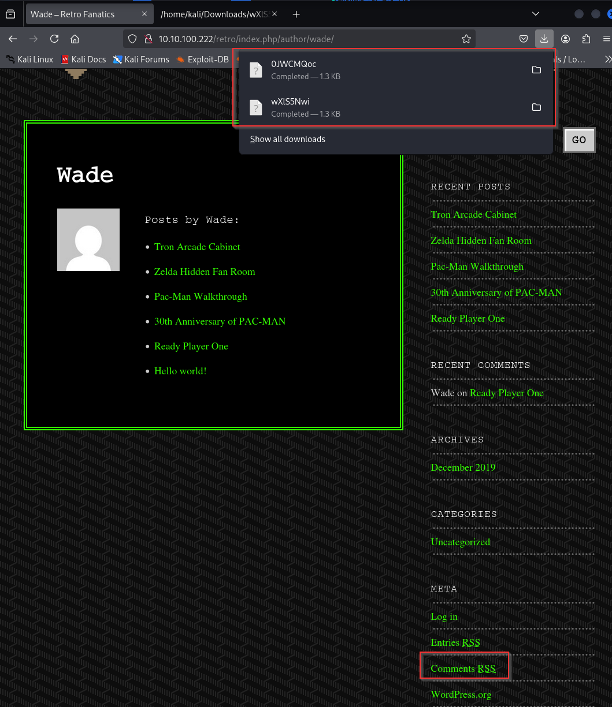


**The tool answer:** if I hadn't spotted the comment, Hydra against
the WordPress login also cracks it. Capturing the login request in
Burp gives me the exact POST body:


```bash
hydra -l wade -P /usr/share/wordlists/rockyou.txt 10.10.62.207 \
  http-post-form "/retro/wp-login.php:log=^USER^&pwd=^PASS^:F=Invalid username"
```

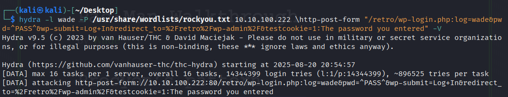

Confirmed the credential works on the WordPress dashboard:

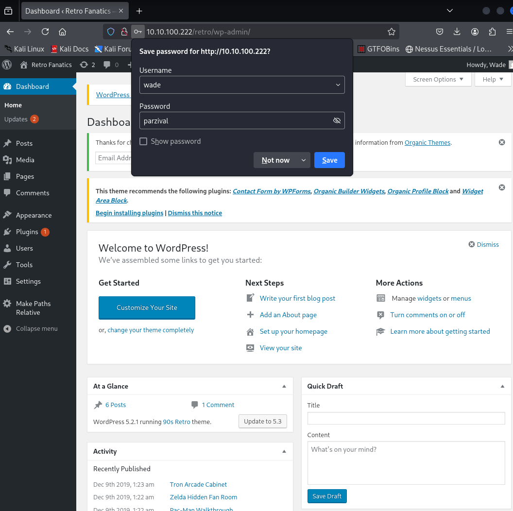

---

## Foothold — RDP

Same password, RDP:

```bash
xfreerdp /u:wade /p:'<password>' /v:10.10.62.207 +clipboard /dynamic-resolution
```


`user.txt` is on the desktop:

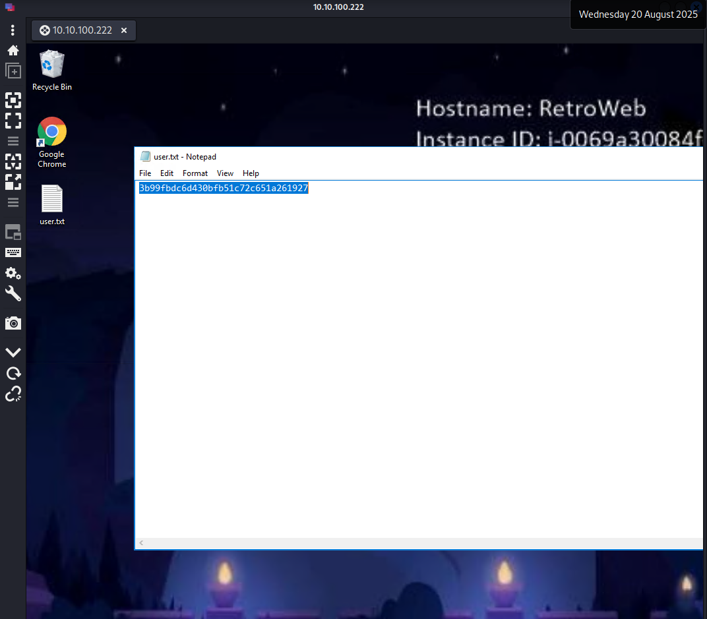

---

## Privilege Escalation — CVE-2019-1388 via `hhupd.exe`

Also on the desktop is an `hhupd.exe` installer. It runs as an
elevated MSI — and it uses the old Windows Certificate Dialog, which
is vulnerable to **CVE-2019-1388**: right-clicking the "Show
information about the certificate" link (published by Verisign, back
when this ran) opens a hyperlink from within a **SYSTEM** process,
which browses out to a URL through Internet Explorer running as
`NT AUTHORITY\SYSTEM`.

Reference PoC: <https://github.com/jas502n/CVE-2019-1388>

Trigger the installer, get to the UAC certificate dialog, follow the
right-click chain:

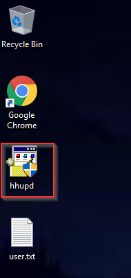
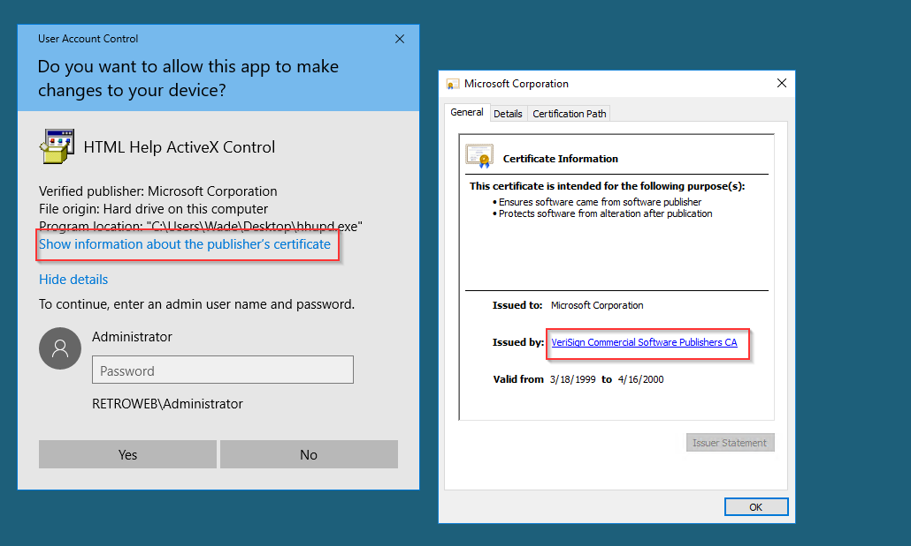
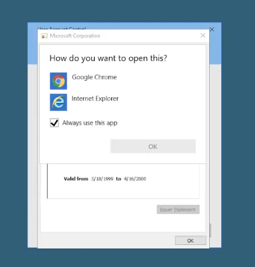

Internet Explorer opens as SYSTEM. From there I use **File → Save
as** to write a file to disk with an unrestricted picker:

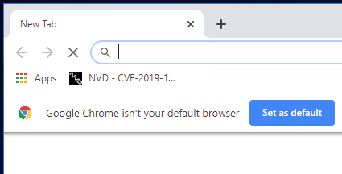
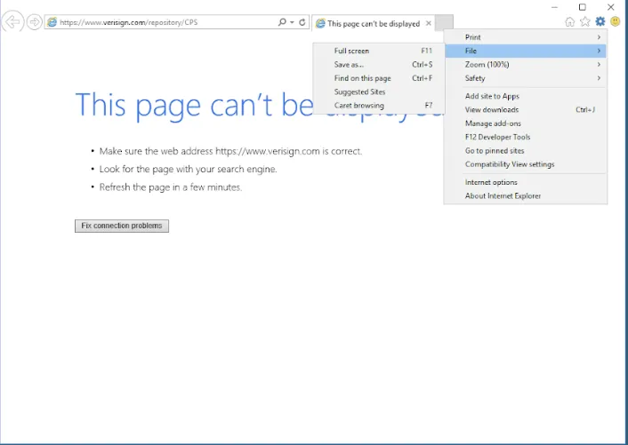
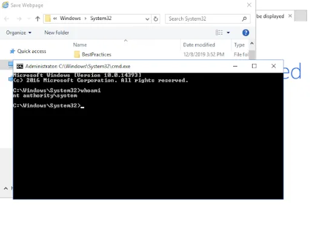

Save the "page" as `cmd.bat` (or overwrite an admin binary if you
prefer); double-click it — the resulting `cmd.exe` is SYSTEM.

`root.txt` is under `C:\Users\Administrator\Desktop\root.txt`:

```
7958b569565d7bd88d10c6f22d1c4063
```

---

## Lessons Learned

- **Comments are recon.** WordPress comments, forum threads, README
  files, and Git history are pages designed for humans — and humans
  leak. Read them before you brute-force anything.
- **A Hydra `http-post-form` against WordPress is worth memorising:**
  the failure string is stable enough (`Invalid username`,
  `The password you entered`) that it becomes a one-liner. It's
  slower than a good enum-guess, but reliable.
- **CVE-2019-1388 is the "outdated hhupd.exe on the desktop"
  fingerprint.** Any elevated installer with a certificate dialog
  from before the 2019 patch is worth right-clicking on.
- **Any process running as SYSTEM that shows a Windows dialog is a
  potential privesc.** The Save-As dialog, the printer picker, the
  browser — anything that lets you spawn a follow-up file operation.

---

## Remediation

- **Patch CVE-2019-1388** (or refuse to ship any executable that
  triggers the pre-2019 certificate dialog).
- **Never leave installers on desktops.** If a patch requires a
  human to run an elevated installer, it belongs on a controlled
  share, not the login desktop.
- **Restrict RDP to jump hosts** and enforce Network Level
  Authentication + 2FA. RDP being open on the Internet is what
  turned "read the WordPress comments" into full remote compromise.
- **Rate-limit `wp-login.php`** or use a WAF plugin. Hydra tried
  hundreds of passwords with no throttle.

---

## Tools used

- `nmap`, `gobuster`
- Burp Suite (login-request capture)
- `hydra` (`http-post-form`)
- `xfreerdp`
- CVE-2019-1388 UAC-bypass PoC / manual exploit
---

**Live version:** [read this write-up on my blog](https://debasjan.github.io/writeups/retro/)
