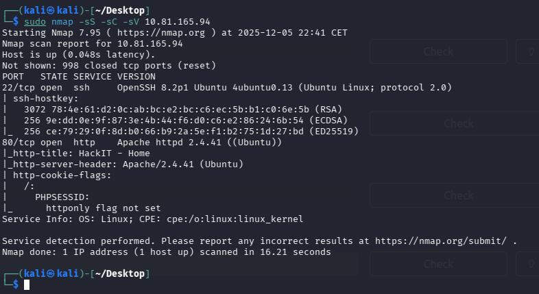
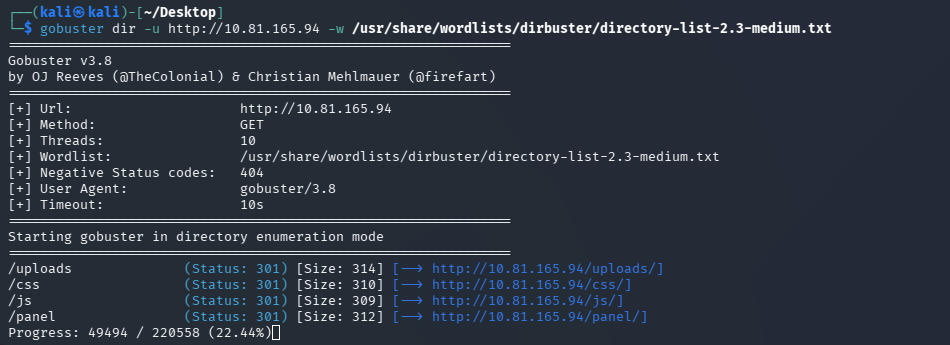

# RootMe — TryHackMe

| | |
|---|---|
| **Platform** | TryHackMe |
| **Difficulty** | Easy |
| **OS** | Linux |
| **Status** | ✅ Room explicitly aimed at write-ups/beginners |
| **Key techniques** | Directory brute-forcing, upload-filter bypass, SUID Python abuse |

---

## TL;DR

A compact, classic-shape box: directory brute-forcing finds an admin path
hiding a file upload form, an extension-filter bypass gets a PHP web shell
onto the server, and privilege escalation is a SUID Python binary abused
directly through its own interpreter privileges.

---

## Recon & Enumeration

```bash
nmap -sC -sV <TARGET_IP>
```

Only two ports open: SSH and Apache. With no other surface, directory
brute-forcing on the web root was the immediate next step:

```bash
gobuster dir -u http://<TARGET_IP> -w <wordlist>
```



This found a hidden `/panel/` directory.



---

## Foothold / Initial Access

The panel exposed a file upload form that rejected obvious PHP extensions
outright. Testing alternate PHP-executing extensions (`.phtml`, `.php5`,
etc. — a standard extension-filter bypass technique) got a PHP reverse
shell past the filter and into the uploads directory, where it was directly
reachable and executable:

```bash
nc -lvnp <PORT>
```

User flag retrieved.

---

## Privilege Escalation

A SUID permission sweep found the **Python interpreter itself** with the
SUID bit set:

```bash
find / -perm -4000 2>/dev/null
```

A SUID Python binary runs any script (or inline command) with the owning
user's privileges rather than the invoking user's — GTFOBins documents the
direct escalation, spawning a shell through Python's own `os.system`/`pty`
call with inherited privilege:

```bash
python -c 'import os; os.execl("/bin/sh", "sh", "-p")'
```

Root shell obtained. Root flag retrieved.

---

## Lessons Learned

- **Extension-based upload filters are commonly incomplete** — testing
  alternate PHP-executing extensions (`.phtml`, `.php3`/`.php4`/`.php5`,
  `.pht`) is a fast, high-value check whenever `.php` alone is blocked.
- **A SUID interpreter (Python, Perl, Ruby, etc.) is functionally
  equivalent to a SUID shell** — always check GTFOBins for the specific
  invocation once one turns up in a SUID sweep.

---

## Remediation

- Validate uploads by content/MIME type rather than extension blacklist,
  and store uploads outside any web-executable directory.
- Never set the SUID bit on a general-purpose interpreter; if a script
  genuinely needs elevated privileges, use a narrowly-scoped `sudo` rule
  instead.

---

## Tools used

- `nmap`, `gobuster`
- `nc`
- `find` (SUID sweep), GTFOBins

---

**See also:** [Linux privilege escalation methodology](../../methodology/linux-privesc.md)

---

**Room:** [TryHackMe — RootMe](https://tryhackme.com/room/rrootme)

**Live version:** [read this write-up on my blog](https://debasjan.github.io/writeups/rootme/)
