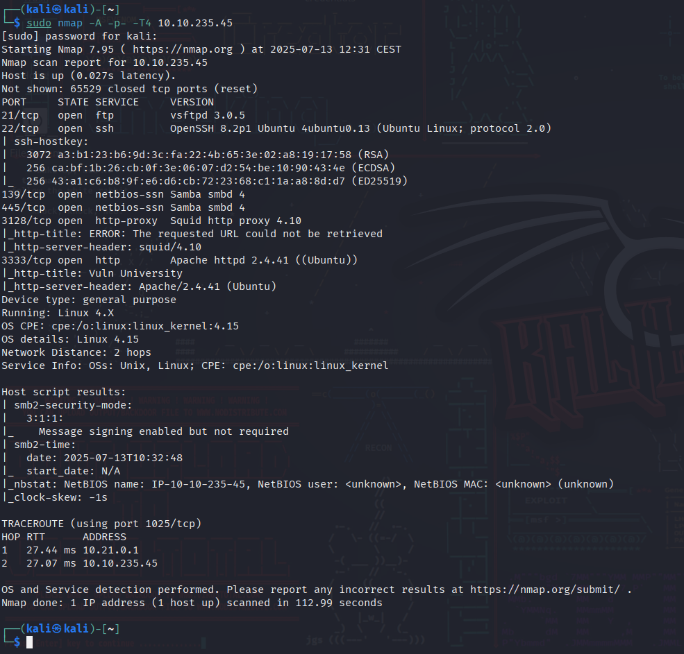
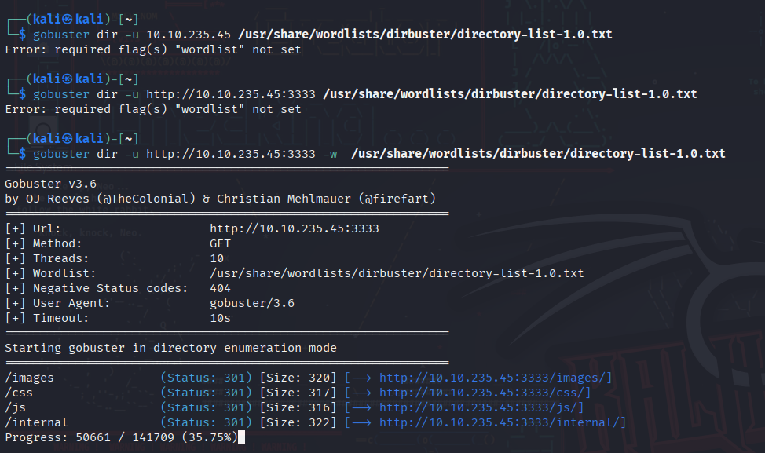
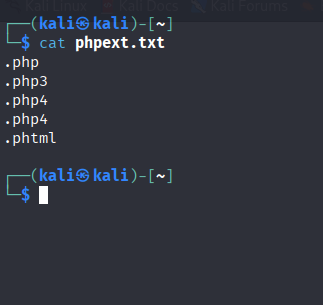
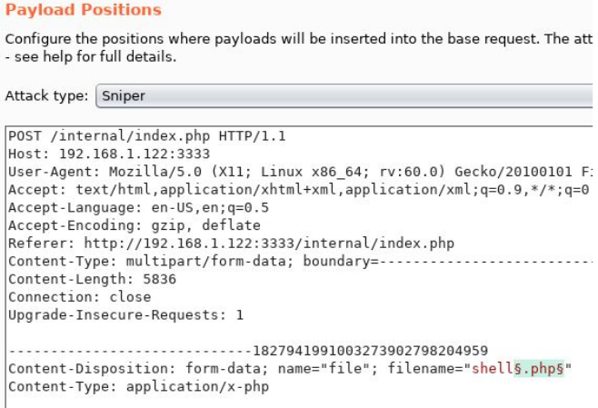
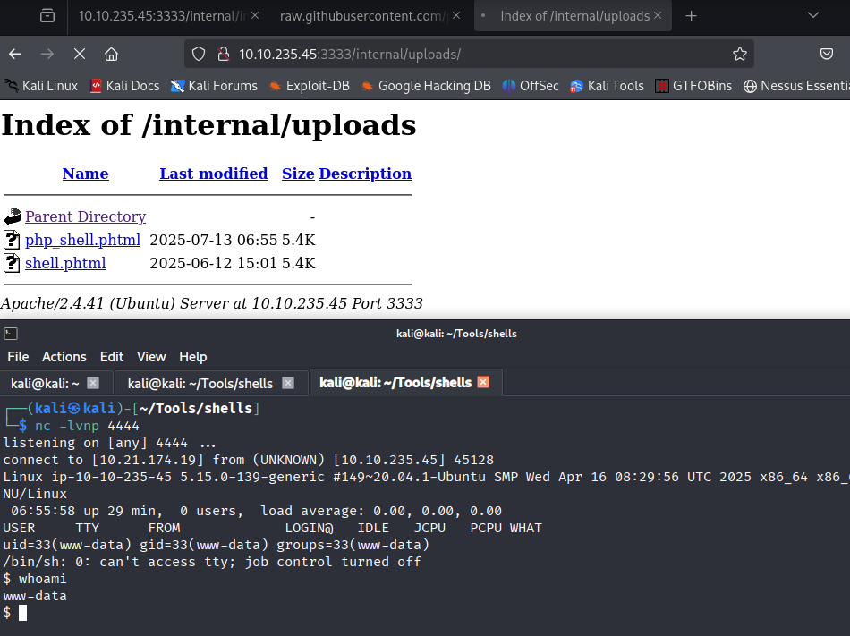
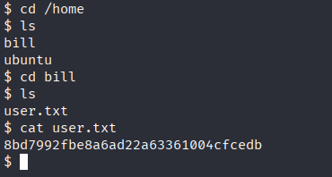
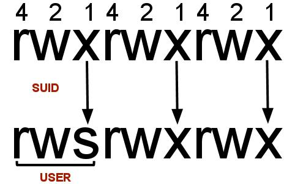
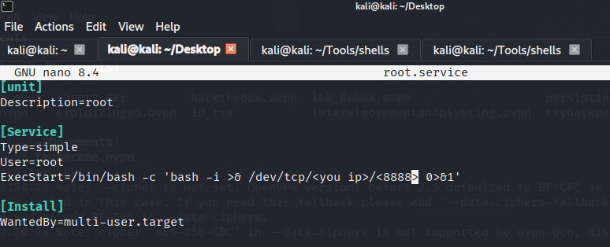

# Vulnversity — TryHackMe

  

Learn about active recon, web app attacks and privilege escalation.

## **Reconnaissance**

Gather information about this machine using a network scanning tool called `Nmap`. Check out the [Nmap](https://tryhackme.com/room/furthernmap) room for more on this!  

## Connecting to the machine

This room recommends using the AttackBox, which can be launched by clicking the blue button on the top-right.

## Scan the box

nmap -sV MACHINE_IP.

Nmap is a free, open-source and powerful tool used to discover hosts and services on a computer network. In our example, we use Nmap to scan this machine to identify all services running on a particular port. Nmap has many capabilities; a table summarises some of its functionality below.

|   |   |
|---|---|
|Nmap flag|Description|
|-sV|Attempts to determine the version of the services running|
|-p <x> or -p-|Port scan for port <x> or scan all ports|
|-Pn|Disable host discovery and scan for open ports|
|-A|Enables OS and version detection, executes in-build scripts for further enumeration|
|-sC|Scan with the default Nmap scripts|
|-v|Verbose mode|
|-sU|UDP port scan|
|-sS|TCP SYN port scan|

###### Answer the questions below

There are many Nmap "cheatsheets" online that you can use too.  

Scan the box; how many ports are open?
6

What version of the squid proxy is running on the machine?
4.10

How many ports will Nmap scan if the flag **-p-400** was used?
400

What is the most likely operating system this machine is running?
Ubuntu

What port is the web server running on?
3333

It's essential to ensure you are always doing your reconnaissance thoroughly before progressing. Knowing all open services (which can all be points of exploitation) is very important, don't forget that ports on a higher range might be open, so constantly scan ports after 1000 (even if you leave checking in the background).  

What is the flag for enabling verbose mode using Nmap?
-v

## **Locating directories using Gobuster**

Using a fast directory discovery tool called `Gobuster`, you will locate a directory to which you can use to upload a shell.

Let's first start by scanning the website to find any hidden directories. To do this, we're going to use Gobuster.

Gobuster is a tool for brute-forcing URIs (directories and files), DNS subdomains, and virtual host names. For this machine, we will focus on using it to brute-force directories.  

Download Gobuster [here](https://github.com/OJ/gobuster), or if you're on Kali Linux run `sudo apt-get install gobuster`.

To get started, you will need a wordlist for Gobuster (which will be used to quickly go through the wordlist to identify if a public directory is available. If you use [Kali Linux](https://tryhackme.com/room/kali), you can find many wordlists under `/usr/share/wordlists`. You can also use the wordlist for directories located at `/usr/share/wordlists/dirbuster/directory-list-1.0.txt` in the AttackBox.  

Now let's run Gobuster with a wordlist using `gobuster dir -u http://10.10.235.45:3333 -w` .

|   |   |
|---|---|
|**Gobuster flag**|**Description**|
|-e|Print the full URLs in your console|
|-u|The target URL|
|-w|Path to your wordlist|
|-U and -P|Username and Password for Basic Auth|
|-p **<x>**|Proxy to use for requests|
|-c <http cookies>|Specify a cookie for simulating your auth|
###### Answer the questions below

I have successfully configured Gobuster. 

What is the directory that has an upload form page?
/internal/

## **Compromise the Webserver**

Now that you have found a form to upload files, we can leverage this to upload and execute our payload, which will lead to compromising the web server. We will fuzz the upload form to identify which extensions are not blocked.

To do this, we'll use BurpSuite. If you need clarification on what BurpSuite is or how to set it up, please complete our [BurpSuite module](https://tryhackme.com/module/learn-burp-suite) first.

Using BurpSuite

We're going to use Intruder (used for automating customised attacks). To begin, make a wordlist with the following extensions:

- .php
- .php3
- .php4
- .php5
- .phtml

Now, make sure BurpSuite is configured to intercept all your browser traffic. Upload a file; once this request is captured, send it to the Intruder. Click on "`Payloads`" and select the "`Sniper`" attack type.

Click the "`Position`s" tab now, find the filename and "`Add §`" to the extension. It should look like this:

Now that we know what extension we can use for our payload, we can progress.

Getting a Reverse Shell

We are going to use a PHP reverse shell as our payload. A reverse shell works by being called on the remote host and forcing this host to make a connection to you. So you'll listen for incoming connections, upload and execute your shell, which will beacon out to you to control! You can download the following reverse PHP shell [here](https://github.com/pentestmonkey/php-reverse-shell/blob/master/php-reverse-shell.php).

To gain remote access to this machine, follow these steps:  

1. Edit the php-reverse-shell.php file and edit the ip to be your tun0 ip (you can get this by going to [http://10.10.10.10](http://10.10.10.10/) in the browser of your TryHackMe connected device).  
2. Rename this file to `php-reverse-shell.phtml`.  
3. We're now going to listen to incoming connections using netcat. Run the following command: `nc -lvnp 1234`.  
4. Upload your shell and navigate to `http://10.10.235.45:3333/internal/uploads/php-reverse-shell.phtml` - This will execute your payload.

You should see a connection on your Netcat session.

Answer the following questions based on the above exercise.

###### Answer the questions below

What common file type you'd want to upload to exploit the server is blocked? Try a couple to find out.
.php

I understand the Burpsuite tool and its purpose during pentesting.  

What extension is allowed after running the above exercise?
.phtml

While completing the above exercise, I have successfully downloaded the PHP reverse shell.

What is the name of the user who manages the webserver?
bill

What is the user flag?
8bd7992fbe8a6ad22a63361004cfcedb

## **Privilege Escalation**

Now that you have compromised this machine, we will escalate our privileges and become the superuser (root).

In Linux, SUID (**set owner userId upon execution**) is a particular type of file permission given to a file. SUID gives temporary permissions to a user to run the program/file with the permission of the file owner (rather than the user who runs it).

For example, the binary file to change your password has the SUID bit set on it (`/usr/bin/passwd`). This is because to change your password, you will need to write to the shadowers file that you do not have access to; `root` does, so it has root privileges to make the right changes.

'

It's challenge time! We have guided you through this far. Unleash your skills and exploit this system further to escalate your privileges and answer the following questions.

Answer the questions below

On the system, search for all SUID files. Which file stands out?  
/bin/systemctl

What is the root flag value?
`a58ff8579f0a9270368d33a9966c7fd5`

---

**Live version:** [read this write-up on my blog](https://debasjan.github.io/writeups/vulnversity/)
